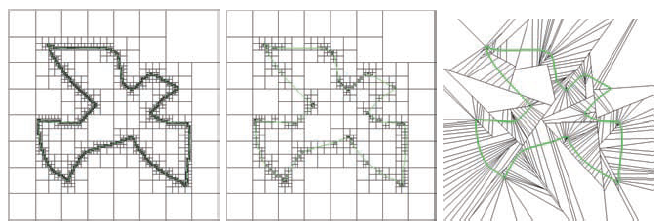

# 📝Summary
**🎯Intent**
What does this book for?

**✏The Book in 3 Sentences**
1...
2...
3...

**🧠Impression**
I feel ...

**🏁Progress**

|             | Read? | Document? |
| ----------- | ----- | --------- |
| Chapter ... |       |           |
|             |       |           |
|             |       |           |

# 📖Chapter 1
# Chapter 1 Surface Representation
- [[Geometry Processing]], [[surface]], [[surface#💫Operation]]
## 1.1 Surface Definition and Properties
- [[surface#📝Definition]]
- [[surface#⛈Characteristics / Properties#Smoothness]]
- [[surface#⛈Characteristics / Properties#Fairness]]
## 1.2. Approximation Power
- [[surface#📏Surface Approximation]]
## 1.3. Parametric Surface Representation
- [[surface#🎨Surface Representation]]
### 1.3.1. Spline Surfaces.
- There are a lot of ideas and concepts closely related. [[Spline]], [[Bernstein Polynomial]], [[B-Spline]], [[Bézier Curve]], [[Cubic Spline]], [[NURBS]]

## 1.4 Implicit Surface Representations
Review the definition at here![[implicit surface representation#📝Definition]]

Preceding is just a description of an implicit surface. So what is its equation? ![[implicit surface representation#✒Notation]]

Understand the objective of it.![[implicit surface representation#🎯Intent]]

Take a look at the example ![[implicit surface representation#🗃Example]]

Be aware of the characteristics of it. ![[implicit surface representation#⛈Characteristics]]
The value of the function $F$ has special meaning.
![[implicit surface representation#💫Operation]]

The preceding neat operation help implicit surface in its applicabilites.
![[implicit surface representation#🧀Applicability#🍞 constructive solid geometry]]

In the meantime, we must be also aware of its cons. ![[implicit surface representation#🩹Cons]]

The appropriate data structures for implicit surface. ![[implicit surface representation#🎶 Data Structures]]
### 1.4.1 Regular Grids
Understand how regular gird can help discretization. ![[regular grid#🧀Applicability#🍞Discretize implicit surface representation implicit surface]]

### 1.4.2 Adaptive Data Structures
**🔗Link**
https://en.wikipedia.org/wiki/Adaptive_mesh_refinement

**📝Description**
This bunch methods have a higher sampling rate only on those precise signed distance values which are most important in the vicinity of the surface.

**⛈Characteristics**
- Reduce complexity from $O(n^3)$(regular grid) to $O(n^2)$.
- Only interested in those areas which are necessary. e.g. high [[curvature]]

**🗃Example**

Different adaptive approximations of a signed distance field with the same accuracy:
- three-color quadtree (left, 12040 cells)
- adaptively sampled distance fields (ADF) [Frisken et al. 00] (center, 895 cells)
- binary space partitioning (BSP) tree [Wu and Kobbelt 03] (right, 254 cells).

black⚫ completely inside (black)
**gray**🔘 only here are worth refinement✅
white⚪ completely outside (white)

Adaptively refining only those cells that are intersected by the surface (grey) yields a uniformly refined crust of leaf cells around the surface and reduces the storage complexity from cubic to quadratic.

**🌱Related Elements**
The technique behind is binary, quad, and oct tree? #TODO 

## 1.5 Conversion Methods
**📌Why we need this?**
Since both representations have their pros and cons, efficient conversion methods between the two are necessary.

**📌Their both charactecristics**
Both kinds of representations are usually **finite samplings** (e.g., triangle meshes in the parametric case, uniform/adaptive grids in the implicit case) and that each conversion corresponds to a resampling step. 

**📌The Objective**
Hence, special care has to be taken in order to **minimize loss of information** during these conversion routines.

# 💭Things I don't Know

# 🍂Unorganized

___
# ℹInformation
**✍Authors:**
**🔗Links:**