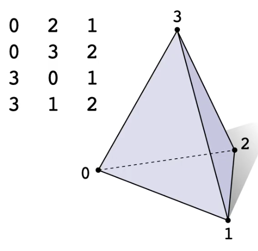

- 📝Definition
	- The adjacency list representation of a [[Graph]] consists of $n$ lists one for each vertex $v_i$, $1\leq i\leq n$, which gives the vertices to which $v_i$ is adjacent.
	- > ==**Note⚠**==: Adjacency List only stores top-dimensional [[simplices]]. For example, it only stores information of faces from a [[tetrahedron]]..
	  {:height 200, :width 200}
- 🎯Intent
	- In [[Graph Theory]] and computer science, an adjacency list is a collection of unordered lists used to represent a finite graph.
- 🚀Pros
	- simple, small storage cost
- 🕳Cons
	- hard to iterate over, e.g. expensive to access its neighbors