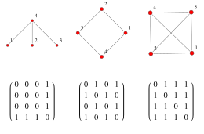
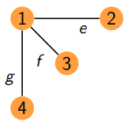

- 📝Definition
	- The adjacency matrix, sometimes also called the connection matrix, of a simple labeled graph is a matrix with rows and columns labeled by graph vertices, with a $1$ or $0$ in position ($v_i,v_j$) according to whether $v_i$ and $v_j$ are adjacent or not.
	- Let $G = (V, E)$ be a [[Graph]] with no multiple edges where $V = \{1, 2, . . . , n\}$. The adjacency matrix of $G$ is the $n\times n$ matrix $A = (a_{ij})$, where $a_{ij} = 1$ if there is an edge between vertex $i$ and vertex $j$ and $a_{ij} = 0$ otherwise.
	- > ==**Note⚠**==: For an undirected graph, the adjacency matrix is symmetric. For a simple graph with no self-loops, the adjacency matrix must have 0s on the diagonal.
- 🕳Pitfalls / Cons
	- People in Geometry Processing and Graph Theory have different interpretation on Adjacency Matrix!!
- 📈Diagram
	- {:height 200, :width 400}
- 🗃Example
	- Adjacency Matrix Example
		- {:height 100, :width 100}
		- $A=\begin{bmatrix}0&1&1&1\\1&0&0&0\\1&0&0&0\\1&0&0&0\\\end{bmatrix}$
- TODO clarify with adjacency list