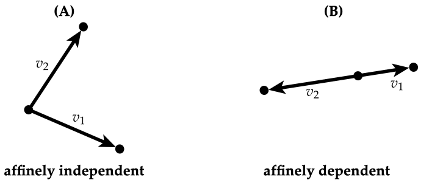

- 📝Definition
    - Introduce concept of [[linear independent]] to geometry: A collection of points $p_0,...,p_k$ are affine independent if the vectors $v_i:=p_i-p_0$ are [[linear independent|linearly independent]].
    - {:height 200, :width 400}
    