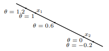

- 📝Definition
	- Affine set is the set contains the line through any two distinct points in the set where line through $x_1, x_2$: all points.
		- $$
		  x=\theta x_1+(1-\theta) x_2\quad(\theta\in\mathbb{R})
		  $$
		- {:height 200, :width 300}
- 🗃Example
	- solution set of linear equations $\{x | Ax = b\}$ is affine set.
		- Conversely, every affine set can be expressed as solution set of system of [[Linear Equation]]s.