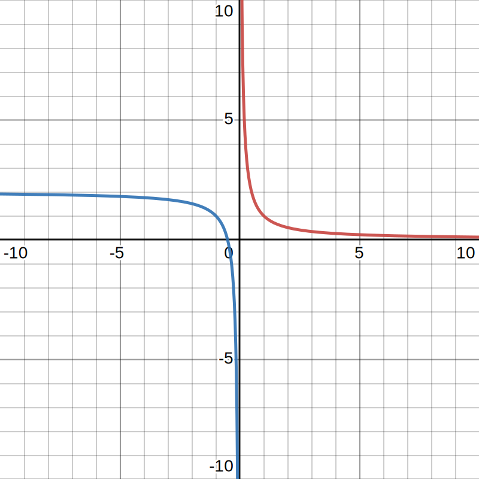

# 📝Definition
- Definition 1
    - An **antiderivative** of $f(x)$ is any function $F(x)$ such that
        - $$
          F'(x)\,  = f(x)
          $$
        
    - In other words, an antiderivative of a function $f(x)$ is another function whose derivative is $f(x)$.
    
- Definition 2
    - Given a function $f(x)$, the **indefinite integra**l or the **antiderivative** of $f(x)$ is denoted $\int f(x)dx$. It is the family of functions
        - $$
          \int f(x) \, dx \,  = F(x) + C
          $$
        - where $F(x)$ is any antiderivative of $f(x)$, that is $F'(x)=f(x)$, and $C$ is any constant.
        
    - We call $\int$ the **integral sign**, $f(x)$ the **integrand**, and $C$ the **constant of integration**. Since there could be infinite $C$, therefore there is no only one antiderivative of such a function. Hence, this is the reason of phrase "*indefinite*". On the other hand, the constant is **the only ambiguity** of the indefinite integral due to the MVT, which guarantees that any two antiderivatives of the same function can **differ only** by a constant.
    
# 🌓Complement
- ![[Differential Equation#📌Differential Equation vs Antiderivative]]
- ![[definite integral#📌 Indefinite Integral vs. Definite Integral]]

# ⚖Laws
- Properties
    - $$
      \begin{align}
      \int k \,  f (x) \,  dx \, &= \, \   k \int \,  f(x) \, dx\\
      \int \left( f(x)+g(x) \right)\,  dx &=\   \int f(x)\,  dx +\int g(x)\,  dx
      \end{align}
      $$
    
- 📌Integrals of powers ^320f6a5fb26863db
    - The indefinite integral of $x^p$ for any real number $p$.
        - $$
          \int \,  x^p\  dx \,  \, = \qquad \begin{cases}  \displaystyle \frac{x^{p+1}}{p+1} +C &  \text{if } p \neq -1 \\ \ln \left(|x|\right)+C &  \text{if } p = -1. \end{cases}
          $$
        - Few words on when $p=-1$. We can notice that $p$ can't be $-1$ in the first expression. Then we might need to consider when $x^p=x^{-1}$. The reason why there is an absolute value is that although the [[Function#^bdaa359665a4eb20|domain]] of $\ln{(x)}$ should greater than $0$, the domain of $x^{-1}$ does not have that constraint! Therefore, we have it like $\ln{(\lvert x\rvert)}$.
        
- Method of substitution
    - The method of substitution is the integration analogue of the chain rule. It is **tailored** for the differential notation.
    - If
        - $$
          \begin{align}
          g(x)dx=f(u(x)) \, u'(x) dx,
          \end{align}
          $$
        
    - that is, the integrand $g(x)$ can be seen as the result of a chain rule, then
        - $$
          \begin{align}
          \int g(x)dx&=\int f(u(x))\,  u'(x)\,  dx\\
          &=\int f(u)du\\
          &=F(u(x))+C
          \end{align}
          $$
        
# ⛈Characteristics / Properties
- 📌Uniqueness
    - Theorem
        - $$
          \text{If $F'=G'$, then $F(x)=G(x)+C$}
          $$
        
    - Proof
        - If
            - $$
              F'=G'
              $$
            
        - Then
            - $$
              (F-G)'=F'-G'=0
              $$
            
        - Using the MVT, hence we have
            - $$
              F(x)-G(x)=C
              $$
            
# 🧬Related Elements
- 📌 [[MVT]] plays an important role in the definition of antiderivatives
    - Recall MVT, we know
        - $$
          F'(x)=0\quad\text{then $F(x)$ MUST be constant.}
          $$
        
    - With MVT guarantee, **ALL** antiderivative of $f(x)=0$ must be constant.
    
# 🕳Pitfalls / Cons
- 📌Derivative with a discontinuity
    - Conclusion:
    - Question:
        - Define a piece-wise function $g(x)$ by
        - $$
          \begin{align}
          g(x)&=\frac{1}{x}\quad\text{when }x>0\\
          g(x)&=\frac{1}{x}+2\quad\text{when }x<0
          \end{align}
          $$
        - Compute the $g'(x)$ and explain.
        
    - Graph:
      {:height 300, :width 300}
    - Solution:
        - When $x<0$,
            - $$
              g'(x)=\frac{d}{dx}(\frac{1}{x})=-\frac{1}{x^2}
              $$
            
        - When $x>0$,
            - $$
              g'(x)=\frac{d}{dx}(\frac{1}{x}+2)=-\frac{1}{x^2}
              $$
            
        - So
            - $$
              g'(x)=-\frac{1}{x^2}\quad\text{for all }x\neq0
              $$
            
        - We know
            - $$
              \int -\frac{1}{x^2}dx=\frac{1}{x}+C
              $$
            
        - That's the key!! But if we consider $x$ to be positive and negative at the same time, **the two constants don't necessarily have to agree**. You can have the same situation that you had before, where one side can shift up and down independently of the other, because there's that is [[Discontinuity]] at $0$ there.
        
# 🖨 Cheat Sheet

> [!WARNING] Warning
> Antiderivative is not [[definite integral]], please please please add $C$(constant) at the end!!

**📌Basic Antiderivative**
$$
\begin{align}
\text{(i)}\quad&\int kdx = kx\\
\text{(ii)}\quad&\int x^ndx = \frac{x^{n+1}}{n+1}, \ n\neq-1\\
\text{(iii)}\quad&\int \frac{1}{x^n} = \frac{-1}{(n-1)x^{n-1}}\\
\text{(iv)}\quad&\int x^{-1}dx = \int \frac{1}{x}dx = \ln|x|\\
\text{(v)}\quad&\int a^x dx = \frac{a^x}{ln(a)}\\
\text{(vi)}\quad&\int e^x dx = e^x\\
\text{(vii)}\quad&\int \log_a(x)dx = x\log_a(x)-x\log_a(e)\\
\end{align}
$$
**📌 Trigonometirc**
$$
\begin{align}
\text{(i)}\quad&\int \sin(x)dx = -\cos(x)\\
\text{(ii)}\quad&\int \cos(x)dx = \sin(x)\\
\text{(iii)}\quad&\int \tan(x)dx = -\ln|\cos(x)| = \ln|\sec(x)|\\
\text{(iv)}\quad&\int \cot(x)dx = \ln|\sin(x)|\\
\text{(v)}\quad&\int \sec(x)dx = \ln|\sec(x)+\tan(x)|\\
\text{(vi)}\quad&\int \csc(x)dx = -\ln|\csc(x)+\cot(x)|\\
\text{(vii)}\quad&\int \sin^{-1}(x)dx = x\sin^{-1}(x)+\sqrt{1-x^2}\\
\text{(viii)}\quad&\int \cos^{-1}(x)dx = x\cos^{-1}(x)-\sqrt{1-x^2}\\
\text{(ix)}\quad&\int \tan^{-1}(x)dx = x\tan^{-1}(x)-\sqrt{1}{2}\ln(1+x^2)\\
\text{(x)}\quad&\int \cot^{-1}(x)dx = x\cot^{-1}(x)+\sqrt{1}{2}\ln(1+x^2)\\
\text{(xi)}\quad&\int \sin^2(x)dx = \frac{1}{2}\big(x-\sin(x)\cos(x)\big)\\
\text{(xii)}\quad&\int \cos^2(x)dx = \frac{1}{2}\big(x+\sin(x)\cos(x)\big)\\
\text{(xiii)}\quad&\int \tan^2(x)dx = \tan(x)-x\\
\text{(xiv)}\quad&\int \cot^2(x)dx = -\cot(x)-x\\
\text{(xv)}\quad&\int \sec^2(x)dx = \tan(x)\\
\text{(xvi)}\quad&\int \csc^2(x)dx = -\cot(x)\\
\text{(xvii)}\quad&\int \csc(x)\cot(x)dx = -\csc(x)$ \\
\text{(xviii)}\quad&\int \frac{1}{\sin(x)}dx = \ln\left|\frac{1-\cos(x)}{\sin(x)}\right|\\
\text{(xix)}\quad&\int \frac{1}{\cos(x)}dx = \ln\left|\frac{1+\sin(x)}{\cos(x)}\right|\\
\text{(xx)}\quad&\int \frac{1}{\sin^2(x)}dx = -\cot(x)\\
\text{(xxi)}\quad&\int \frac{1}{\cos^2(x)}dx = \tan(x)\\
\text{(xxii)}\quad&\int \frac{1}{1+\sin(x)}dx = \frac{-\cos(x)}{1+\sin(x)}\\
\text{(xxiii)}\quad&\int \frac{1}{1+\cos(x)}dx = \frac{\sin(x)}{1+\cos(x)}\\
\text{(xxiv)}\quad&\int \frac{1}{1-\sin(x)}dx = \frac{\cos(x)}{1-\sin(x)}\\
\text{(xxv)}\quad&\int \frac{1}{1-\cos(x)}dx = \frac{-\sin(x)}{1-\cos(x)}\\
\text{(xxvi)}\quad&\int \sin(ax)dx = -\frac{1}{a}\cos(ax)\\
\text{(xxvii)}\quad&\int \cos(ax)dx = \frac{1}{a}\sin(ax)\\
\text{(xxviii)}\quad&\int \tan(ax)dx = -\frac{1}{a}\ln(\cos(ax))\\
\text{(xxix)}\quad&\int x\sin(ax)dx = -\frac{1}{a}x\cos(ax)+\frac{1}{a^2}\sin(ax)\\
\text{(xxx)}\quad&\int x\cos(ax)dx = \frac{1}{a}x\sin(ax)+\frac{1}{a^2}\cos(ax)\\
\text{(xxxi)}\quad&\int \sinh(x) dx = \cosh(x)\\
\text{(xxxii)}\quad&\int \cosh(x) dx = \sinh(x)\\
\text{(xxxiii)}\quad&\int \tanh(x) dx = \ln(\cosh(x))\\
\text{(xxxiv)}\quad&\int \coth(x) dx = \ln|\sinh(x)|\\
\text{(xxxv)}\quad&\int \sinh^{-1}(x) dx = x\sinh^{-1}(x) - \sqrt{x^2+1}\\
\text{(xxxvi)}\quad&\int \cosh^{-1}(x) dx = x\cosh^{-1}(x) - \sqrt{x^2-1}\\
\text{(xxxvii)}\quad&\int \tanh^{-1}(x) dx = x\tanh^{-1}(x) + \frac{1}{2}\ln(1-x^2)\\
\text{(xxxviii)}\quad&\int \coth^{-1}(x) dx = x\coth^{-1}(x) + \frac{1}{2}\ln(x^2-1)\\
\end{align}
$$
**📌 Logarithmic**
$$
\begin{align}
\text{(i)}\quad&\int \ln(ax)dx = x\ln(ax)-x\\
\text{(ii)}\quad&\int x\ln(ax)dx = \frac{x^2}{4}(2\ln(ax)-1)\\
\text{(iii)}\quad&\int \frac{\ln(ax)}{x}dx = \frac{1}{2}(\ln(ax)^2\\
\end{align}
$$
**📌 Exponential**
$$
\begin{align}
\text{(i)}\quad&\int e^{ax}dx = \frac{1}{a}e^{ax}\\
\text{(ii)}\quad&\int xe^x dx = (x-1)e^x\\
\text{(iii)}\quad&\int xe^{ax}dx = \left(\frac{x}{a}-\frac{1}{a^2}\right)e^{ax}\\
\end{align}
$$

**📌 Rational Functions**
$$
\begin{align}
\text{(i)}\quad&\int \frac{1}{\sqrt{x}} = 2\sqrt{x}\\
\text{(ii)}\quad&\int (x+a)^n dx=\frac{(x+a)^{n+1}}{n+1}, \ n\neq-1\\
\text{(iii)}\quad&\int x(x+a)^n dx=\frac{(x+a)^{n+1}((n+1)x-a)}{(n+1)(n+2)}$    \\
\text{(iv)}\quad&\int \frac{ax+b}{cx+d}dx = \frac{ax}{c}-\frac{ad-bc}{c^2}\ln|cx+d|\\
\text{(v)}\quad&\int \frac{1}{(x+a)^2}dx = -\frac{1}{x+a}\\
\text{(vi)}\quad&\int \frac{1}{ax+b}dx = \frac{1}{a}\ln|ax+b|$ \\
\text{(vii)}\quad&\int \frac{1}{a^2+x^2}dx = \frac{1}{a}\tan^{-1}\left(\frac{x}{a}\right)\\
\text{(viii)}\quad&\int \frac{1}{ax^2+bx+c}dx = \frac{2}{\sqrt{4ac-b^2}}\tan^{-1}\left(\frac{2ax+b}{\sqrt{4ac-b^2}}\right)\\
\text{(ix)}\quad&\int \frac{1}{(x-a)(x-b)}dx = \frac{1}{a-b}\ln\left|\frac{x-a}{x-b}\right|\\
\text{(x)}\quad&\int \frac{x}{a^2+x^2}dx = \frac{1}{2}\ln\left|a^2+x^2\right|\\
\text{(xi)}\quad&\int \frac{x^2}{a^2+x^2}dx = x-a\tan^{-1}\left(\frac{x}{a}\right)\\
\text{(xii)}\quad&\int \frac{x^3}{a^2+x^2}dx = \frac{1}{2}x^2-\frac{1}{2}a^2\ln\left|a^2+x^2\right|\\
\text{(xiii)}\quad&\int \frac{x}{(x+a)^2}dx = \frac{a}{a+x}+ \ln\left|a+x\right|\\
\text{(xiv)}\quad&\int \frac{x}{ax^2+bx+c} = \frac{1}{2a}\ln\left|ax^2+bx+c\right|-\frac{b}{a\sqrt{4ac-b^2}}\tan^{-1}\left(\frac{2ax+b}{\sqrt{4ac-b^2}}\right)\\
\end{align}
$$

**📌 Square Roots**
$$
\begin{align}
\text{(i)}\quad&\int \sqrt{x-a}dx = \frac{2}{3}(x-a)^{\frac{3}{2}}\\
\text{(ii)}\quad&\int \sqrt{ax+b}dx = \left(\frac{2b}{3a}+\frac{2x}{3}\right)\sqrt{ax+b}\\
\text{(iii)}\quad&\int \sqrt{x^2+a}dx = \frac{1}{2}x\sqrt{x^2+a}+\frac{a}{2}\ln|x+\sqrt{x^2+a}|\\
\text{(iv)}\quad&\int \sqrt{a^2-x^2}dx = \frac{1}{2}x\sqrt{a^2-x^2}+\frac{a^2}{2}\sin^{-1}\left(\frac{x}{a}\right)\\
\text{(v)}\quad&\int x\sqrt{x-a}dx = \frac{2}{3}a(x-a)^{\frac{3}{2}}+\frac{2}{5}(x-a)^{\frac{5}{2}}\\
\text{(vi)}\quad&\int x\sqrt{x^2 \pm a^2}dx = \frac{1}{3}(x^2 \pm a^2)^{\frac{3}{2}}$   \\
\text{(vii)}\quad&\int (ax+b)^{\frac{3}{2}}dx = \frac{2}{5a}(ax+b)^{\frac{5}{2}}\\
\text{(viii)}\quad&\int \frac{1}{\sqrt{x^2 \pm a^2}}dx = \ln\left|x+\sqrt{x^2 \pm a^2}\right|\\
\text{(ix)}\quad&\int \frac{1}{\sqrt{a^2-x^2}}dx = \sin^{-1}\left(\frac{x}{a}\right)\\
\text{(x)}\quad&\int \frac{1}{\sqrt{x\pm a}}dx = 2\sqrt{x\pm a}\\
\text{(xi)}\quad&\int \frac{x}{\sqrt{x^2 \pm a^2}}dx = \sqrt{x^2 \pm a^2}\\
\end{align}
$$

**📌 Other**
$$
\begin{align}
\text{(i)}\quad&\int x\sin(ax)dx = -\frac{1}{a}x\cos(ax)+\frac{1}{a^2}\sin(ax)\\
\text{(ii)}\quad&\int x\cos(ax)dx = \frac{1}{a}x\sin(ax)+\frac{1}{a^2}\cos(ax) \\
\text{(iii)}\quad&\int e^{bx} \sin(ax)dx = \frac{1}{a^2+b^2}e^{bx}\left(b\sin(ax)-a\cos(ax)\right)\\
\text{(iv)}\quad&\int e^{bx} \cos(ax)dx = \frac{1}{a^2+b^2}e^{bx}\left(a\sin(ax)+b\cos(ax)\right)\\
\end{align}
$$

    
# 🗃Example
- 📌an example of antiderivative
    - If $f(x)=0$, then which of the following functions are antiderivatives of $f(x)$?
        - ✅$F(x)=0$
        - ❌$F(x)=x$
        - ✅$F(x)=-7$
        - ✅$F(x)=\frac{1}{2}$
        - ❌$F(x)=\frac{1}{x}$
        
    - Since the derivative of above selected functions are $0$.
    
- 📌example of notation between antiderivative and [[Differential]]
    - Question
        - Let $dF$ be the differential of the function $F(x)$, then $\int dF=?$
        
    - Solution
        - Since
            - $$
              \begin{align}
              dF&=F'(x)dx,\\ \int dF&=\int F'(x)dx
              \end{align}
              $$
            
        - Now, $F(x)$ is an antiderivative of $F'(x)$, so
            - $$
              \int F'(x)\, dx = F(x)+C \, \, \text{where}\, \,  C \, \, \text{is any real number.}
              $$
            
        - Note that while $F(x)$ is AN antiderivative, it is not the most general form of the antiderivatives of $F'(x)$ and so is not the correct answer.
        
- 📌example of ==units== of antiderivative
    - Consider the differential equation $\frac{dx}{dt} = f(t)$, where $x$ has units of meters, and $t$ has units of seconds.
        - $\int f(t) dt$ - meters
            - The functions $x=\int f(t) dt$ are the solution curves to the differential equation $\frac{dx}{dt} = f(t)$. Thus $\int f(t) dt$ must have the same units as $x$, which are meters.
            
        - $dt$ - seconds
            - The symbol $dt$ stands for the infinitesimal version of $\Delta t$, which is a tiny bit of $t$, thus it has the same units as $t$, which is seconds.
            
        - $f(t)dt$ - meters
            - The differential quantity $f(t)dt=dx$, so $f(t)dt$ has the same units as $dx$, which is a little bit of $x$, and must have units of meters.
            
- 📌example of ==integrals of powers==
    - use the rule of integrals of powers
    - $$
      \begin{align}
      \int x^{\frac{2}{3}} \,  dx&=\frac{ 3x^{\frac{5}{3}}}{5}+C\\
      \int \left(\sqrt{x}\right)^3 \,  dx &= \int x^{\frac{3}{2}} \,  dx=\frac{2x^{\frac{5}{2}}}{5}+C\\
      \int \frac{3}{x} \,  dx&=3 \ln (|x|) +C.
      \end{align}
      $$
    
- 📌example of ==integral of constant multiples of functions==
    - $$
      \begin{align}
      \int \frac{1}{2} (2x)^6 \  dx\  &=\  \int 2^5 x^6 \  dx\\
      &=2^5\int x^6 \  dx\\
      &= \frac{2^5}{7} x^7 +C .
      \end{align}
      $$
    
- 📌example of ==integral of sums of functions==
    - $$
      \begin{align}
      \int \left( \frac{-3}{x}-\frac{1}{x^{3}}\right)\,  dx &= \int \frac{-3}{x}-\int\frac{1}{x^{3}} dx\\
      &= -3 \ln |x|+\frac{x^{-2}}{2}+C.
      \end{align}
      $$
    
- 📌example of ==integral of quotient==
    - $$
      \begin{align}
      \int \frac{x^2+\sqrt{x}}{x^2} \,  dx &= \int 1+ x^{-\frac{3}{2}}\,  dx\\
      &=x - 2 x^{-\frac{1}{2}}+C
      \end{align}
      $$
    
- 📌example of ==integral of chain rule==
    - $$
      \begin{align}
      \int e^{6x}dx\\
      \text{Take a guess, the integral is } e^{6x}\\
      (e^{6x})'&=e^{6x}\cdot6\\
      \text{then we fix the coefficient}\\
      (\frac{1}{6}e^{6x})'&=e^{6x}\frac{1}{6}\cdot6\\
      \text{therefore, we have}\\
      \int e^{6x}dx&=\frac{1}{6}e^{6x}+C
      \end{align}
      $$
    - $$
      \begin{align}
      \int \frac{1}{3x+1}\\
      \text{Take a guess, the integral is } \ln(\lvert3x+1\rvert)\\
      (\ln(\lvert3x+1\rvert))'&=\frac{3}{3x+1}\\
      \text{then we fix the coefficient}\\
      (\frac{1}{3}\ln(\lvert3x+1\rvert))'&=\frac{1}{3x+1}\\
      \text{therefore, we have}\\
      \int \frac{1}{3x+1}&=\frac{1}{3}\ln(\lvert3x+1\rvert)+C
      \end{align}
      $$
    
- 📌Example ==using method of substitution==
    - $$
      \begin{align}
      \int x^3(x^4+2)^5dx&=?\\
      \text{let }u&=x^4+2\\
      \text{differential of the function gives }\\
      du&=(x^4+2)'dx\\
      du&=4x^3dx\\
      \frac{du}{4}&=x^3dx\\
      \text{therefore we can make the integral as the following}\\
      \int x^3(x^4+2)^5dx&=\int (x^4+2)^5x^3dx&= \int\underbrace{ u^5}_{(x^4+2)^5} \underbrace{\frac{1}{3}du}_{x^3dx}\\
      &=\frac{1}{4} \int u^5du\\
      &=\frac{1}{24}u^6+C
      \end{align}
      $$
    - $$
      \begin{align}
      \int \frac{2x^3-3x^2}{(x^4-2x^3-7)^3}\, dx &=?\\
      \text{let }u&=x^4-2x^3-7\\
      du&=(4x^3-6x^2)dx\\
      \text{then substitute we have}\\
      \int \frac{2x^3-3x^2}{(x^4-2x^3-7)^3}\, dx &= \int \frac{1}{2}u^{-3}du\\
      \int \frac{2x^3-3x^2}{(x^4-2x^3-7)^3}\, dx &=\frac{-1}{4u^2}+C\\
      &=\frac{-1}{4(x^4-2x^3-7)^2}+C.
      \end{align}
      $$
    
- 📌example of ==integral of logarithmic function==
    - Let us use substitutions for the following integral.
    - $$
      \int \frac{dx}{x\ln{x}}
      $$
    - Let $u=\ln{x}$
    - Then $du=\frac{dx}{x}$
    - $$
      \begin{align}
      \int \frac{dx}{x\ln{x}}&=\int \frac{1}{\ln{x}}\frac{dx}{x}\\
      &=\int\frac{du}{u}\\ 
      &=\ln{u}+C\\
      &=\ln{\ln{x}}+C\\
      &=\ln\lvert\ln{x} \rvert+C
      \end{align}
      $$
    
- 📌example of ==integral of trigonometry function==
    - Let us compare using two different substitutions for the following integral.
    - $$
      \begin{align}
      \int \sec ^2(y) \tan (y)\,  dy
      \end{align}
      $$
    - First, let $u=\tan(y)$. Then $du=\sec^2(y)dy$
    - This gives
        - $$
          \int \sec ^2(y) \tan (y)\,  dy =\frac{1}{2}\tan^2(y)+C
          $$
        
    - Alternatively, let $u=\sec(y)$. Then $du=\sec(y)\tan(y)dy$
    - This gives
        - $$
          \int \sec ^2(y) \tan (y)\,  dy =\frac{1}{2}\sec^2(y)+C
          $$
        
- 📌example of integral of harder problems!
    - Example 1
        - Question
            - $$
              \int \frac{1}{9y^2+6 y +1} \, dy \, =\,?
              $$
            
        - Solution
            - $$
              \begin{align}
              \int \frac{1}{9y^2+6 y +1} \, dy \, &=\int \frac{1}{\left( 3y+1\right)^2} \, dy\\
              \text{If we let $u=3y+1$, then $du=3dy$. This gives}\\
              \int \frac{1}{\left( 3y+1\right)^2} \, dy &= \int \frac{1}{u^2} \frac{du}{3}\\
              &=-\frac{1}{3u}+C\\
              &=-\frac{1}{3(3y+1)}+C.
              \end{align}
              $$
            
    - Example 2 - comparing similar integrals
        - Question
            - $$
              \begin{align}
              \int \frac{1}{1+4v^2} \, dv &=\,?\\
              \int \frac{v}{1+4v^2} \, dv &=\,?
              \end{align}
              $$
            
        - Solution
            - $$
              \begin{align}
              \int \frac{1}{1+4v^2} dv&=\frac{1}{2}\arctan (2v) +C\\
              \int \frac{v}{1+4v^2} dv&=\frac{1}{8}\ln |1+4v^2|+C\\
              &=\frac{1}{8}\ln (1+4v^2)+C
              \end{align}
              $$
            
    - Example 3 - comparing similar integrals
        - Question
            - $$
              \begin{align}
              \int \frac{1}{\sqrt{9-\frac{9v^2}{4}}} dv \, &=\,?\\
              \int \frac{v}{\sqrt{9-\frac{9v^2}{4}}}\, dv \, &=\,?
              \end{align}
              $$
            
        - Solution
            - $$
              \begin{align}
              \int \frac{1}{\sqrt{9-\frac{9v^2}{4}}} dv \, &=\frac{2}{3} \arcsin \left(\frac{v}{2}\right) +C\\
              \int \frac{v}{\sqrt{9-\frac{9v^2}{4}}}\, dv \, &=\frac{4}{9}\sqrt{9-\frac{9v^2}{4}} +C
              \end{align}
              $$
            

- 📌when the exponent of cosine is one
	- 💬Question: Use the method of substitution to evaluate $\int \cos (y)\sin ^3(y) \, dy$
	- ✏Solution:
		- Let $u=\sin(y)$, then $du=\cos(y)dy$, and
		- $$\begin{align}\int \cos (y)\sin ^3(y) \, d&=\int u^3 \, du\qquad (u=\sin (y))\\&=\frac{u^4}{4}+C\\&=\frac{\sin ^4(y)}{4}+C.\end{align}$$

# 🗑Unorganized
