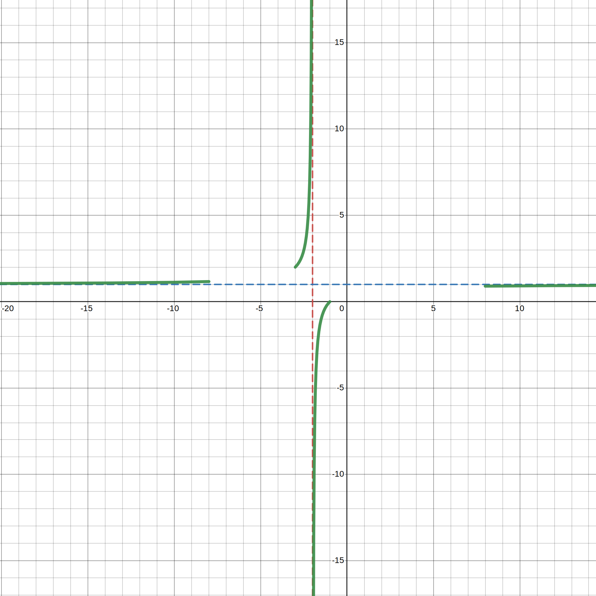
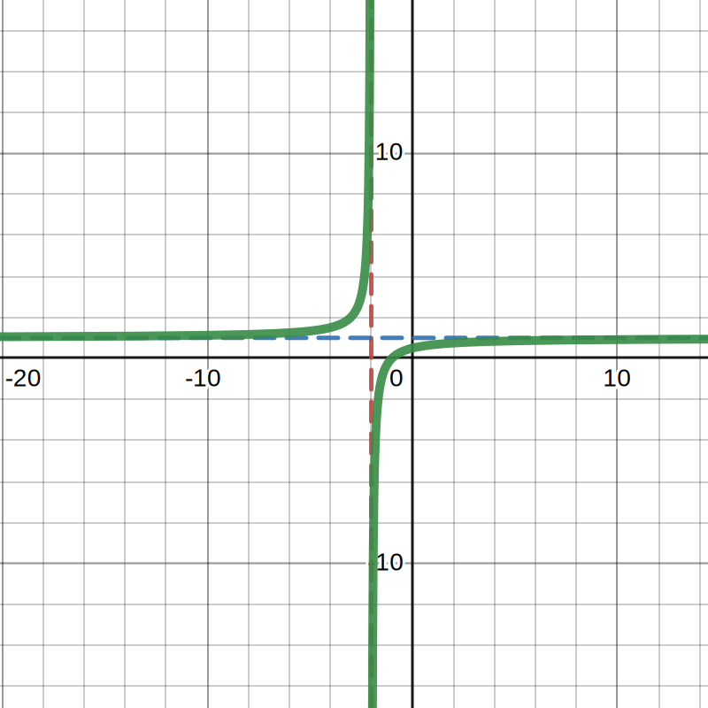
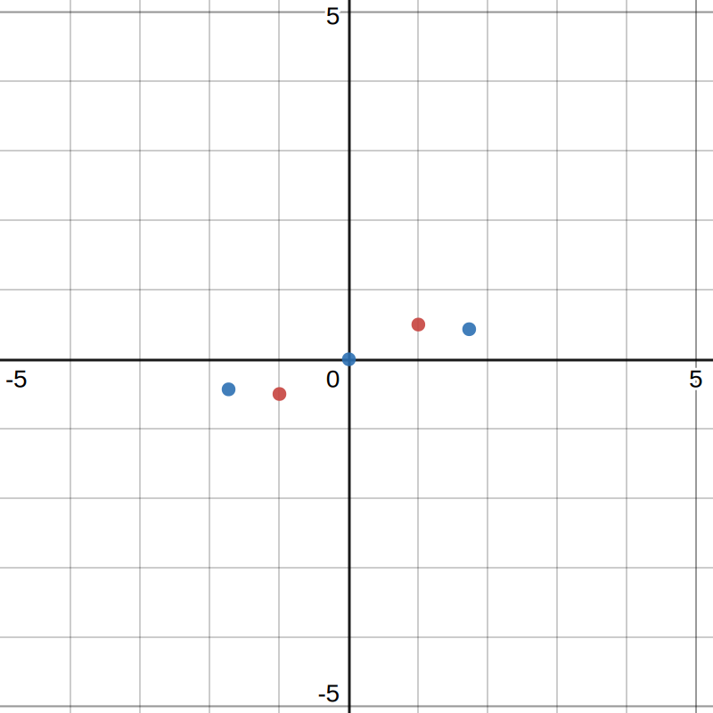
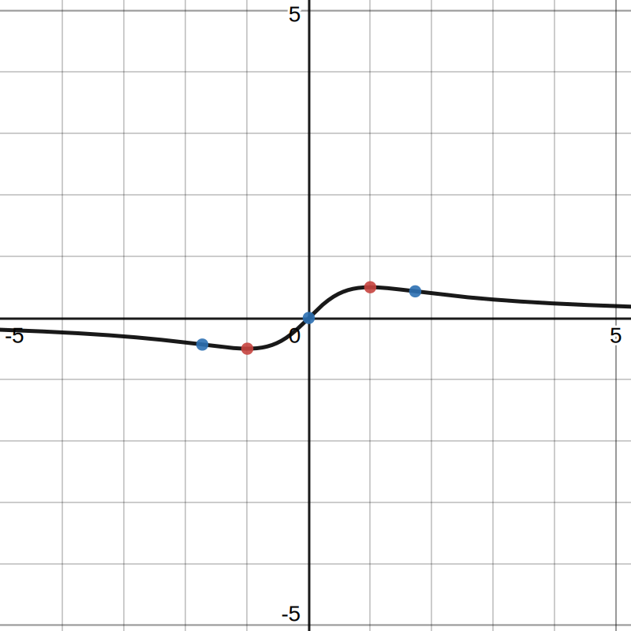
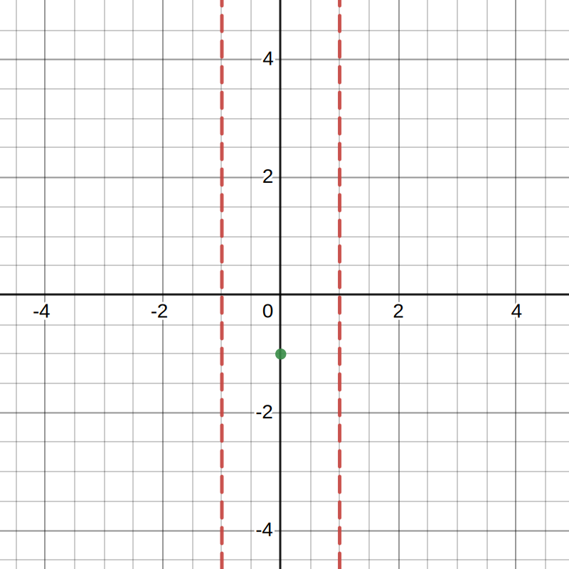
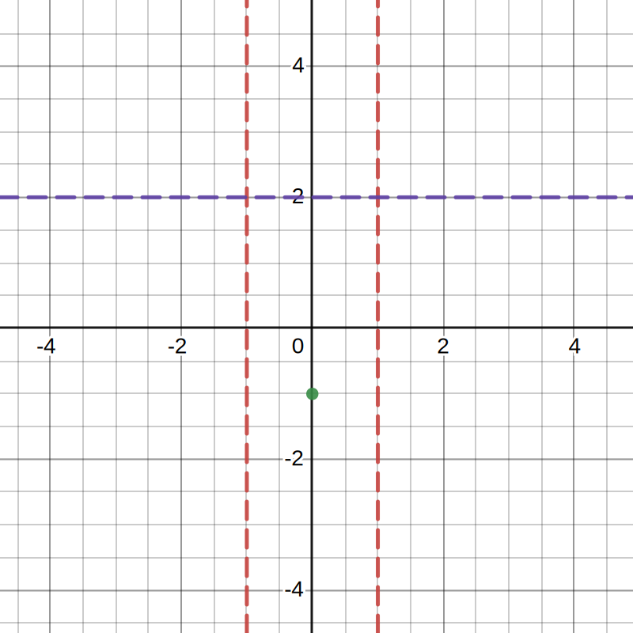
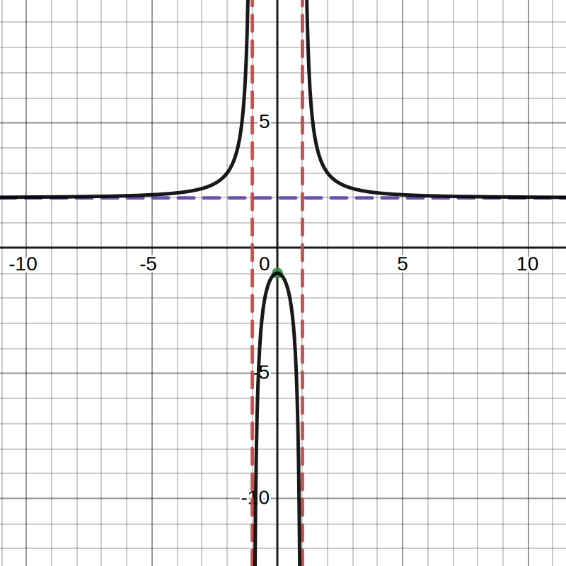

- ## 📝Definition
	- Asymptotics is the calculus of approximations. It is used to solve hard problems that cannot be solved exactly and to provide simpler forms of complicated results, from early results like Taylor's and Stirling's formulas to the prime number theorem. It is extensively used in areas such as number theory, combinatorics, numerical analysis, analysis of algorithms, probability and statistics, special functions and modern physics.
- ## ✒Descriptive Strategy
	- To do an asymptotic, here is a general strategy
		- Plot
			- discontinuities (especially infinite ones)
			- end points (or $x\to\pm\infty$)
			- easy points ($x=0$, or $y=0$) (This is optional.)
		- Plot critical points and values. (Solve $f'(x)=0$ or undefined.)
		- Decide whether $f'<0$ or $f'>0$ on each interval between endpoints, critical points, and discontinuities. (Valuable double check)
		- Identify where $f''<0$ and $f''>0$ (concave down and concave up).
		- Identify inflection points. (Makes graph look nice. Can be used to double check.)
		- Combine into graph.
- ## 🗃Example
  Example is the most straightforward way to understand a mathematical concept.
	- 📌Example to do an asymptotics(1)
	  id:: 63076a15-0dee-48d0-9112-fe2b1af3d855
		- Question:
			- Sketch the function $f(x)=\frac{x+1}{x+2}$
		- Solution:
			- test a value when $x=0$, and we have $(0, 1)$
			- then calculate the derivative
			- $f'(x)=\frac{1}{(x+2)^2}$
			- ⚠most students can be trapped in this step when they leave it the fact that
			  collapsed:: true
				- $f'(x)=\frac{1}{(x+2)^2}\neq 0$
				- so what do we want to do? 🤔
			- Please be aware [[Critical Point]] is not just $f'=0$ but also the point [[DNE]]
			- We knew at $x=-2$, $f$ is DNE.
			- In here, we introduce the concept [[just to the left]] and [[just to the right]] of the $x=-2$
			  collapsed:: true
				- $f(-2^+)=\frac{-2+1}{-2^++2}=\frac{-1}{0^+}=-\infty$
				- $f(-2^-)=\frac{-2+1}{-2^-+2}=\frac{-1}{0^-}=\infty$
			- We also are interested in the extrema cases:
			  collapsed:: true
				- $\infty$
				- $-\infty$
			- from $f(x)=\frac{x+1}{x+2}$ we know
			  collapsed:: true
				- $f(x)=\frac{x+1}{x+2}=\frac{1+\frac{1}{x}}{1+\frac{2}{x}}$
				- as $x\to\pm\infty$, the result is $1$.
			- We can draw the [[Asymptote]] first. But we are not sure if the function is going to maybe dip below and come back up or not.🤔
			- {:height 316, :width 297}
			- Let's go up and see that $f'\neq0$ and therefore $f$ has no critical point except $x=-2$. Finally we can draw the function without any concern.
			- {:height 316, :width 297}
	- 📌Example to do an asymptotics(2)
		- Question:
			- Sketch the function $f(x)=\frac{x}{1+x^2}$
		- Solution:
			- Calculate the first and second derivative
				- $f'(x)=\frac{1-x^2}{(1+x^2)^2}$
				- $f''(x)=\frac{2x^3-6x}{(1+x^2)^3}$
			- From the first derivative, we know that
				- the [[Critical Point]]s are:
					- $x=-1, f'(-1)=0$
					- $x=1, f'(1)=0$
			- From the second derivative, we know that
				- the denominator can never that 0 or DNE
				- the numerator could be 0 as $2x^3-6x=2x(x^2-3)$, then we know the [[Inflection Point]]s are:
					- $x=0$
					- $x=-\sqrt{3}$
					- $x=\sqrt{3}$
			- we can have easy points and in this case we have
				- $x=0, y=0$
			- Plug all the critical points and inflection points on the graph
				- {:height 303, :width 282}
			- Decide the local extrema by second derivative
				- $f''(-1)=0.5$, the curve concaves up here, and $x=-1$ is [[Local Minimum]]
				- $f''(1)=-0.5$, the curve concaves down here, and $x=1$ is [[Local Maximum]]
			- Mark the end points by using [[L'Hôpital's Rule]]
				- $$
				  \lim_{x\to\pm\infty}f(x)=\frac{x}{1+x^2}=\frac{1}{2x}
				  $$
				- Then we know the end points
					- when $x\to-\infty$, then $f(x)\to0$
					- when $x\to\infty$, then $f(x)\to0$
			- Finally we are happy to sketch this!
				- {:height 303, :width 282}
	- 📌Example to do an asymptotics(3)
		- Question:
			- Sketch the function $f(x)=\frac{2x^2+1}{x^2-1}$
		- Solution:
			- Calculate the first and second derivative
				- $f'(x)=\frac{-6x}{(x^2-1)^2}$
				- $f''(x)=\frac{6(3x^2+1)}{(x^2-1)^3}$
			- From the first derivative, we know that
				- the [[Critical Point]]s are:
					- $x=0, f'(0)=0$
					- $x=-1, f'(-1)$ is [[DNE]]
					- $x=1, f'(1)$ is [[DNE]]
				- so we can compute the limit
					- $$
					  \begin{align}
					  f(1^+)&=\frac{2+1}{(1^+-1)(1+1)}=\frac{3}{0^+\cdot2}\to\infty\\
					  f(1^-)&=\frac{3}{0^-\cdot2}\to-\infty\\
					  f(-1^+)&=\frac{3}{0^+\cdot-2}\to-\infty\\
					  f(-1^-)&=\frac{3}{0^-\cdot-2}\to\infty\\
					  \end{align}
					  $$
				- then we can draw the critical point and 2 vertical asymptotes
					- {:height 303, :width 282}
			- Next wee look at the end points
				- $$
				  f(x)=\frac{2x^2+1}{x^2-1}=\frac{2+1/x^2}{1-1/x^2}\xrightarrow{x\to\pm\infty}2
				  $$
				- we can update with a horizontal
				  {:height 303, :width 282}
			- From the second derivative, we know that
				- the denominator can never be 0, so that no inflection point
				- we can identify the concavity:
					- $-\infty<x<-1, f''>0$ concave up
					- $-1<x<1, f''<0$ concave down
					- $1<x<\infty, f''>0$ concave up
			- Plug all the critical points and inflection points on the graph
				- {:height 303, :width 282}