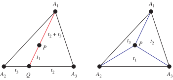
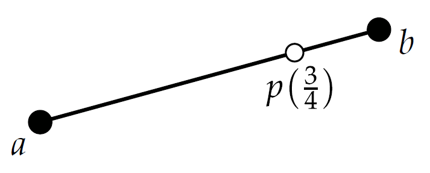
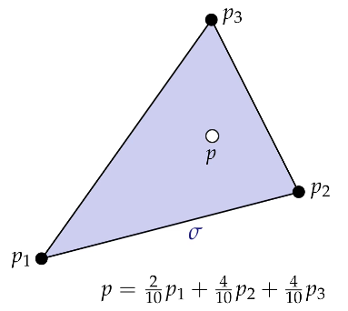

- 📝Definition
    - Barycentric coordinates are **triples** of numbers ($t_1,t_2,t_3$) corresponding to masses placed at the [[vertices]] of a reference triangle $\Delta A_1A_2 A_3$. These masses then determine a point $P$, which is the ==geometric centroid== of the three masses and is identified with coordinates ($t_1,t_2,t_3$). The vertices of the triangle are given by $(1,0,0), (0,1,0)$, and $(0,0,1)$.
    - A **barycentric coordinate system** is a coordinate system in which **the location of a point** is **specified** by **reference** to a [[Simplex]] (a triangle for points in a plane, a tetrahedron四面体 for points in three-dimensional space, etc.). The barycentric coordinates of a point can be interpreted as **masses** placed at the vertices of the simplex, such that the point is the center of mass (or **barycenter**) of these masses.
    
- 💫Operation
    - 📌Find the barycentric coordinates for an arbitrary point $P$
        - 📈Diagram
            - {:height 200, :width 400}
            
        - ✏Solution
            - find $t_2$ and $t_3$ from the point Q at the intersection of the line $A_1P$ with the side $A_2A_3$
            - determine $t_1$ as the mass at $A_1$ that will balance a mass $t_2$+$t_3$ at $Q$
            - thus making $P$ the centroid (left figure).
            
        - 📝Note: Furthermore, the areas of the triangles $\Delta A_1A_2 P, \Delta A_1A_3 P$, and $\Delta A_2A_3P$ are ==proportional== to the barycentric coordinates $t_3, t_2$, and $t_1$ of $P$
        
# 🗃Example
- 📌**Barycentric Coordinates Example:  1-simplex** ^79cf4ca6f13358e9
    - *1-simplex* is comprised of all **weighted** combinations of the two points where the weights sum to **1**：
        - $$
          p(t) = (1-t)a + tb, t\in[0,1]
          $$
        - {:height 89, :width 200}
        
    - Why $a\times(1-t)$ rather than $t$ ? Easy to comprehend, e.g. $t=\frac{3}{4}, p$ inclines to the right, hence the **weight** of $a$ (left) should be small, vice versa.
    
- 📌**Barycentric Coordinates Example:  k-simplex** ^61be35eb121706b7
    - Any point $p$ in a $k$-simplex $\sigma$ can be expressed as a (**non-negative**) weighted combination of the vertices, where the weights sum to **1**. The weights $t_i$ are called *barycentric coordinates*.
        - $$
          \sigma = \Bigg\{\sum_{i=0}^kt_ip_i\Bigg|\sum_{i=0}^kt_i=1,t_i\geq0\forall i\Bigg\}
          $$
        - {:height 200, :width 200}
        
    - This is also known as [[Convex Combination]] which defined as a [[linear combination]] of points (which can be vectors, scalars, or more generally **points in an affine space**) where all coefficients are **non-negative** and sum to **1**.
    