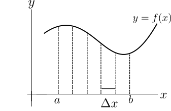
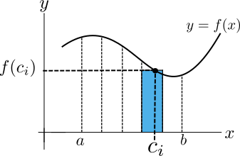
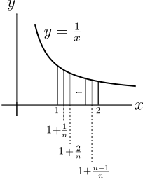

# Riemann Hypothesis
- 📝Definition
    - The function
        - $$
          Li(x)=\int _{2}^{x} \frac{dt}{\ln (t)}
          $$
        
    - approximates the number of [[Prime Number]]s smaller than $x$ and is related to what is known as the Riemann Hypothesis.
    
# Riemann sums
## 🎯Intent
- [[Limit]] of sums can be very hard to evaluate. Recognizing a limit of sums as the limit of a Riemann sum allows us to evaluate the limit as the [[definite integral]] .

## 📝Definition
- Let us summarize in precise terms the steps for evaluating the following using a Riemann Sum.
$$
\int_{a}^{b}f(x)dx
$$
-
- 1️⃣Divide $[a,b]$ into $n$ equal subintervals.
    - {:height 200, :width 200}
    - Then each interval is of length
        - $$
          \Delta x=\frac{b-a}{n}
          $$
        
    - Let the $i^{th}$ subinterval be the base of $i^{th}$ rectangle.
    
- 2️⃣Choose a point $c_i$ within the $i^{th}$ subinterval. Choose $f(c_i)$ be the height of the $i^{th}$ rectangle.
    - {:height 300, :width 300}
    
- 3️⃣Add up the areas of the $n$ rectangles. The total area of $n$ rectangles is:
    - $$
      \underbrace{f(c_1)}_\text {height}\,  \underbrace{\Delta x}_\text {base} +\underbrace{f(c_2)}_\text {height} \, \underbrace{\Delta x}_\text {base}+\cdots + \underbrace{f(c_n)}_\text {height} \underbrace{\Delta x}_\text {base} \  =\   \sum _{i=1}^{n} f(c_i) \Delta x
      $$
    
- 4️⃣Take the limit as the rectangles become infinitesimally thin, ($\Delta x\to0$, or equivalent $n\to\infty$). This limit is the actual area under the curve between $a$ and $b$.
    - $$
      \lim _{n\rightarrow \infty }\,  \sum _{i=1}^{n} \, f(c_i) \Delta x\  =\  \int _a^b f(x) \, dx
      $$
    
- The sum of the areas of the $n$ rectangles,
$$
\sum _{i=1}^{n} f(c_i) \Delta x
$$
- is called a Riemann Sum.

## 🗃Example
### Examples of converting Riemann Sum and Definite Integral
- 📌Example 1
    - 🤔Question:
        - Consider the right Riemann sum
            - $$
              \sum _{i=1}^{n} \frac{2}{n} \left(-1+\frac{2i}{n}\right)^3
              $$
            
        - Express the limit
            - $$
              \lim _{n\rightarrow \infty } \sum _{i=1}^{n} \frac{2}{n} \left(-1+\frac{2i}{n}\right)^3
              $$
            
        - as a definite integral.
        
    - 🏹Strategy:
        - Remind the form of definite integral
            - $$
              \int_a^b f(x)dx
              $$
            
        - Identify the components we want to find
            - $dx$ which can be also see it as $\Delta x$
            - $f(x)$ the function of $x$
            - $a$ the lower limit
            - $b$ the upper limit
            
    - ✏Solution:
        - 1️⃣identify the pattern $f(x)dx$
            - We want to write this sum in terms of a multiple ${\color{orange}{\Delta x}}$ that is independent of the index $i$ and a function ${\color{blue}{f(x)}}$ which should contain all of the terms involving the index $i$. In our case
                - $$
                  {\color{orange}{\frac{2}{n}}}  {\color{blue}{\left(-1+\frac{2i}{n}\right)^3}}  = {\color{orange}{\Delta x}} {\color{blue}{ f(x)}}
                  $$
                
        - 2️⃣identify the range
            - At this stage what do we know? Since $\Delta x=2/n$, the width of each rectangle is $2/n$ and we are summing over  rectangles. Therefore the total length of the interval we are summing over is $n\cdot2/n=2$.
            
        - 3️⃣identify the function $f(x)$
            - To determine the upper and lower limit of the definite integral, first we need to figure out what our function is. In this case it seems that
                - $$
                  \left(-1+\frac{2i}{n}\right)^3 = f(-1+\frac{2i}{n}) = f(x) = x^3
                  $$
                
        - 4️⃣identify the lower and upper limits
            - so our function is that we are integrating is $f(x)=x^3$, and our expression for $x$ is $x=-1 +2i/n$.
            - Therefore, plug in
                - $i=1$
                - $i=n$
                
            - We can have our lower and upper limits as
                - lower limit: $x=-1+2\cdot1/n=-1+\frac{2}{n}$. Since $n\to\infty$, we have $x=-1$
                - upper limit: $x=-1+2\cdot n/n=-1+\frac{2}{1}=1$, we have $x=1$
                
        - 5️⃣Result
            - Therefore the limit of this sum represents the definite integral
            - $$
              \int _{-1}^{1} x^3 \,  dx \,  .
              $$
            
- 📌Example 2
    - 🤔Question:
        - Recognizing Riemann Sums
            - $$
              \displaystyle \int _1^2 \frac{1}{x}\, dx=?
              $$
            
    - 🏹Strategy
        - 1️⃣Think about what the definite integral should be
            - {:height 200, :width 200}
            - To evaluate $\displaystyle \int _1^2 \frac{1}{x}\, dx$ using a Riemann sum, we divide $[1,2]$ into $n$ subintervals of length $\frac{1}{n}$.
            - The $i^{th}$ subinterval is $\displaystyle \left[1+\frac{i-1}{n},1+\frac{i}{n}\right]$
            
        - 2️⃣Identify the format of Riemann sum
            - By definition
                - $$
                  \displaystyle \int _1^2 \frac{1}{x}\, dx \, =\, \lim _{n\rightarrow \infty } \sum _{i=1}^n \frac{1}{n} \frac{1}{c_i} \,
                  $$
                - where $c_i$ is in $\displaystyle [1+\frac{i-1}{n}, 1+\frac{i}{n}]$
                
            - We will now rewrite all the given choices in this form by factoring out $\frac{1}{n}$ in the summands, and then compare with the formula above for the Riemann Sum.
            
    - ✏Solution
        - ❌
          $$
          \lim _{n\rightarrow \infty } \sum _{i=1}^{n} \frac{1}{i}
          $$
        - ✅
          $$
          \displaystyle \lim _{n\rightarrow \infty } \sum _{i=1}^n \frac{1}{n+i}
          $$
            - Reformat the preceding notation
                - $$
                  \displaystyle \lim _{n\rightarrow \infty } \sum _{i=1}^n \frac{1}{n+i}=\displaystyle  \lim _{n\rightarrow \infty } \sum _{i=1}^n \frac{1}{n} \,  \frac{1}{1+\frac{i}{n}}
                  $$
                
            - Identify the Riemann sum format
                - This is the **==Right Riemann sum==** of $\displaystyle \int _1^2 \frac{1}{x}\, dx$, that is, $\displaystyle c_i=1+\frac{i}{n}$ for each $i$.
                
        - ✅
            - $$
              \displaystyle \lim _{n\rightarrow \infty } \sum _{i=0}^{n-1} \frac{1}{n+i}
              $$
            - $$
              \displaystyle \lim _{n\rightarrow \infty } \sum _{i=1}^{n} \frac{1}{n+i-1}
              $$
            - Notice that these sums differ only in the indexing of the terms but are equal, so their limits are also equal.
                - $$
                  \begin{align}
                  \displaystyle \sum _{i=0}^{n-1} \frac{1}{n+i}&=\displaystyle \sum _{i=1}^{n} \frac{1}{n+i-1}\\
                  \displaystyle \lim _{n\rightarrow \infty }\sum _{i=0}^{n-1} \frac{1}{n+i}&=\displaystyle \lim _{n\rightarrow \infty }\sum _{i=1}^{n} \frac{1}{n+i-1}.
                  \end{align}
                  $$
                
            - Let us rewrite the second limit.
                - $$
                  \displaystyle  \displaystyle \lim _{n\rightarrow \infty }\sum _{i=1}^{n} \frac{1}{n+i-1}
                  =\displaystyle  \lim _{n\rightarrow \infty } \sum _{i=1}^{n} \frac{1}{n} \,  \frac{1}{1+\frac{i-1}{n}}
                  $$
                
            - This is the ==**Left Riemann sum**== of $\displaystyle \int _1^2 \frac{1}{x}\, dx$, that is, $\displaystyle c_i=1+\frac{i-1}{n}$, the left endpoint of the $i^{th}$ subinterval.
            
        - ❌
          $$
          \displaystyle \lim _{n\rightarrow \infty } \sum _{i=1}^{n} \frac{n}{n+i}
          $$
        - ❌
          $$
          \displaystyle \lim _{n\rightarrow \infty } \sum _{i=1}^{n} \frac{n}{i}
          $$
        - ✅
          $$
          \displaystyle \lim _{n\rightarrow \infty } \sum _{i=0}^{n-1} \frac{2}{2n+1+2i}
          $$
            - Let's first reformat
                - $$
                  \lim _{n\rightarrow \infty } \sum _{i=0}^{n-1} \frac{2}{2n+1+2i}=\displaystyle  \lim _{n\rightarrow \infty } \sum _{i=0}^{n-1} \frac{1}{n} \,  \frac{1}{\left(1+\frac{1}{2n}+\frac{i}{n}\right)}
                  $$
                
            - This is the ==**Mid Riemann sum**== of $\displaystyle \int _1^2 \frac{1}{x}\, dx$, that is, $\displaystyle c_i=1+\frac{1}{2}\left(\frac{1}{n}\right)+\frac{i}{n}$, the midpoint of the $i^{th}$ subinterval.
            
- 📌Example 3
    - 🤔Question
        - Rewrite the following limit as a definite integral.
            - $$
              \displaystyle \lim _{k \rightarrow \infty } \sum _{n=1}^{k} \frac{1}{k} \frac{n^2+3nk+9k^2 \sin (n/k)}{k^2}=
              $$
            
    - ✏Solution
        - $$
          \begin{align}
          \displaystyle  \displaystyle \lim _{k \rightarrow \infty } \sum _{n=1}^{k} \frac{n^2+3nk+9k^2 \sin (n/k)}{k^3}&=\displaystyle  \lim _{k \rightarrow \infty } \sum _{n=1}^{k} \frac{1}{k} \cdot \left( \left(\frac{n}{k}\right)^2+3\frac{n}{k}+9 \sin \left(\frac{n}{k}\right)\right)
          \end{align}
          $$
        - This is the right Riemann sum of $\displaystyle \int _{0}^{1} \left(x^2+3x+9\sin (x)\right)\, dx$.
        
- 📌Evaluate the following limit by relating it to a Riemann sum.
    - 💬Question
        - $$
          \lim _{n\to \infty } \frac{\sin \left(\frac{b}{n}\right) + \sin \left(\frac{2b}{n}\right) + \cdots +\sin \left(\frac{(n-1)b}{n}\right)+ \sin (b)}n\  =\, \,?
          $$
        
    - 🏹Strategy: Identify the sum of $n$ share of $\frac{1}{n}$ is actually $\int_0^1$.
    - ✏Solution
        - The limit is of the right Riemann sum for the integral.
        - $$
          \left.\int _0^1 \sin (bx)\,  dx\  =\  -\frac{1}{b}\cos (bx)\, \right|_{0}^1\  =\  \frac{1 -\cos (b)}{b}.
          $$
        
## 🏷(Sub)Categories
### left Riemann Sum
- If we pick $c_i$ to be the left endpoint of the $i^{th}$ subinterval, the Riemann sum is called a left Riemann Sum.

### right Riemann Sum
- Similarly, if $c_i$ is the right endpoint of the $i^{th}$ interval, the Riemann sum is called a right Riemann sum.

- ==⚠Note:==
    - However, in the limit $n\to\infty$ (so that $\Delta x\to0$), this distinction is no longer needed. The limit of any Riemann Sum, no matter what the $c_i$'s within the subinterval are, is equal to the exact area under the curve.
    