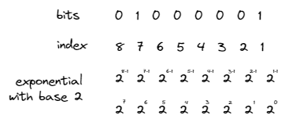
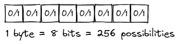

# 📝Definition
Bit is the basic unit of information in a computer. A bit can have the value 0 or the value 1. Conventionally, 
- 0 is `false`
- 1 is `true`

# 🎯Intent
The state `0` and `1` which are two digits used in the binary number system on which computer arithmetic is based.

# 🧠Intuition
Find an intuitive way of explanation of this concept.
- The meaning of bits in memory is completely **dependent** on the [[type]] used to access it. Think of it this way: computer memory doesn’t know about our types; it’s just memory. The bits of memory get meaning only when we decide how that memory is to be interpreted.
- What does `12.5` mean? We don’t know. It could be `$12.5` or `12.5cm` or `12.5gallons`. Only when we supply the unit does the notation `12.5` mean anything.

# 🚀Benefit / Pros
Good for machine code.

# 🕳Pitfalls / Cons
Binary numbers are **cumbersome**, mostly because they tend to be so long.

# 🗃Example  
Example is the most straightforward way to understand a mathematical concept.
- 📌Example of interpretation of bits in memory
    - Short review. As addressed in the definition, bit is merely bit. It is meaningful only until we think of it with type.
    - Question. What is `01000001` in terms of `char`?
        - Convert the bits to decimal.
          {:height 500, :width 500}
        - Therefore it is $2^6\times1+2^0\times1=65$
        - In light of [[ASCII Character Codes|ASCII Table]], `01000001` is character `A`.
        

# 🧬Related Elements
The stuffs are closed related to bit.
- 📌 Bit and [[byte]] Conversion
    - 
    - Since one bit is either `0` or `1` so therefore 8 bits have $2^8=256$ possibilities.
   

# 🥼Expert's Advice
- Gottfried Wilhelm Leibniz (1646-1716), one of the greatest intellects of his time, was fond of the dyadic system. To quote Laplace: “Leibniz saw in his binary arithmetic the image of creation. He imagined that Unity represented God, and zero the void; that the Supreme Being drew all beings from the void, just as unity and zero express all numbers in his system of numeration.”

# 💫 Operation
## Two's complement
### 📝Definition
Two's complement is an  operation to convert a **positive** binary number into a **negative** binary number.
### 🏹Strategy
There are ==3== strategies of two's complement.
#### From the ones' complement
The steps are:
-  1️⃣inverting (i.e. flipping) all bits
- 2️⃣adding a place value of 1 to the inverted number.
#### Subtraction from $2^N$
To represent a negative value, you subtract its absolute value from $2^N$, where $N$ is the number of bits used in the representation.

### 🗃Example
#### Example using "from the one's complement"
Use 1 byte(=8 bits) the decimal number ==5== as example.
- The decimal number 5 in binary form is
	- $0000\space0101_2$
- The most significant bit (the ==leftmost== bit in this case) is 0, so the pattern represents a **non-negative** value.
- Let's first invert them.(that is: 0 becomes 1 and 1 becomes 0)
	- $1111\space1010_2$ 
- Finally, add 1 to it
	- $1111\space1011_2$
The result is a **signed** binary number representing the decimal value −5 in two's complement form. The most significant bit is 1, so the value represented is negative.

> [!NOTE] Notes
> The operation "invert every bits" is so-called [[bitwise operation]]. While in this case, it is bitwise NOT.

#### Example using subtraction from $2^N$
To find the 4-bit representation of −5.
- We have
	- $x = 5_{10}$,  therefore $x = 0101_2$
- From that we know $N=4$
	- Convert to base-2, then subtract
		- $$\begin{align}x^*&=2^{N}-x\\&=2^4-5_{10}\\&=16_{10}-5_{10}\\&=10000_2 − 0101_2 \\&= 1011_2\end{align}$$
	- Subtract, then convert to base-2
		- $$\begin{align}x^*&=2^N-x\\&=2^4-5_{10}\\&=11_{10}\\&=1011_{2}\end{align}$$

