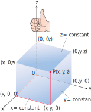

https://mathworld.wolfram.com/CartesianCoordinates.html

# 📝Definition

# 📈Diagram

The Cartesian coordinate system is right-handed.

# 🧠Intuition
Find an intuitive way of understanding this concept.

# 🧪Composition
## 🧫[[octant]]

⚗
🔬
💉

# 🗃Example
- 📁few equations better understand the space
	- $z\geq0$
		- The half-space consisting of the points on and above the $xy$-plane.
	- $x = -3$
		- The plane perpendicular to the $x$-axis at $x = -3$. This plane lies parallel to the $yz$-plane and 3 units behind it.
	- $z=0, x\leq0, y\geq0$
		- The second [[quadrant]] of the $xy$-plane.
	- $x\geq0, y\geq0, z\geq0$
		- The first [[octant]].
	- $-1\leq y\leq1$
		- The slab between the planes $y = -1$ and $y = 1$ (planes included).
	- $y = -2, z = 2$
		- The line in which the planes $y = -2$ and $z = 2$ intersect. Alternatively, the line through the point $(0, -2, 2)$ parallel to the $x$-axis.

📩
🗂
📨
📂

# 🌱Related Elements
The closest pattern to current one, what are their differences?

# 🍂Unorganized