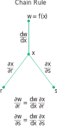

# 📝Definition
## single variable
If $w=f(x)$ is [[differentiable]] at the point $x$ and $x=g(t)$ is differentiable at the point $t$, then the composite function $w=f\circ g$ is differentiable at $t$. Furthermore, let $w=f(g(t))$ and $x=g(t)$, then
$$
{dw\over dt}={dw\over dx}\cdot{dx\over dt} 
$$
> [!info] Remark
> For this composite function $w(t) = f(g(t))$, we can think of
> - $t$ as the *independent variable*,
> - $x = g(t)$ as the “*intermediate variable*”, because $t$ determines the value of $x$ which in turn gives the value of $w$ from the function $f$.
> 

## general
The "general" chain rule applies to two sets of functions
$$
\begin{align}
y_1&=f_1(u_1,\dots,u_p)\\
&\vdots\\
y_m&=f_m(u_1,\dots,u_p)\\
\end{align}
$$
and
$$
\begin{align}
u_1&=g_1(x_1,\dots,x_n)\\
&\vdots\\
u_p&=g_p(x_1,\dots,x_n)\\
\end{align}
$$

Defining the $m\times n$ [[Jacobi rotation matrix]] by
$$
\left(\frac{\partial y_i}{\partial x_j}\right)=
\begin{bmatrix}{
\partial y_1\over\partial x_1}&{\partial y_1\over\partial x_2}&\cdots&{\partial y_1\over\partial x_n}\\
\vdots&\vdots&\ddots&\vdots\\
{\partial y_m\over\partial x_1}&{\partial y_m\over\partial x_2}&\cdots&{\partial y_m\over\partial x_n}
\end{bmatrix},
$$
and similarly for $(\partial y_i/\partial u_j)$ and $(\partial u_i/\partial x_j)$, then gives
$$
\left({\partial y_i\over\partial x_j}\right)=\left({\partial y_i\over\partial u_i}\right)\left({\partial u_i\over\partial x_j}\right),
$$
In differential form, this becomes
$$
dy_1=\left({\partial y_1\over\partial u_1}{\partial u_1\over\partial x_1}+\cdots+{\partial y_1\over\partial u_p}{\partial u_p\over\partial x_1}\right)dx_1+\left({\partial y_1\over\partial u_1}{\partial u_1\over\partial x_2}+\cdots+{\partial y_1\over\partial u_p}{\partial u_p\over\partial x_2}\right)dx_2+\cdots
$$

## 1 independent variable and 2 intermediate variables
If $w = f(x, y)$ is differentiable and if $x = x(t), y = y(t)$ are differentiable functions of $t$, then the composite $w = f(x(t), y(t))$ is a differentiable function of $t$ and
$$
\frac{dw}{dt}=f_x(x(t),y(t))\cdot x'(t)+f_y(x(t),y(t))\cdot y'(t)
$$
or
$$
\frac{dw}{dt}=\frac{\partial f}{\partial x}\frac{dx}{dt}+\frac{\partial f}{\partial y}\frac{dy}{dt}.
$$
> [!info] Remark
> Actually, there is a slightly different notion of $w$ on the left hand side and on the right hand side.
> 
> Speaking of *semantic*,
> - On the left, $w$ indicates the composite function $w = f(x(t), y(t))$ as a function of the single variable $t$.
> - On the right, $w$ indicates the function $w = f(x, y)$ as a function of the two variables $x$ and $y$.
> 
> Speaking of *computation*,
> - the single derivatives $dw/dt, dx/dt, dy/dt$ are being evaluated at a point $t_0$.
> - the partial derivatives $\partial w/\partial x$ and $\partial w/\partial y$ are being evaluated at the point $(x_0 , y_0)$, with $x_0 = x(t_0)$ and $y_0 = y(t_0)$.

> [!example]
> Example refers to [[Chain Rule#^732eac]]

## 1 independent variable and 3 intermediate variables
If $w = f(x, y, z)$ is differentiable and $x, y, z$ are differentiable functions of $t$, then $w$ is a differentiable function of $t$ and
$$
\frac{dw}{dt}=\frac{\partial f}{\partial x}\frac{dx}{dt}+\frac{\partial f}{\partial y}\frac{dy}{dt}+\frac{\partial f}{\partial z}\frac{dz}{dt}.
$$

> [!example]
> Example refers to [[Chain Rule#^ac8c10]]

## 2 independent variables and 3 intermediate variables
Suppose that $w = f(x, y, z), x = g(r, s), y = h(r, s), z = k(r, s)$. If all 4 functions are differentiable, then $w$ has [[partial derivative]]s with respect to $r$ and $s$, given by the formulas
$$
\begin{align}
\frac{\partial w}{\partial r}=\frac{\partial w}{\partial x}\frac{\partial x}{\partial r}+\frac{\partial w}{\partial y}\frac{\partial y}{\partial r}+\frac{\partial w}{\partial z}\frac{\partial z}{\partial r}
\\
\frac{\partial w}{\partial s}=\frac{\partial w}{\partial x}\frac{\partial x}{\partial s}+\frac{\partial w}{\partial y}\frac{\partial y}{\partial s}+\frac{\partial w}{\partial z}\frac{\partial z}{\partial s}.
\end{align}
$$

> [!example]
> Example refers to [[Chain Rule#^69c57c]]

## 2 independent variables and 2 intermediate variables
If $w = f(x, y), x = g(r, s), y = h(r, s)$, then
$$
\begin{align}
\frac{\partial w}{\partial r}=\frac{\partial w}{\partial x}\frac{\partial x}{\partial r}+\frac{\partial w}{\partial y}\frac{\partial y}{\partial r}
\\
\frac{\partial w}{\partial s}=\frac{\partial w}{\partial x}\frac{\partial x}{\partial s}+\frac{\partial w}{\partial y}\frac{\partial y}{\partial s}.
\end{align}
$$

> [!example]
> Example refers to [[Chain Rule#^f74ba8]]

## 2 independent variables and 1 intermediate variable
If $w = f(x)$ and $x = g(r, s)$, then
$$
\begin{align}
\frac{\partial w}{\partial r}&=\frac{d w}{d x}\frac{\partial x}{\partial r}
\\
\frac{\partial w}{\partial s}&=\frac{d w}{d x}\frac{\partial x}{\partial s}.
\end{align}
$$

# 🧠Intuition
Find an intuitive way of understanding this concept.

# 🗃Example
- 📁Chain Rule 1 independent variable and 2 intermediate variables example ^732eac
	- 💬Question: Use the Chain Rule to find the derivative of $w=xy$ with respect to $t$ along the path $x = \cos t, y = \sin t$. What is the derivative’s value at $t = \pi/2$?
	- ✏Solution:
		- Recall what is the equation for Chain Rule.
			- $$\frac{dw}{dt}=\frac{\partial f}{\partial x}\frac{dx}{dt}+\frac{\partial f}{\partial y}\frac{dy}{dt}.$$
		- $$\begin{align}\frac{dw}{dt}&=\frac{\partial f}{\partial x}\frac{dx}{dt}+\frac{\partial f}{\partial y}\frac{dy}{dt}\\&=\frac{\partial(xy)}{\partial x}\frac{d}{dt}(\cos t)+\frac{\partial(xy)}{\partial y}\frac{d}{dt}(\sin t)\\&=(y)(-\sin t)+(x)(\cos t)\\&=-\sin^2t+\cos^2t=\cos2t\end{align}$$
		- In either case, at the given value of $t=\frac{\pi}{2}$,
			- $$\left(\frac{dw}{dt}\right)_{t=\pi/2}=\cos(2\cdot\frac{\pi}{2})=-1$$

- 📁Chain Rule 1 independent variable and 3 intermediate variables example ^ac8c10
	- 💬Question: Find $dw/ dt$ if
		- $$w = xy + z,\quad x = \cos t,\quad y = \sin t,\quad z = t.$$
	- ✏Solution:
		- Recall the equation.
			- $$\frac{dw}{dt}=\frac{\partial f}{\partial x}\frac{dx}{dt}+\frac{\partial f}{\partial y}\frac{dy}{dt}+\frac{\partial f}{\partial z}\frac{dz}{dt}.$$
		- Do the calculation.
			- $$\begin{align}\frac{dw}{dt}&=\frac{\partial f}{\partial x}\frac{dx}{dt}+\frac{\partial f}{\partial y}\frac{dy}{dt}+\frac{\partial f}{\partial z}\frac{dz}{dt}\\&=(y)(-\sin t)+(x)(\cos t)+(1)(1)\\&=(\sin t)(-\sin t)+(\cos t)(\cos t)+(1)(1)\\&=-\sin^2t+\cos^2t+1=1+\cos2t\end{align}$$
			- $\left(\frac{dw}{dt}\right)_{t=0}=1+\cos(0)=2$

- 📁Chain Rule 2 independent variables and 3 intermediate variables example ^69c57c
	- 💬Question: Express $\partial w/\partial r$ and $\partial w/\partial s$ in terms of $r$ and $s$ if
		- $$w = x + 2y + z^2,\quad x = {r\over s} ,\quad y = r^2 + \ln s,\quad z = 2r.$$
	- ✏Solution:
		- Recall the equation.
			- $$\begin{align}\frac{\partial w}{\partial r}&=\frac{\partial w}{\partial x}\frac{\partial x}{\partial r}+\frac{\partial w}{\partial y}\frac{\partial y}{\partial r}+\frac{\partial w}{\partial z}\frac{\partial z}{\partial r}\\&=(1)({1\over s})+(2)(2r)+(2z)(2)\\&={1\over s}+12r\end{align}$$
			- $$\begin{align}\frac{\partial w}{\partial s}&=\frac{\partial w}{\partial x}\frac{\partial x}{\partial s}+\frac{\partial w}{\partial y}\frac{\partial y}{\partial s}+\frac{\partial w}{\partial z}\frac{\partial z}{\partial s}\\&=(1)(-\frac{r}{s^2})+(2)(\frac{1}{s})+(2z)(0)=\frac{2}{s}-\frac{r}{s^2}\end{align}$$
- 📁Chain Rule 2 independent variables and 2 intermediate variables example ^f74ba8
	- 💬Question: Express $\partial w/\partial r$ and $\partial w/\partial s$ in terms of $r$ and $s$ if
		- $$w = x^2 + y^2,\quad x = r-s ,\quad y = r+ s.$$
	- ✏Solution:
		- Recall the equation.
			- $$\begin{align}\frac{\partial w}{\partial r}&=\frac{\partial w}{\partial x}\frac{\partial x}{\partial r}+\frac{\partial w}{\partial y}\frac{\partial y}{\partial r}\\&=(2x)(1)+(2y)(1)\\&=(2(r-s))+(2(r+s))=4r\end{align}$$
			- $$\begin{align}\frac{\partial w}{\partial s}&=\frac{\partial w}{\partial x}\frac{\partial x}{\partial s}+\frac{\partial w}{\partial y}\frac{\partial y}{\partial s}\\&=(2x)(-1)+(2y)(1)\\&=(-2(r-s))+(2(r+s))=4s\end{align}$$

- 📁Chain Rule 2 independent variables and 1 intermediate variables example ^0cefa6
	- 💬Question: xxx
	- 🏹Strategy: xxx
	- 🗣Answer: xxx
	- ✏Solution: xxx

# 🌱Related Elements
The closest pattern to current one, what are their differences?

# 🍂Unorganized