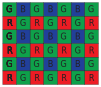

alias:: color filter mosaic

- 📝Definition
	- In digital imaging, a color filter array (CFA), or color filter mosaic (CFM), is a mosaic of tiny color filters placed over the pixel sensors of an image sensor to capture color information.
- 📈Diagram
	- {:height 200, :width 200}
- 🤳Applicability
	- Digital Camera
		- Most color cameras work by using a color filter array or mosaic to allow each pixel to see only red, green, or blue light, leaving the image processing software to fill in the missing values in a process known as demosaicking.