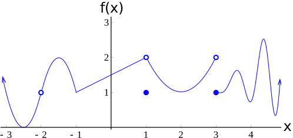
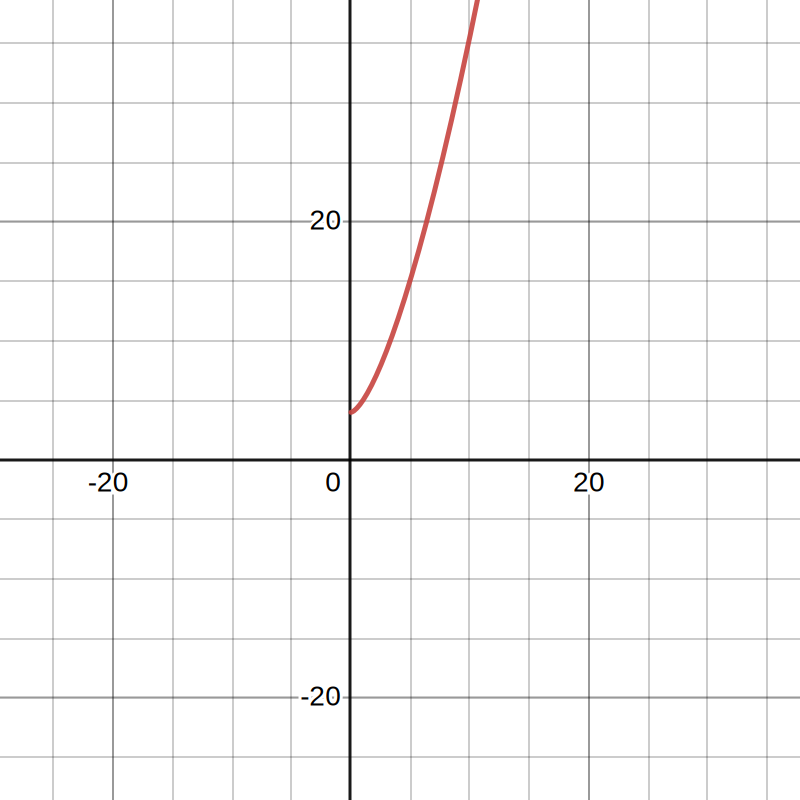
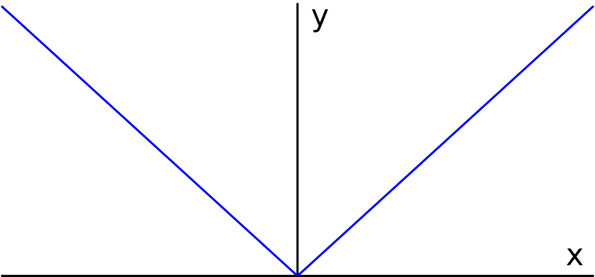

alias:: continuous, Continuous, continuously

- # Continuity
	- ## 📝Definition
		- 📌**Definition of *continuity* at a point**
			- We say that a function $f$ is **continuous at a point** $x=a$ if
			  $$
			  \lim_{x\to a}f(x) = f(a)
			  $$
			  In particular, if either $f(a)$ or $\lim_{x\to a}f(x)$ fails to exist, then $f$ is discontinuous at $a$.
			- We say that a function is **right-continuous at a point** $x=a$ if $\lim_{x\to a^+}f(x) = f(a)$
			- We say that a function is **left-continuous at a point** $x=a$ if $\lim_{x\to a^-}f(x) = f(a)$
	- ## 🧠Intuition
	  Find an intuitive way of understanding this concept.
	- ## 📈Diagram
		- 📌One graph covering Continuity and Discontinuity
			- 
			- Summary in one table
			  | At     | Left-continuous | Right-continuous | Continuous | Removable Discontinuity | Jump Discontinuity |
			  | ------ | --------------- | ---------------- | ---------- | ----------------------- | ------------------ |
			  | $x=-2$ | ❌               | ❌                | ❌          | ⭕                       |                    |
			  | $x=-1$ | ✔               | ✔                | ✔          |                         |                    |
			  | $x=1$  | ❌               | ❌                | ❌          | ⭕                       |                    |
			  | $x=3$  | ❌               | ✔                | ❌          |                         | ⭕                  |
			  | $x=4$  | ✔               | ✔                | ✔          |                         |                    |
	- ## 🌓Complement
	  [[Discontinuity]]
	- ## ⚖Laws
	  The following are the laws related to continuous and limit.
		- 📌Suppose the function $f$ and $g$ are continuous everywhere,
			- $f+g$ is continuous everywhere
			  id:: 630610a5-ae1e-43d8-955d-c91c18e75271
			- $f-g$ is continuous everywhere
			- $f\cdot g$ is continuous everywhere
			- $f\circ g$ is continuous everywhere,  ($\circ$ means compose, e.g. $f(g(x))$)
			- $\frac{f}{g}$ is continuous where it is defined.
	- ## ✒Descriptive Explanation
	  A narrative... a descriptive words subject on the concept... 描述性解释…
	- ## 🗃Example
	  The following are some examples related to continuity.
		- 📌example -  $f,g$ not continuous, but $f+g$ might be continuous
			- In the [law section](((630610a5-ae1e-43d8-955d-c91c18e75271))), we know that:
				- the function $f$ and $g$ are continuous everywhere, then $f+g$ is continuous everywhere.✅
				- but on the **contrary**, if $f,g$ are not continuous, $f+g$ might **also** be continuous!✅
			- Here it is an expression to prove that
			  $$
			  \begin{align}
			  f(x)&=\lfloor x \rfloor\\
			  g(x)&=-\lfloor x \rfloor\\
			  f(x)+g(x)&=\bold{0}
			  \end{align}
			  $$
			  Constant $\bold{0}$ is continuous everywhere.
		- 📌example of a not continuous function
			- Question: Why $x^{3/2}+4$ is not continuous?
			- Answer: Because it is not defined where $x<0$ so therefore it is not continuous for all reall $x$.
			- Graph:
			  {:height 300, :width 300}
	- ## 🧮Expression
	  $$
	  \begin{align}
	  f(x)&=
	  \end{align}
	  $$
	- ## 🤳Applicability
	   What are the situations in which this subject can be applied?
	- ## 🧪Composition
	  What kind of stuffs composite this subject?
	- ## 🏷(Sub)Categories
	  What are the sub objects of this subject?
	- ## 🎯Intent
	   A short description what does this thing do?
- # 🧬Related Elements
   The closest pattern to current one, what are their differences?
	- 📌 [[Limit]] , Continuous, and [[differentiable]]
	  id:: 6322bf32-04a2-4be3-b166-6e9d1600a8e9
		- Let's look at the $x=0$ of the following function $f(x)=\lvert x\rvert$:
			- {:height 300, :width 300}
		- Limits✔:
			- The <u>left-hand limit</u> and <u>right-hand limit</u> are the same. Therefore the limit at $x=0$ exist.
			  $$
			  \begin{align}
			  \lim_{x\to0^-}\lvert x\rvert=0\\
			  \lim_{x\to0^+}\lvert x\rvert=0\\
			  \lim_{x\to0}\lvert x\rvert=0\\
			  \end{align}
			  $$
		- Continuous✔:
			- Since
			  $$
			  \lim_{x\to0^-}\lvert x\rvert=0=\lim_{x\to0^+}\lvert x\rvert=f(x)=0
			  $$
			  Therefore the function is continuous.
		- Differentiable❌:
			- It is not differentiable at $x=0$, because
			  $$
			  \begin{align}
			  \lim_{x\to0^-}\frac{\lvert x\rvert-0}{x-0}&=-1\\
			  \lim_{x\to0^+}\frac{\lvert x\rvert-0}{x-0}&=1\\
			  \end{align}
			  $$
			  We have a name of the preceding derivative:
			- <u>left-sided derivative</u>
				- denoted as $f'(0^-)=\lim_{x\to0^-}\frac{f(x)-f(x)}{x-0}$
			- <u>right-sided derivative</u>
				- denoted as $f'(0^+)=\lim_{x\to0^+}\frac{f(x)-f(x)}{x-0}$