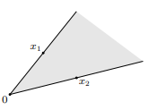

- 📝Definition
    - Set that contains all [[Conic Combination]]s of points in the set
    
- 📈Diagram
    - {:height 200, :width 200}
    
- 🗃Example
    - ![[linear combination#^7120637e78bdcef2]]
    