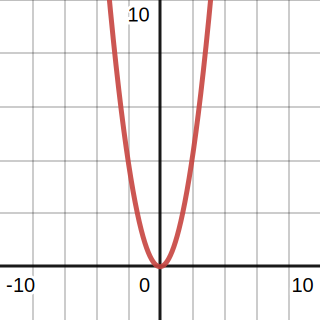

# 📝Definition
- A function $f : \mathbb{R}^n \to \mathbb{R}$ is [[Convex]] if [[Function#^bdaa359665a4eb20|**dom**]] $f$ is a [[Convex Set]] and if for all $x,y \in$ **dom** $f$, and $a$ with $0\leq a\leq1$, we have
    - $$
      f(ax+(1-a)y)\leq af(x)+(1-a)f(y), \quad \text{for all }a\in [0,1]
      $$ ^e7f3c75840c94275
    
**Strictly convex**: $x\neq y$ in the preceding formula AND $a$ is in the open interval $(0,1)$
- A function $f$ is **strictly convex** if strict inequality holds in [[#^e7f3c75840c94275|preceding formula]] whenever $x \neq y$ and $0 < a < 1$.
- We say $f$ is [[Concave]] if $-f$ is convex, and strictly concave if $-f$ is strictly convex. ^e714a655a647d72f

# 📈Diagram
- {:height 300, :width 300}
- You may wonder🤔 is this really convex?? why not [[Concave]] ??	Yes, function is said to be *concave* if it is *convex*. See [[#^e714a655a647d72f|here]]
