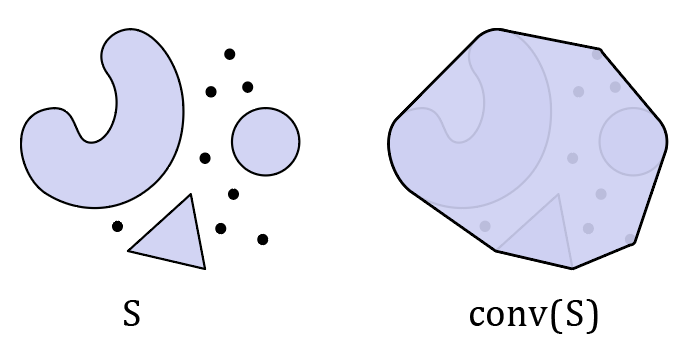
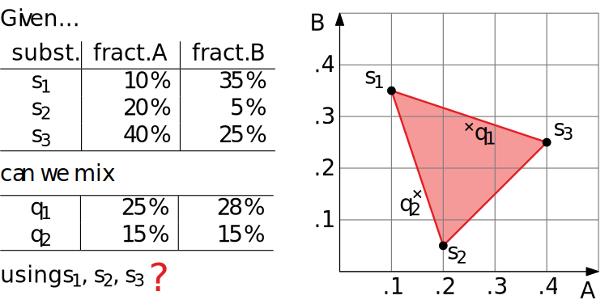
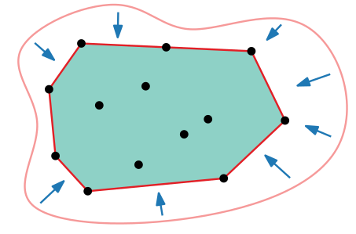
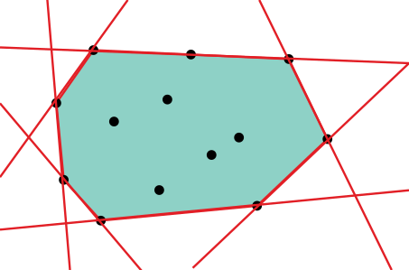

# 📝Definition
For any subset $S\subset\mathbb{R}^n$, its [[Convex]] hull $conv(S)$ is the smallest [[Convex Set]] containing $S$, or equivalently, the intersection of all [[Convex Set]] containing $S$.

# ✒Notation
The notation of the definition of convex hull can be mathematically written as followed:
$$
\begin{align}
CH(S)=\bigcap_{C\supseteq S:\space C\space\text{convex}}C
\end{align}
$$

# 📈Diagram

# 🗃Example
- 📌example of a convex hull
    - Question
        - What is the convex hull of the set $S := \{(\pm1,\pm1,\pm1)\}\subset\mathbb{R}^3$ ?
        
    - Answer
        - A Cube.
        
    - Graph:
        - 

# 🤳Applicability
## Mixing Things
We can transfer such mathematical problems to a convex hull geometric problem.

From the preceding, we know $q_1$ can be mixed while $q_2$ cannot.

# 🐍Algorithm
There are several approaches to compute a convex hull.
**📌Physical Approach**

The steps are:
- take (large enough) elastic rope
- stretch and let go
- take area inside (and on) the rope

**📌Halfplane approach**

The approach can be defined mathematically:
$$
\begin{align}
CH(S)=\bigcap_{H\supseteq S:\space H\space\text{closed halfplane}}H=\bigcap_{H\supseteq S:\space H\space\text{closed halfplane,}|\partial H\cap S|\geq2}H
\end{align}
$$
