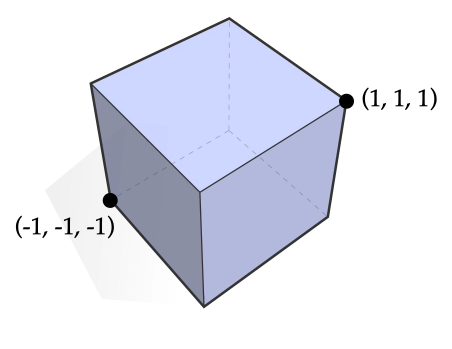

# 📝Definition
- For any subset $S\sub\mathbb{R}^n$, its [[Convex]] hull $conv(S)$ is the smallest [[Convex Set]] containing $S$, or equivalently, the intersection of all [[Convex Set]] containing $S$.

# 📈Diagram
- {:height 300, :width 300}

# 🗃Example
- 📌example of a convex hull
    - Question
        - What is the convex hull of the set $S := \{(\pm1,\pm1,\pm1)\}\sub\mathbb{R}^3$ ?
        
    - Answer
        - A Cube.
        
    - Graph:
        - {:height 300, :width 300}
        