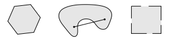

# 📝Definition
- A set $S \in \mathbb{R}^n$​​ is a [[Convex]] set if line connecting any two points lies inside $S$​​. For any two points $x\in S\space\text{and}\space y\in S$, we have $ax+(1-a)y\in S$ , for all $a\in [0,1]$
- A subset $S\sub\mathbb{R}^n$ is convex if for  every pair of points $p,q\in S$ the line segment between $p$ and $q$ is contained in $S$.
- Convex set $C$ is a set contains line segment between any two points in the set where line through $x_1, x_2$: all points.
    - $$
      x_1,x_2\in C, \quad 0\leq\theta\leq1\quad\Rightarrow \quad \theta x_1+(1-\theta) x_2\in C
      $$
    
# 📈Diagram
- {:height 300, :width 300}

# 🗃Example
- With red line, they are not convex set. Without red line, they are.
  {:height 300, :width 300}
- Left is convex set, others are not. The right is almost a convex while some part of edge is missing... (Math is strict!)
  {:height 200, :width 300}
