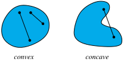
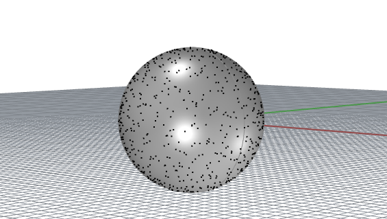

alias:: convexity

- # 🧠Intuition
	- {:height 300, :width 300}
	  id:: 825bc6fa-9ac8-4bb3-8dc4-2f5bad543c19
- # 🌓Complement
	- [[Concave]]
- # 🗃Example
	- 📌[[Linear Function]] is convex
		- $$
		  f(x)=c^Tx+a
		  $$
	- 📌Quadratic function is convex
		- $$
		  f(x) = x^T Hx
		  $$
	- 📌Unit Ball is convex
		- $$
		  \{y ∈ \mathbb{R}^n\quad |\quad\lVert y\rVert_2\leq 1\}
		  $$
		- {:height 300, :width 300}
	- 📌 [[polyhedron]] is convex
		- Notation
			- $A,C$: matrices of appropriate dimension
			- $b, d$ :vectors.
		- $$
		  \{x ∈ \mathbb{R}^n\quad |\quad Ax = b, \quad Cx ≤ d\}
		  $$
	-
- # 🧬Related Elements
	- [[Convex Set]]
	- [[Convex Function]]
	- [[Convex Programming]]
	- Convex Optimization
	- [[Convex Cone]]