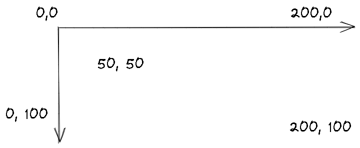

# 📝Definition
- In #computer-science , The most common way of modeling a screen in a [[program]] is as a rectangle of pixels. Each [[pixel]] is identified by an x (horizontal) coordinate and a y (vertical) coordinate. The x coordinates start with 0, indicating the leftmost pixel, and increase (toward the right) to the rightmost pixel.
- In #mathematics  , the preceding view is odd...

# 📈Diagram
#computer-science view
