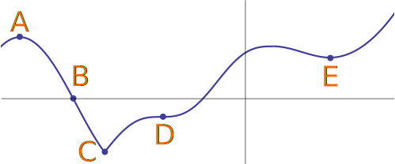

- # Critical Point
- ## 📝Definition
  The critical points of a function $f(x)$ to be all points $x$ in the domain of $f(x)$ such that
	- $f'(x)=0$, a.k.a. [[differentiable]] or
	- $f'(x)$ does not exist, a.k.a. [[DNE]]
- # 🧬Related Elements
	- {{embed ((70a7387e-cbc7-4d58-89ad-bea004d77bb4))}}
- ## 🗃Example
	- 📌Classifying Critical Points
		- The graph
		  
		- The answer relates to [[Local Minima]] and [[Local Maxima]] 
		  |      | critical point | local minima | local maxima |
		  | ---- | -------------- | ------------ | ------------ |
		  | A    | ✅              |              | ✅            |
		  | B    |                |              |              |
		  | C    | ✅              | ✅            |              |
		  | D    | ✅              |              |              |
		  | E    | ✅              | ✅            |              |
	- 📌Find all $x$-values of points that are critical points of $g(x)=0.2x^5+2x^4+4x^3-17$
		- To find critical point, first calculate the derivative $g'(x)$ which is
		  $$
		  g'(x)=x^4+8x^3+12x^2=x^2(x+6)(x+2)=0
		  $$
		- Therefore we can have the critical points are $x=0, -6, -2$
	- 📌Find all $x$-values of points that are critical points of $h(x)=1.5x^{2/3}+x$
		- We can calculate the derivative
		  $$
		  h'(x)=\frac{1}{\sqrt[3]{x}}+1
		  $$
		- Note that $h'(x)$
			- at $x=0$ is not defined ,
			- at $x=-1$ is $h'(x)=0$
		- So the critical points are $x=0, -1$.