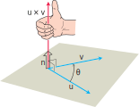
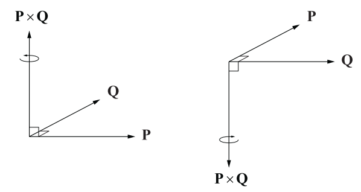
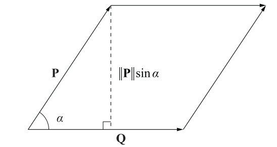

# 📝Definition
**📄Definition 1**
The cross product $\mathbf{u}\times\mathbf{v}$  (naming $\mathbf{u}$ "cross" $\mathbf{v}$) is the [[vector]]
$$
\mathbf{u}\times\mathbf{v}=(\lVert\mathbf{u}\rVert\lVert\mathbf{v}\rVert\sin\theta)\mathbf{n}
$$
> [!info] Remark
> The $\mathbf{n}$ is the unit vector perpendicular to the plane by the right-hand rule and $\mathbf{n}$ might not be the $z$-axis. This means that we choose $\mathbf{n}$ to be the unit (normal) vector that points the way your right thumb points when your fingers curl through the angle $\theta$ from $\mathbf{u}$ to $\mathbf{v}$
> 

> [!info] Remark
> This formula also explains why 2 nonzero vectors are perpendicular when $\mathbf{u}\times\mathbf{v}=0$. If they are parallel, the $\theta=0$ or $\theta=180\degree$ and therefore $\sin\theta=0$.

> [!info] Remark
> We are very *careful* on the details. The little $\mathbf{n}$ at the end of the equation makes $\mathbf{u}\times\mathbf{v}$ is a **vector**. Similarly, in [[cross product#🌈Properties#🟠Area]], the equation does not have a little $\mathbf{n}$ since $\lVert\mathbf{u}\times\mathbf{v} \rVert$ is a scalar!

**📑Definition 2**
The cross product of two $3$-vectors $P$ and $Q$, written as $P\times Q$, is a vector quantity given by the formula.
$$
P\times Q = \langle P_yQ_z-P_zQ_y,\space P_zQ_x-P_xQ_z,\space P_xQ_y-P_yQ_x\rangle
$$
    
Cross product in **matrix picture**(also known as **pseudodeterminant**), where $i,j,k$ are unit vector:
$$
P\times Q = 
\begin{vmatrix}
\mathbf{i}&\mathbf{j}&\mathbf{k}\\
P_x&P_y&P_z\\
Q_x&Q_y&Q_z
\end{vmatrix}\\\\
i=\langle1,0,0\rangle\\
j=\langle0,1,0\rangle\\
k=\langle0,0,1\rangle\\
$$

> [!info] Remark
> the sign in front of $\mathbf{j}$ is **negative**! Others are positive.

___    

**cross product** is also known as **vector product** which **returns a vector** rather than an scalar.

# 🎯Intent
It **calculates surface normal** at a particular point given two distinct tangent vectors.

# 🧠Intuition

# ⚖Theorem
- 📌Theorem about cross product and orthogonal
    - Let $P$ and $Q$ be any two 3D vectors. Then:
    - $$
      (P\times Q)\cdot P=(P\times Q)\cdot Q=0
      $$
    - This is very easy to understand. The [[inner product|dot product]] between a vector and its *orthogonal complement* is **ZERO** because they have nothing aligned.

# ⛈Characteristics
## ☁Right hand rule
The cross product is with orientation.

# 🌈Properties
## 🔴Properties for arithmetic
**Version1**
The cross product obeys the following laws.
$$
\begin{align}
(r\mathbf{u})\times(s\mathbf{v})=(rs)(\mathbf{u}\times\mathbf{v})\tag{1}\\
\mathbf{u}\times(\mathbf{v}+\mathbf{w})=\mathbf{u}\times\mathbf{v}+\mathbf{u}\times\mathbf{w}\tag{2}\\
\mathbf{v}\times\mathbf{u}=-\mathbf{u}\times\mathbf{v}\tag{3}\\
(\mathbf{v}+\mathbf{w})\times\mathbf{u}=\mathbf{v}\times\mathbf{u}+\mathbf{w}\times\mathbf{u}\tag{4}\\
\mathbf{0}\times\mathbf{u}=\mathbf{0}\tag{5}\\
\mathbf{u}\times(\mathbf{v}\times\mathbf{w})=(\mathbf{u}\cdot\mathbf{w})\mathbf{v}-(\mathbf{u}\cdot\mathbf{v})\mathbf{w}\tag{6}
\end{align}
$$

> [!warning]
> Cross product multiplication is not associative so $\mathbf{u}\times(\mathbf{v}\times\mathbf{w})$does not generally equal $(\mathbf{u}\times\mathbf{v})\times\mathbf{w}$.

___
**Version2**
Given any two scalars $a$ and $b$, and any three 3D vectors $P$, $Q$, and $R$, the following properties hold.
$$
\begin{align}
Q\times P = -(P\times Q)\\
(aP)\times Q = a(P\times Q)\\
P\times(Q+R)=P\times Q+P\times R\\
P\times P = 0 = \langle0,0,0\rangle\\
(P\times Q)\cdot R = (R\times P)\cdot Q = (Q\times R)\cdot P\\
P\times(Q\times P) = P\times Q\times P = P^2Q - (P\cdot Q)P
\end{align}
$$

## 🟠Area
**📄Definition**
it is the **parallelogram** formed by $P$ and $Q$.
$$
\text{Area} = \lVert Q\rVert\cdot\lVert P\rVert\sin{a}=\text{base}\times\text{height}
$$

___
**📑Definition**
$\mathbf{u}\times\mathbf{v}$ is a **vector**.
$\lVert\mathbf{u}\times\mathbf{v}\rVert$ is a **scalar** which is the area of a parallelogram.

> [!info] Remark
> There are 2 ways to better understand why $\lVert\mathbf{u}\times\mathbf{v}\rVert$ is an area.
> 1.From the diagram below.
> 
> 2.$\lVert\space\rVert$ indicates this is a [[Norm]] of a vector and it must be a number!

# 🕳Pitfalls
📌**Anticommutative**
It is a characteristic of cross product which implies the **order** of cross product matters.
$$
(P\times Q)\times R \neq P\times (Q\times R)
$$

# 🗃Example
- 📁cross product example
	- 💬Question:
		- (1) Find a vector perpendicular to the plane of $P(1, -1, 0), Q(2, 1, -1),$ and $R(-1, 1, 2)$
		- (2) Find the area of the triangle with vertices  $P(1, -1, 0), Q(2, 1, -1),$ and $R(-1, 1, 2)$
	- 🏹Strategy:
		- For (1), construct 2 vector from the points, take the cross product which will be the vector perpendicular to the 2 vectors.
		- For (2), the norm of the cross product is the area!
	- ✏Solution:
		- (1)
			- Construct 2 vectors.
				- $\overrightarrow{PQ}=Q(2, 1, -1)-P(1, -1, 0)=1\mathbf{i}+2\mathbf{j}-1\mathbf{k}$
				- $\overrightarrow{PR}=R(-1, 1, 2)-P(1, -1, 0)=-2\mathbf{i}+2\mathbf{j}+2\mathbf{k}$
			- Calculate the area using determinant.
				- $$\overrightarrow{PQ}\times\overrightarrow{PR}=\begin{vmatrix}\mathbf{i}&\mathbf{j}&\mathbf{k}\\1&2&-1\\-2&2&2\end{vmatrix}=\begin{vmatrix}2&-1\\2&2\end{vmatrix}\mathbf{i}-\begin{vmatrix}1&-1\\-2&2\end{vmatrix}\mathbf{j}+\begin{vmatrix}1&2\\-2&2\end{vmatrix}\mathbf{k}=6\mathbf{i}+0\mathbf{j}+6\mathbf{k}$$
		- (2)
			- The area is just the norm.
			- $\lVert\overrightarrow{PQ}\times\overrightarrow{PR}\rVert=\sqrt{(6)^2+(0)^2+(6)^2}=6\sqrt{2}$
	- 🗣Note: I remember few years ago 2018? A senior computational designer Anders from BIG told me that I could use cross product to produce the area of 3 [[vertex|vertices]]... I just plug in those numbers at that time... Until now I fully understand.

# 🧀Applicability
## 🍞torque
**📝Description**
When we turn a bolt by applying a force $\mathbf{F}$ to a wrench, we produce a torque that causes the bolt to rotate. Well, there are 2 things to be addressed.
- torque vector
- magnitude of the torque

## 🥐Distance from Point to Line
See [[point-line distance]].

🥖
🥨
🥯
🥞
🧇