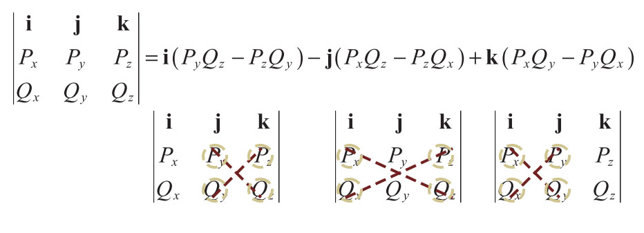

# 📝Definition
- The cross product of two $3$-vectors $P$ and $Q$, written as $P\times Q$, is a vector quantity given by the formula.
    - $$
      P\times Q = \langle P_yQ_z-P_zQ_y,\space P_zQ_x-P_xQ_z,\space P_xQ_y-P_yQ_x\rangle
      $$
    
- Cross product in **matrix picture**(also known as **pseudodeterminant**), where $i,j,k$ are unit vector:
    - $$
      P\times Q = 
      \begin{vmatrix}
      \bold{i}&\bold{j}&\bold{k}\\
      P_x&P_y&P_z\\
      Q_x&Q_y&Q_z
      \end{vmatrix}\\\\
      i=\langle1,0,0\rangle\\
      j=\langle0,1,0\rangle\\
      k=\langle0,0,1\rangle\\
      $$
    - {:height 300, :width 300}
    - ⚠**Attention:** the sign in front of j is **negative**! Others are positive.
    
**cross product** is also known as **vector product** which **returns a vector** rather than an scalar.

# 🧠Intuition
- It **calculates surface normal** at a particular point given two distinct tangent vectors.

# ⚖Theorem
- 📌Theorem about cross product and orthogonal
    - Let $P$ and $Q$ be any two 3D vectors. Then:
    - $$
      (P\times Q)\cdot P=0\\(P\times Q)\cdot Q=0
      $$
    - This is very easy to understand. The [[dot product]] between a vector and its *orthogonal complement* is **ZERO** because they have nothing aligned.
    
# 🧮Expression  
$$
\begin{align}
f(x)&=
\end{align}
$$

# ⛈Characteristics / Properties
- 📌Right hand rule
    - The cross product is with orientation.
    - {:height 300, :width 300}
    
- 📌Planar Angle
    - Given two 3D vectors $P$ and $Q$, the cross product $P\times Q$ satisfies the equation. where $a$ is  the **planar angle** between the lines connecting the origin to the points represented by $P$ and $Q$.
    - $$
      \lVert P\times Q\rVert=\lVert P\rVert\lVert Q\rVert\sin{a}
      $$
    - The preceding equation is essential to solving the [[#^1e331fcdb25ed6e|area]].
    
- 📌Area ^1e331fcdb25ed6e
    - it is the **parallelogram** formed by $P$ and $Q$.
    - $$
      \text{Area} = \lVert Q\rVert\cdot\lVert P\rVert\sin{a}=\text{base}\times\text{height}=P\times Q
      $$
    - {:height 300, :width 300}
    
- 📌Properties for arithmetic
    - Given any two scalars $a$ and $b$, and any three 3D vectors $P$, $Q$, and $R$, the following properties hold.
    - $$
      Q\times P = -(P\times Q)\\
      (aP)\times Q = a(P\times Q)\\
      P\times(Q+R)=P\times Q+P\times R\\
      P\times P = 0 = \langle0,0,0\rangle\\
      (P\times Q)\cdot R = (R\times P)\cdot Q = (Q\times R)\cdot P\\
      P\times(Q\times P) = P\times Q\times P = P^2Q - (P\cdot Q)P
      $$
    
- 📌**Anticommutative**
    - It is a characteristic of cross product which implies the **order** of cross product matters.
    - $$
      (P\times Q)\times R \neq P\times (Q\times R)
      $$
    
# 📈Diagram  
{:height 300, :width 300}

# ✒Descriptive Explanation  
A narrative... a descriptive words subject on the concept... 描述性解释…

# 👑Importance
No matter good or bad, this subject plays an important role...

# 🌓Complement  
What is the complement of this subject? e.g. vector-covector, constructor-destructor

# 📏Proof   
To prove something...

# 🗃Example  
Example is the most straightforward way to understand a mathematical concept.

# 🤳Applicability  
What are the situations in which this subject can be applied?

# 🧪Composition  
What kind of stuffs composite this subject?

# 🏷(Sub)Categories  
What are the sub objects of this subject?

# ⚖Laws  
The laws related to this math concepts.

# 🎯Intent  
A short description what does this thing do?

# 🌱Related Elements  
The closest pattern to current one, what are their differences?

# 🚀Benefit / Pros
 A scenario that illustrates the benefit this object provides.

# ⌨Sample Code
 Code fragments

# 🔎Implementation
 The code or technical stuffs implement this.

# 🕳Pitfalls / Cons
Be aware of the pitfalls when using this stuffs... (especially considering edge cases)

# 📋Prerequisite
Some techniques and objects only work under certain condition.

# 💫Support Operation
What is related operation?

# 🐍Algorithm
Algorithm relates to this stuff..

# 🥼Expert's Advice
See what experts addressed.

# 🧱Structure
Any other hierarchical issues?
