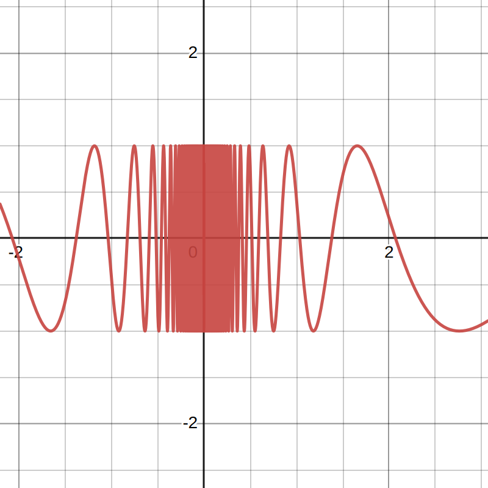

# 📝Definition
- DNE is does not exist.

# 📈Diagram
- {:height 211, :width 204}

# 🗃Example
Example is the most straightforward way to understand a mathematical concept.
- 📌example of a function has DNE limit at some point
    - $j(x)=\sin(13/x), \text{what is }\lim_{x\to 0^+}j(x)?$
    - We can put this in programming.
      
      ``` c++
      double Calculate(double x)
      {
          return sin(13/x);
      }
      
      int main()
      {
      	std::cout << "j(x) = sin(13/x)" << std::endl;
      	std::cout << Calculate(1) << std::endl;
      	std::cout << Calculate(0.5) << std::endl;
      	std::cout << Calculate(0.1) << std::endl;
      	std::cout << Calculate(0.01) << std::endl;
      	return 0;
      }
      ```
      The result seems weird
      
      ``` shell
      ➜  calculate_limit git:(main) ✗ ./main.exe
      j(x) = sin(13/x)
      0.420167
      0.762558
      -0.930106
      -0.580513
      ```
      It oscillates and **never settle down** to a value.
      
    - The diagram of the function is
      {:height 190, :width 199}
    
- 📌example covering DNE, [[Left-hand limit]], and [[Right-hand limit]]
    - see [[Limit#^eb759c09775a3ef2|here]]
    
- 📌example(1) of function DNE at certain value
    - Question:
        - Given the results for $\lim_{x\to0^-}\frac{1}{x}$ and $\lim_{x\to0^+}\frac{1}{x}$, what should we say about $\lim_{x\to0}\frac{1}{x}$?
        
    - Answer:
        - A: The limit does not exist($DNE$), and it is neither $+\infin$ nor $-\infin$. Let's look at the graph.
        
    - Graph:
        - {:height 190, :width 199}
        
- 📌example(2) of function DNE at certain value
    - Question:
        - What is the value at $x=2$ of function $\lim_{x\to2} \frac{3x}{4-x^2}$?
        
    - Answer:
        - in $x\to2^-$, the result of $4-x^2$ is very close to $0$ but $4>x^2$(positive), therefore $\lim_{x\to2^-} \frac{3x}{4-x^2}=+\infin$
        - in $x\to2^+$, the result of $4-x^2$ is very close to $0$ but $4<x^2$(negative), therefore $\lim_{x\to2^+} \frac{3x}{4-x^2}=-\infin$
        
    - Graph: And we can see it from the following graph.
        - {:height 190, :width 199}
        