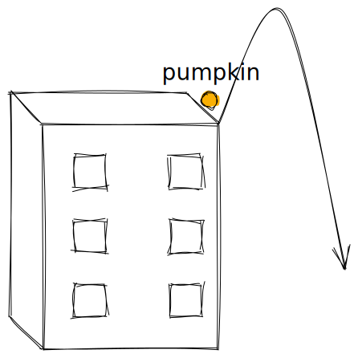
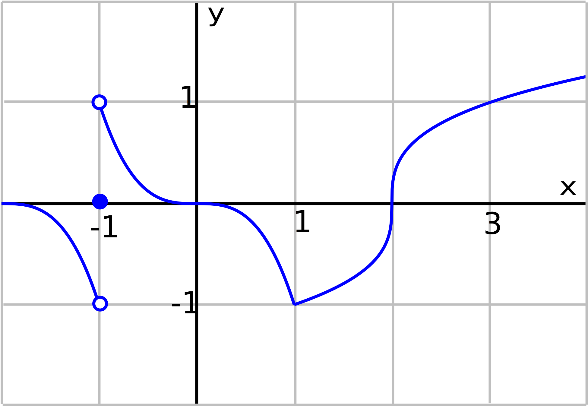

- # 📝Definition
	- The **derivative** of a function $f(x)$ at a point $x=a$ is defined to be:
	  $$
	  f'(a)=\lim_{b\to a}\frac{f(b)-f(a)}{b-a}
	  $$
	  There is also an alternative definition:
	  $$
	  f'(a)=\lim_{h\to0}\frac{f(a+h)-f(a)}{h}
	  $$
	- 📌Delta Notation$\Delta$ of Derivative
		- We change the notation from:
		  $$
		  f'(x)=\lim_{b\to x}\frac{f(b)-f(x)}{b-x}\\
		  $$
		- to:
		  $$
		  f'(x)=\lim_{\Delta x\to0}\frac{f(x+\Delta x)-f(x)}{\Delta x}\\
		  $$
- ## 🧠Intuition
	- We care about the <u>derivative</u> of $f(x)$ at $x=a$ is <u>instant rate of change</u> of $f(x)$ at $x=a$. See the magic of "instant" [here](((630e00ad-fe6c-4845-b1b1-c0ea4cba0651)))
	- 📌3 Main Interpretation of Derivative
	  id:: 630dd309-601e-461e-b09f-ee409b04543e
		- physical -  **instantaneous** rate of change.
		- geometrical - the **slope** of the tangent line.
		- sensitive - the **sensitivity** of a function to small changes.
- ## 🧮Expression
	- Common Derivatives
	  
	  
	  $$
	  \begin{align}
	  
	  \end{align}
	  $$
- ## 📈Diagram
  
- ## ✒Descriptive Explanation
  A narrative... a descriptive words subject on the concept... 描述性解释…
- # 🌓Complement
	- [[Antiderivative]]
- ## 🗃Example
  Example is the most straightforward way to understand a mathematical concept.
	- 📌Example throwing pumpkin using derivative
		- Question:
		  collapsed:: true
			- Suppose there is a guy throwing pumpkin from a $100$ foot roof top, and the distance in terms of time measured is the following
			- $f(t)=100+20t+-5t^2$
			- Find the the average velocity between $t=0$ and $t=1$
			- Find the instantaneous velocity at $t=1$
		- Graph:
		  {:height 300, :width 300}
		- Solution:
		  collapsed:: true
			- For average velocity, we don't have to use derivative.
			  collapsed:: true
				- $$
				  \begin{align}
				  \text{average velocity}&=\frac{f(1)-f(0)}{1-0}\\
				  &=\frac{100+20\times1-5\times1^2-(100+20\times0-5\times0^2)}{1}\\
				  &=15\text{m/s}
				  \end{align}
				  $$
			- For instantaneous velocity, we have to use derivative.
			  collapsed:: true
				- $$
				  \begin{align}
				  \text{instantaneous velocity}&=f'(1)\\&=\lim_{b\to1}\frac{f(b)-f(1)}{b-1}\\
				  &=\lim_{b\to1}\frac{100+20b-5b^2-(100+20-5)}{b-1}\\
				  &=\lim_{b\to1}\frac{20b-5b^2-15}{b-1}\\
				  &=\lim_{b\to1}\frac{-5(b^2-4b+3)}{b-1}\\
				  &=\lim_{b\to1}\frac{-5(b-1)(b-3)}{b-1}\\
				  &=\lim_{b\to1}\frac{-5\cancel{(b-1)}(b-3)}{\cancel{b-1}}\\&=-5\times(-2)=10\text{ m/s}
				  \end{align}
				  $$
	- 📌Example of derivative on a graph
		- {:height 250, :width 250}
		- The following are the derivatives:
		  $$
		  \begin{align}
		  f'(-1)&=DNE\\
		  f'(0)&=0\\
		  f'(1)&=DNE\\
		  f'(2)&=DNE\\
		  f'(3)&=1/3\\
		  \end{align}
		  $$
- ## 🤳Applicability
   What are the situations in which this subject can be applied?
- ## 🧪Composition
  What kind of stuffs composite this subject?
- ## 🏷(Sub)Categories
  What are the sub objects of this subject?
- ## ⚖Laws
  The laws related to this math concepts.
- ## 🎯Intent
   A short description what does this thing do?
- ## 🙋‍♂️Related Elements
   The closest pattern to current one, what are their differences?