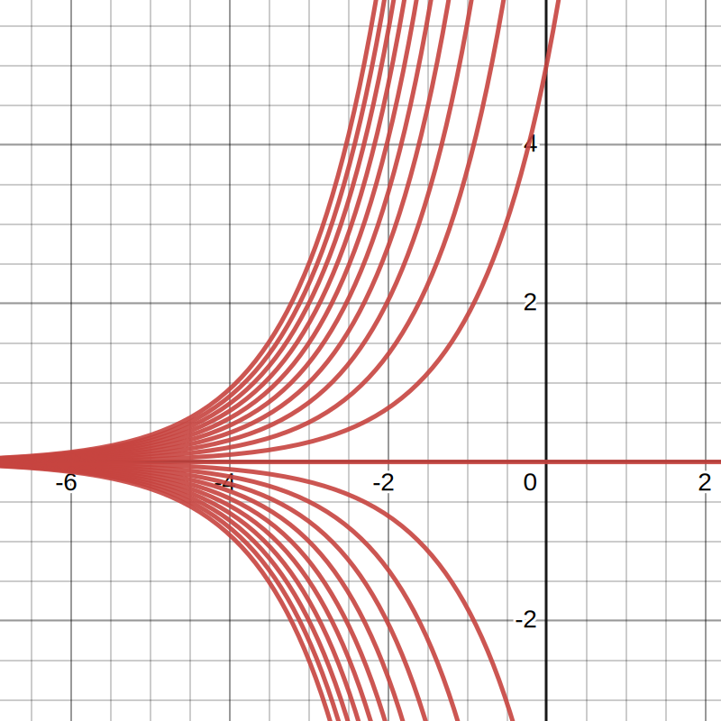

- # 📝Definition
	- A differential equation is an equation involving an unknown function and one or more of its derivatives. The order of such an equation is the order of the highest derivative that occurs in it.
- # ✒Notation
	- 📌First-order differential equations of the form
		- $$
		  \begin{align}
		  \frac{dy}{dx}=f(x)
		  \end{align}
		  $$
		- where $f(x)$ is a given function.
- # 🚀Benefit / Pros
	- 📌Differential Equation is good at solving physical and engineering problem
		- Taking the Newton's Law as example
			- $$
			  F=ma
			  $$
		- We can write out with differential equation in terms of different interests and perspective
			- $$
			  \begin{align}
			  F&=m\frac{dv}{dt}\quad\text{interested in velocity}\\\
			  F&=m\frac{d^2x}{dt^2}\quad\text{interested in acceleration}
			  \end{align}
			  $$
- # ⛈Characteristics / Properties
	- 📌Solution of Differential Equation
		- The solution of a differential equation **is a family of functions**.
		- Analogy between equation and differential equation
		  | Equation             | Solution        | Interpretation        |
		  | -------------------- | --------------- | --------------------- |
		  | $x^2-1=0$            | $x=-1,1$        | 2 points              |
		  | $\frac{dy}{dx}=f(x)$ | $y=\int f(x)dx$ | a family of functions |
	- 📌Separable
		- A differential equation is **separable** if it can be written in the form
			- $$
			  \frac{dy}{dx} = f(x)g(y)
			  $$
		- To solve a separable differential equation, separate all terms involving $x$ from terms involving $y$, and anti-differentiate both sides.
			- $$
			  \begin{align}
			  \frac{dy}{dx} &= f(x) g(y)\\
			  \frac{dy}{g(y)} &= f(x)dx\\
			  \int \frac{dy}{g(y)} &= \int f(x) dx
			  \end{align}
			  $$
- # ⚖Theorem
	- 📌Theorem of initial conditions
		- Given a differential equation $\frac{dy}{dx} = f(x)g(y)$ and an **initial condition** $y(a)=b$, if $f, g$, and $g'$ are continuous near $(a,b)$, then there is a unique function $y$ whose derivative is given by $f(x)g(y)$ and that passes through the point $(a,b)$.
- # 🌓Complement
	- ## 📌Differential Equation vs. [[Antiderivative]]
	  id:: b12a6846-f68a-4292-a157-cff57281c1be
		- We have seen that the equation of antiderivative
			- id:: 63302cc3-811d-469f-8371-b7a62115e5f1
			  $$
			  y=\int f(x)dx
			  $$
		- is equivalent to the differential equation
			- $$
			  \frac{dy}{dx}=f(x)
			  $$
		- This statement can be interpreted in two ways.
			- A.
				- we can think of the symbol
					- $$
					  \int\cdots x
					  $$
				- as **operating on the function** $f(x)$ **to produce its integral**, or antiderivative, $y$. From this point of view the integral sign $\int$ and the $dx$ go together as parts of a single symbol.
					- the integral sign $\int$ specifies the operation of integration
					- the only role of the $dx$ is to tell us that $x$ is the “variable of integration.”
			- B.
				- For the second form
					- $$
					  dy=f(x)dx
					  $$
				- so that $f(x)dx$ is explicitly seen to be **the differential of** $y$.
				- If we now take $dx$ in [first equation](((63302cc3-811d-469f-8371-b7a62115e5f1))) at its face value, as the differential of $x$, then the integral sign in [first equation](((63302cc3-811d-469f-8371-b7a62115e5f1))) acts on the differential of a function $y$, namely, on $f(x)dx$, and produces the function itself. Thus, the symbol $\int$ for integration (without considering the $dx$ as part of the symbol) stands for the operation which is the inverse of the operation denoted by the symbol $d$.
		- We shall use both interpretations. However, **the second is particularly convenient**, not only for the actual procedures used in computing integrals, but also for solving certain simple differential equations.
- # 🗃Example
	- 📌unit of differential equation
		- Consider the differential equation $\frac{dy}{dx} = f(x)$, where $x$ and $f(x)$ have units of meters ($m$).
		- What are the units of the solution
			- $$
			  y = \int f(x) dx
			  $$
		- Answer
			- The units of $y$ are the units of $f(x)$ times the units of $dx$, which are the same as the units of $x$. This gives units of $m^2$, which is a measure of area.
			- Another way to think this is considering the power of antiderivative. Since we are interested in $y$ and $y$ is the antiderivative of $f(x)$. Using the [integral of power](((632f15f1-5c04-48e6-8440-1fed32f2fda3))), we have $\int m=m^{1+1}$ which is $m^2$.
	- 📌example of solving separable differential equation ==**IMPORTANT**==
		- Question:
			- Use separation of variables to solve the differential equation $\frac{dy}{dx} = y$
		- Solution:
			- To apply separation of variables, we write
				- $$
				  \frac{dy}{dx} = y = f(x)g(y).
				  $$
			- Here $f(x)=1$ and $g(y)=y$. Thus
				- $$
				  \begin{align}
				  \frac{dy}{dx} &= y\\
				  \frac{dy}{y} &= dx \quad y\neq0\\
				  \int \frac{dy}{y} &= \int dx\\
				  \ln\lvert y\rvert &= x+c\\
				  \lvert y\rvert &= e{x+c}\\
				  y &= Ce^x
				  \end{align}
				  $$
			- Checking by hand, we see that the equation holds for $C=0$ as well! Thus the solution is $y=Ce^x$ for $C$ ==any real number==.
				- when $C>0$ and $C<0$,
					- $$
					  \begin{align}
					  y &= -Ce^x\\
					  \frac{dy}{dx} &= -Ce^x\quad\text{which is }y!
					  \end{align}
					  $$
				- when $C=0$
					- $$
					  \begin{align}
					  y &= -Ce^x = 0\\
					  \frac{dy}{dx} &= 0 =y
					  \end{align}
					  $$
		- Diagram:
			- That said, we can visualize the result. Because $C$ varies.
			- {:height 300, :width 300}
	- 📌example of solving separable differential equation (1)
		- Question: Solve the differential equation
			- $$
			  \frac{dy}{dx} = (2x+5)^4
			  $$
		- Solution:
			- $$
			  \begin{align}
			  \frac{dy}{dx} &= (2x+5)^4\\
			  \int dy &= \int (2x+5)^4 dx \qquad \text{separate variables}\\
			  \int dy &= \int u^4 \frac{du}{2} \qquad \text{u-substitution} \quad u=2x+5, du = 2dx\\
			  y &= \frac{1}{10}u^5 + C \qquad \text{antidifferentiate}\\
			  y &= \frac{(2x+5)^5}{10} + C \qquad \text{substitute back for } x
			  \end{align}
			  $$
	- 📌example of solving separable differential equation (2)
		- Question: Solve the differential equation
			- $$
			  x\frac{dy}{dx}=(x^2+x)(y^2+1)
			  $$
		- Solution
			- $$
			  \begin{align}
			  x\frac{dy}{dx}&=(x^2+x)(y^2+1)\\
			  \frac{1}{y^2+1}dy &= (x+1)dx\\
			  \int\frac{1}{y^2+1}dy &= \int(x+1)dx\\
			  \arctan(y) &= \frac{x^2}{2}+x+C\\
			  y &= \tan( \frac{x^2}{2}+x+C)
			  \end{align}
			  $$
	- 📌example of initial condition
		- Solve
			- $$
			  \frac{dy}{dx} = \sqrt{y+1}, \qquad y(0) = 3
			  $$
		- Solution:
			- First we solve the differential equation using separation of variables:
				- $$
				  \begin{align}
				  \frac{dy}{dx} &= \sqrt{y+1} \qquad \textrm{as long as } y \geq -1\\
				  \frac{dy}{\sqrt{y+1}} &= dx \qquad \textrm{as long as } y > -1\\
				  \int \frac{dy}{\sqrt{y+1}} &= \int dx \qquad \textrm{antidifferentiate }\\
				  2\sqrt{y+1} &= x + c \qquad y > -1\\
				  \sqrt{y+1} &= \frac{x}{2} + C \qquad \textrm{rename constant}
				  \end{align}
				  $$
			- Now that we have found the family of solution functions, we find the solution that satisfies the initial condition.
				- $$
				  y(0)=3\quad\Rightarrow\quad\sqrt{3+1}=0+C\quad\Rightarrow C=2
				  $$
			- Next we plug in our value for $C$ and solve for $y$.
				- $$
				  \begin{align}
				  \sqrt{y+1} &= \frac{x}{2} + 2 \qquad \textrm{plug in }C=2\\
				  y + 1 &= \left(\frac{x}{2} + 2\right)^2\\
				  y &= \left(\frac{x}{2} + 2\right)^2 -1
				  \end{align}
				  $$
	- 📌example of solving separable differential equation (3)
		- Question: Solve the differential equation
			- $$
			  \frac{dy}{dx} = xy^2
			  $$
		- Solution:
			- $$
			  \begin{align}
			  \frac{dy}{dx} &= xy^2\\
			  \int\frac{dy}{dx} &= \int xdx \qquad \textrm{separate variables}\\
			  \frac{-1}{y} &= x^2/2 + C \qquad \textrm{antidifferentiate}\\
			  y &= \frac{-1}{x^2/2+C} \qquad \textrm{algebraic simplification}
			  \end{align}
			  $$