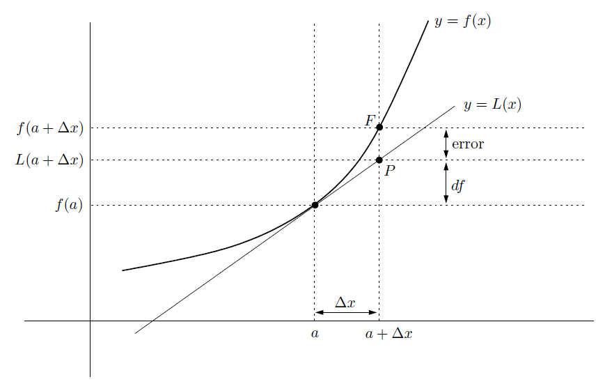
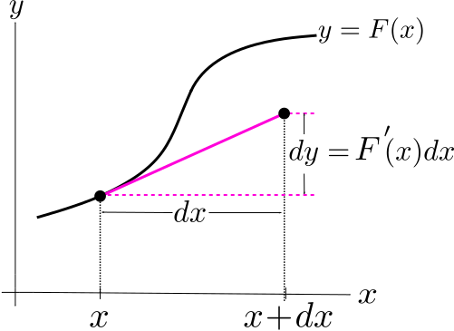

# 📝Definition
## Definition in MIT class
- There are several definitions on "differential" since it is an important topic. I found each of them
- Let $y=F(x)$, the **differential** of $y$ is defined as
    - $$
      dy \, = \,  F'(x) dx.
      $$
    
- This is also called the differential of $F$ and denoted $dF$.
- Rearranging this equation, we get the the [[Leibniz notation]] for the [[derivative]] , which says the derivative is the ratio of the two differentials $dy$ and $dx$.
    - $$
      F'(x)= \frac{dy}{dx} \qquad \left(\text{or} \, \, \frac{ dF}{dx}\right)
      $$
    
- We may think of the **differential of** $x$ noted as $dx$, meaning "little bit" of $x$, and the **differential of** $y$, noted as $dy$, meaning "little bit" of $y$. Here, what we mean by a "little bit" is really an infinitely small bit, we call these infinitely small quantities “**infinitesimals**." The point is that even though both $dy$ and $dx$ are infinitely small, **their ratio is NOT**. Their ratio is the derivative $F'(x)$. In other words, the differential notation says that $dy$ is **proportional** to $dx$ with constant of proportionality $F'(x)$ even though both $dy$ and $dx$ are infinitely small. We use the differential notation as a tool to keep track of how much $y$ changes when $x$ changes by a tiny tiny tiny ... tiny bit.

## Definition in *the Calculus Lifesaver* by Adrian Banner
- {:height 500, :width 500}
- The graph shows the curve $y = f(x)$ and the linearization $y = L(x)$, which is the [[tangent line]] to the curve at $x = a$. We want to estimate the value of $f(a + \Delta x)$. That’s the height of the point $F$ in the above picture.
- In the above graph, there’s one more **quantity** marked: this is $df$, which is the **difference** between the height of $P$ and $f(a)$. It is the amount we needed to add to $f(a)$ in order to get our estimate. Since $L(a+\Delta x) = f(a)+f'(a)\Delta x$, we see that
    - $$
      df=f'(a)\Delta x
      $$
    
- The quantity $df$ is called the **differential** of $f$ at $x = a$. It is an approximation to the amount that $f$ changes when $x$ moves from $a$ to $a + \Delta x$.
- We’ve actually touched on these ideas before. In [[derivative]] and [[limit]] , we saw that if $y = f(x)$, then
    - $$
      f'(x)=\lim_{\Delta x\to0}\frac{\Delta y}{\Delta x}
      $$
    
- This means that a small change in $x$ produces approximately $f'(x)$ times the change in $y$. This is exactly what the equation $df = f'(a)\Delta x$ says, **taking into account** that this time we are starting at $x = a$.

# 🧠Intuition
- Differential is about smart smart smart amount of changes.
- $dy$ is a little bit change of $y$
- $dx$ is a little bit change of $x$

# 📈Diagram
- {:height 300, :width 300}

# 👑Importance
- This notation Leibniz used are way **more effective and intuitive** then the notation that Newton used. It allows you to think much faster sometimes when you have the right names and the right symbols for everything. And this case, it made a very big difference. Leibniz' notation was adopted on the continent and Newton dominated in Britain. And as a result, **the British fell behind by 100 or 200 years in the development of calculus**. It was really a serious matter. So it's really well worth your while to get used to this idea of **==ratios==** which is $\frac{dy}{dx}$, a ratio of "infinitesimals".

# 🌱Related Elements
- 📌Differential vs. [[Linear Approximation]]
    - $$
      \begin{align}
      \text{Linear approximation at }&\quad\, x \Delta F &\approx& F'(x)\Delta x, \, \quad&\Delta x \, \text{is a finite change in x.}\\
      \text{Differential notation: }&\quad dF &=&  F'(x)dx, \quad&dx \, \text{is a tiny tiny }\ldots \text{tiny bit of} \, \, x 
      \end{align}
      $$
    
# 🗃Example
- 📌[[Linear Approximation]] using differential
    - Question:
        - Approximate $\sqrt{21}$ by using linear approximation in a differential way to $f(x)=\sqrt{10x-x^2}$ based at $x_0=2$.
        - Note: $f(2)=4, f(3)=\sqrt{21}$
        
    - Solution:
        - what we have is that if $y$ equals $f$ of $x$, so $y$ is given as a function of $x$ then we have that
        - $$
          y=f(x)
          $$
        - so if we want to change $x$ a little bit and figure out what the change in $y$ is, we have this formula
        - $$
          f(x+dx)\approx y+dy
          $$
        - which is that $f(x+dx)$, so the function value at a nearby point is approximately equal to $y+dy$.
        - From above, we know
            - $x=2,y=4$,
            - since we want to approximate what $f(x)$ at $x=3$, therefore we know that
            - $dx=1$
            
        - Therefore, our goal is to find $dy$ which is "what is the change in $y$"?
        - $$
          \begin{align}
          dy&=d(\sqrt{10x-x^2})\\
          &=(\sqrt{10x-x^2})'dx\\
          &=\frac{1}{2}(10x-x^2)^{-1/2}\cdot(10-2x)dx\\
          \end{align}
          $$
        - Now, we plug $x=2, dx=1$ in it
            - $$
              \begin{align}
              dy&=\frac{1}{2}(10x-x^2)^{-1/2}\cdot(10-2x)dx\\
              &=\frac{1}{2}(10\cdot2-2^2)^{-1/2}\cdot(10-2\cdot2)1\\
              &=\frac{1}{2}(16)^{-1/2}\cdot(6)\\
              &=\frac{3}{4}
              \end{align}
              $$
            
        - We can have the linear approximation as
            - $$
              f(3)\approx4+\frac{3}{4}
              $$
            
- 📌example of differential 1
    - $$
      \begin{align}
      d \left(3 w^{-1}+\frac{w^2}{4} - 7\right) \, \,  &= \left(3 w^{-1}+\frac{w^2}{4} - 7\right)'dw\\
      &=\left(\frac{-3}{w^2}+\frac{w}{2}\right)dw
      \end{align}
      $$
    
- 📌example of differential 2
    - $$
      \begin{align}
      d \left(\cos ^3 (t)\right) &= \left(\cos ^3 (t)\right)' \, dt\\
      \text{let }u&=\cos(t)\\
      &=(u^3)'=3u^2u'dt\\
      &=3\cos^2(t)\cdot(-\sin(t))dt\\
      &=-3 \cos ^2(t)\sin (t)\, dt
      \end{align}
      $$
    
- 📌example of differential 3
    - $$
      \begin{align}
      d \left[\, \ln (y^2)+ \ln \left(1+\sqrt{y}\right)\right]\, \,  &= d\Big( \ln \left(y^2\left(1+\sqrt{y}\right)\right) \Big) \quad\text{using logarithm trick}\\
      &=\Big( \ln \left(y^2\left(1+\sqrt{y}\right)\right) \Big)' dy\\
      &=\, \,  \frac{2+\frac{5}{2}\sqrt{y}}{y\left(1+\sqrt{y}\right)}\,  dy.
      \end{align}
      $$
    
