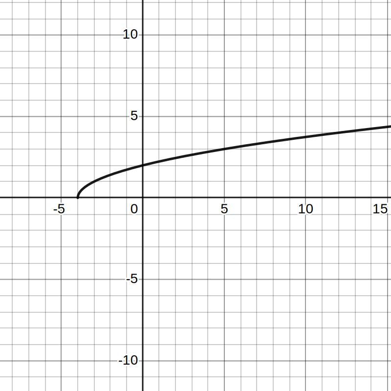
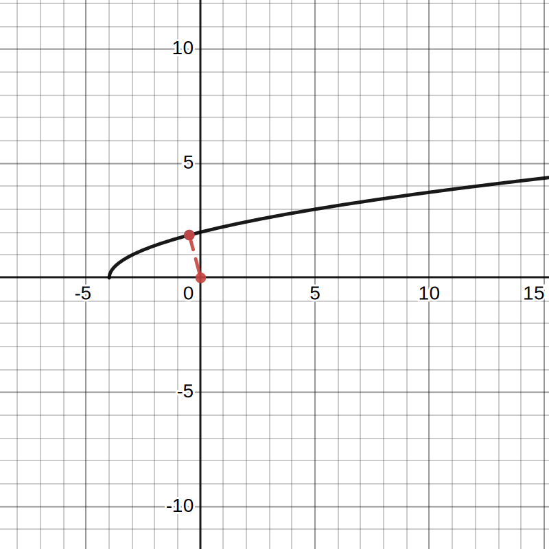
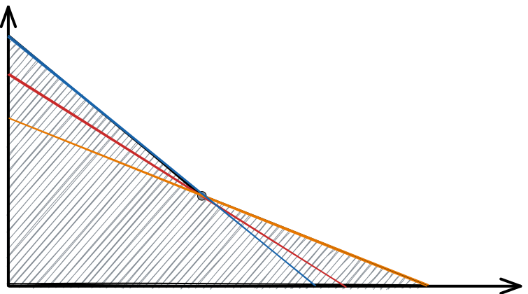
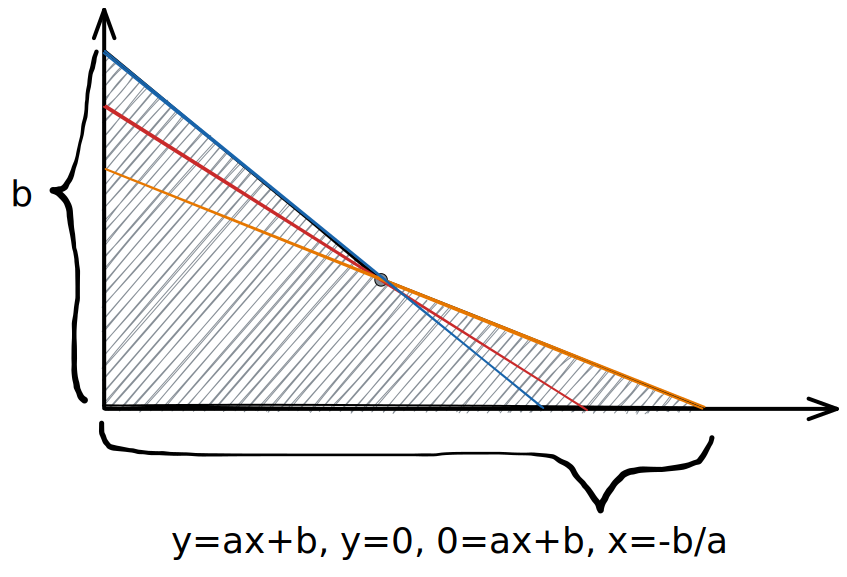
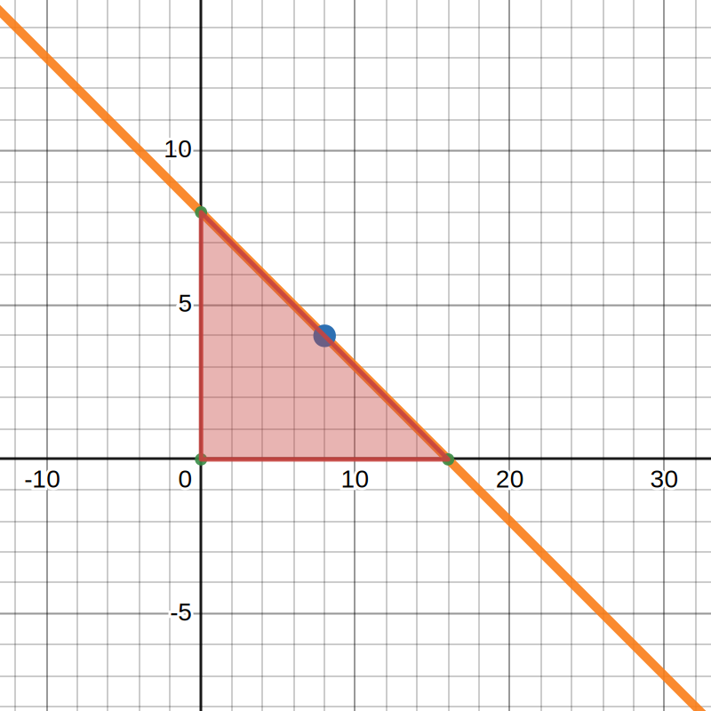
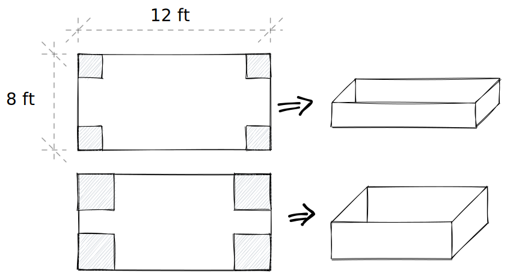
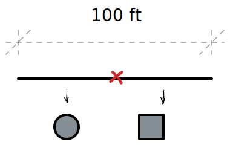

- # 🍴Quick Digest -> Differentiation
	- ## 📝Definition
	  The computation of a [[Derivative]].
	- ## 🤳Applicability
	   What are the situations in which this subject can be applied?
		- ### Optimization: min and max problem
		  collapsed:: true
		  The application involving differentiation is to optimize.
			- TODO maybe there is a better category of this block.
			- 📌Find the closest point to the origin
				- Question: What point on the curve $y=\sqrt{x+4}$ comes closest to the origin?
				- Graph:
				  {:height 212, :width 220}
				- Solution:
				  collapsed:: true
					- identify the optimization equation
					  collapsed:: true
						- the distance from the point to the origin can be identified as $d$
						- from [[Pythagorean Theorem]], we have
						- $$
						  d=\sqrt{(x-a)^2+(y-b)^2}
						  $$
						- Well. Actually this is not good. Since optimization problem always involves [[Derivative]] and the preceding form is hard to differentiate.
						- Therefore we can change it to the following
						- $$
						  d^2=(x-a)^2+(y-b)^2
						  $$
						- Why does this also work?
						  collapsed:: true
							- Because in this optimization program, we are going to find $d'=0$
							- And $(d^2)'=2d\cdot d'$, therefore we can also try to find $d^2=0$
						- Next, we can identify the constraint which is "the point should be on the curve".
						- $$
						  y=\sqrt{x+4}  \text{ constraint function}
						  $$
						- start to implicit differentiate
						  $$
						  \begin{align}
						  d^2&=(x-a)^2+(y-b)^2\\
						  d^2&=x^2+y^2\quad \text{since the target is origin, therefore }a=0,b=0\\
						  d^2&=x^2+x+4\\
						  (d^2)'&=2x+1 \quad \text{ implicit differentiate}\\
						  0&=2x+1\quad \text{ find the point where the derivative should is 0}\\
						  x&=-\frac{1}{2}\\
						  y&=\sqrt{\frac{7}{2}}
						  \end{align}
						  $$
				- Result:
				  {:height 317, :width 314}
			- 📌Minimize the area of a triangle
				- Question:
					- Consider triangle formed by lines passing through
						- the point $(8,4)$
						- the $x$ axis
						- the $y$ axis
					- Find the dimension that **minimize** the area.
				- Graph:
				  {:height 300, :width 300}
				- Solution:
					- This is linear equation like so
					  $$
					  y=ax+b
					  $$
					- Therefore we can identify the property of the triangle like so
					  {:height 300, :width 300}
					- The area equation is the following (also the minimization problem)
					  $$
					  A=(b\times-\frac{b}{a})/2
					  $$
					- Since the line passes through point $(8,4)$, this is the constraint.
					- $$
					  \begin{align}
					  4&=a\times8+b\\
					  b&=4-8a
					  \end{align}
					  $$
					- We can plug it in the minimization equation
					  $$
					  \begin{align}
					  A&=-\frac{(4-8a)^2}{2a}\\
					  \end{align}
					  $$
					- We can try to differentiate it to get the extremum.
					  $$
					  \begin{align}
					  A'&=\bigg(-\frac{(4-8a)^2}{2a}\bigg)'=0\\
					  &=-\frac{(4-8a)(-8)4a-2(4-8a)^2}{(2a)^2}\\
					  &=-\frac{(4-8a)\cdot(-32a-(4-8a)\cdot2)}{(2a)^2}\\
					  0&=4-8a\to a=\frac{1}{2}\\
					  0&=-32a-2(4-8a)\to a=-\frac{1}{2}
					  \end{align}
					  $$
				- Result:
					- Since the slope of the equation is always negative, therefore $a=-\frac{1}{2}$
					- $b=4-8(-\frac{1}{2})=8$
				- Graph
				  {:height 300, :width 300}
			- 📌Minimize the surface area of a cylinder
				- Question: A [[cylinder]] has a fixed volume. What ratio between radius and height minimizes the total surface area?
				- Solution:
					- Identify the optimization equation which is the total area of cylinder
					  $$
					  T=2\pi r h+2(\pi r^2)
					  $$
					- The constraint function is the volume
					  id:: 78caf965-4561-4b36-998e-8206f5ce7a66
					  $$
					  V=\pi r^2h
					  $$
					- We can see $V$ as a constant and therefore plug it into the optimization equation
					  $$
					  \begin{align}
					  \frac{V}{r}&=\pi r h\\
					  T&=\cancel{2\pi r h}+2(\pi r^2)\\
					  T&=\frac{2V}{r}+2\pi r^2
					  \end{align}
					  $$
					- Then we take the derivative of $T$ respects to $r$
					  $$
					  \begin{align}
					  T'&=-\frac{2V}{r^2}+4\pi r=0\\
					  r^3&=\frac{V}{2\pi}
					  \end{align}
					  $$
					- The question is to ask us the ratio rather than the $r$. For ratio it is something like this
					  $$
					  \frac{r}{h}
					  $$
					- It can be done by the following
					  $$
					  \begin{align}
					  \frac{r}{h}=\frac{r^3}{r^2h}
					  \end{align}
					  $$
					  And surprisingly, $r^2h=\frac{V}{\pi}$ from the [constraint function](((78caf965-4561-4b36-998e-8206f5ce7a66))).
					- Therefore we can have
					  $$
					  \begin{align}
					  r^3&=\frac{V}{2\pi}\\
					  (r^3)/(r^2h)&=\frac{V}{2\pi}/\frac{V}{\pi}\\
					  \frac{r}{h}&=\frac{1}{2}
					  \end{align}
					  $$
				- Result: the ratio of $\frac{1}{2}$ makes the cylinder the minimum surface area.
			- 📌Making a Box
				- Question: What is the biggest volume we can attain?
				- Graph:
				  {:height 300, :width 300}
				- Solution:
				  collapsed:: true
					- Identify the optimization expression which is volume equation. Let $x$ be the side length of the cut square.
					  $$
					  V(x) = x(12-2x)(8-2x)
					  $$
					- The interval of the side length of that square therefore
					  collapsed:: true
						- from the left, it is $0$
						- from the right, it is $4$
						- the interval is $0 < x < 4$
					- Find the critical point by first derivative.
					  $$
					  V'(x) = 96 - 80x + 12 x^2=0
					  $$
					- Solve the root is
					  collapsed:: true
						- $x = \displaystyle \frac{10- \sqrt{28}}{3}$, ✅inside the interval
						- $x = \displaystyle \frac{10+ \sqrt{28}}{3}$, ❌does not lie in the interval
				- Result: $V(\displaystyle\frac{10- \sqrt{28}}{3})\approx67.6\text{ft}^2$
			- 📌The max and min of a wire
				- Question: There is a 100 inches of wire that we want to cut into two pieces. We will use one piece to make a circle and the other to make a square. Let $c$ be the [[Perimeter]] of the circle. What should $c$ be in order to **minimize/maximize the total area**?
				- Graph:
				  {:height 300, :width 300}
				- Solution:
					- Identify the optimization equation. The total area of square and circle.
					- What is the constrain function? It is relationship between the wire/suqare/circel. The square is represented in terms of $c$.
					- Here is the optimization equation with constrain function. 
					  $$
					  A(c) = \frac{c^2}{4\pi } + \left( \frac{100-c}{4}\right)^2
					  $$
					- Find the critical point by
					  $$
					  A'(c) = \frac{c}{2\pi } - \frac{100-c}{8}=0
					  $$
					- Solved by $c = \frac{100\pi }{\pi + 4} \approx 43.99$
					- We calculate the critical point and end points of the area.
						- Critical Point: $A(43.99) = 350$
						- $c=0$, (100% circle, 0% square)  $A(0)= 625$
						- $c=100$, (0% circle, 100% square)  $A(100) = \frac{2500}{\pi } \approx 796$
				- Result:
					- the max $A=796$ when $c=100$
					- the min $A=350$ when $c=43.99$
				- Graph
		- ### [[Related Rates Problem]]
	- ## 🧠Intuition
	  Find an intuitive way of understanding this concept.
	- ## 🧮Expression
	  $$
	  \begin{align}
	  f(x)&=
	  \end{align}
	  $$
	- ## 📈Diagram
	  
	- ## ✒Descriptive Explanation
	  A narrative... a descriptive words subject on the concept... 描述性解释…
	- ## 🌓Complement
	  What is the complement of this subject? e.g. vector-covector, constructor-destructor
	- ## 📏Proof 
	  To prove something...
	- ## 🗃Example
	  Example is the most straightforward way to understand a mathematical concept.
	- ## 🧪Composition
	  What kind of stuffs composite this subject?
	- ## 🏷(Sub)Categories
	  What are the sub objects of this subject?
	- ## ⚖Laws
	  The laws related to this math concepts.
	- ## 🎯Intent
	   A short description what does this thing do?
	- ## 🙋‍♂️Related Elements
	   The closest pattern to current one, what are their differences?