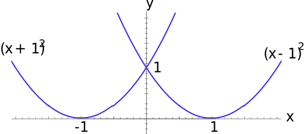

# 📝Definition
Disc integration, also known in [[definite integral|integral calculus]] as the disc method, is a method for calculating the volume of a solid of revolution of a solid-state material when integrating along an axis "parallel" to the axis of revolution.
# ✒Notation
$$
\begin{align}
dV = \pi y^2\, dx.
\end{align}
$$

# 🧠Intuition
The method of disks gives the differential volume element for a curve rotated about the $x$-axis.
> [!tip] Tips
> Think about 2 major stuffs:
> - what is the radius and the area of the disk?
> - what is the thickness? (that's $\Delta$ or $d$)

# 📈Diagram


# 🌓Complement
[[Shell integration]]
# 🗃Example
## 📌Classic Sphere Volume
- 💬Question: Find the volume of a ball of radius $a$
	- 
- 🏹Strategy: The sphere requires only one-time spinning of the upper part.
- ✏Solution:
	- The equation for the upper half of the circle is
		- $$y=\sqrt{a^2-x^2}$$
		- The $y$ is the radius of the disk.
	- Thinking spinning from $-a$ to $a$ will be
		- $$V=\int\pi y^2dx=\int_{x=-a}^{x=a}\pi(a^2-x^2)dx=\big(\pi a^2x-\frac{\pi x^3}{3}\big)\bigg|_{-a}^{a}=\frac{2}{3}\pi a^3-(-\frac{2}{3}\pi a^3)=\frac{4}{3}\pi a^3$$
	- Thinking spinning from $0$ to $a$ and double
		- Since the curve is symmetric about the $y$-axis, we can save this effort.
		- $$V=\int_{x=-a}^{x=a}\pi(a^2-x^2)dx=2\int_{x=0}^{x=a}\pi(a^2-x^2)dx=2\big(\pi a^2x-\frac{x^3}{3}\big)\bigg|_{0}^{a}=\frac{4}{3}\pi a^3$$

# 🕹Quiz
- 📌Revolve an equilateral triangle
	- 💬Question:
		- Find the volume $V$ of the solid obtained by revolving an equilateral triangle of side-length $a$ around one of its sides.
	- ✏Solution:
		- Draw the picture:
			- 
		- Identify the elements
			- thickness of the disk: $dx$
			- radius of the disk: $y$
			- area of the disk: $\pi y^2$
			- limit: $[0, \frac{a}{2}]$, because it is symmetric and therefore it could be double.
		- The volume will be like
			- $$V = 2\int _0^{a/2} \pi y^2 \,  dx = 2\int _0^{a/2} \pi (x \sqrt{3})^2 dx = \frac{\pi a^3}{4}.$$


- 📌A witch’s cauldron
	- 💬Question:
		- what is the volume of the cauldron?
		- $y = x^2$ rotated around the $y$-axis.
		- 
	- 🏹Strategy:
		- Think about what is the radius?
		- Think about what is the thickness?
	- ✏Solution:
		- The area of the disk is $\pi x^2$ in the following figure.
		- 
		- The disk has thickness $dy$ and volume $dV=\pi x2dy$.
		- Then the volume is
			- $$\begin{align}V &= \int_0^a\pi x^2 dy \quad(\text{ substitute}\space y = x^2)\\V&=\int_0^a\pi ydy=\pi\frac{y^2}{2}\bigg|_0^2=\frac{\pi a^2}{2}\end{align}$$

- 📌a split log volume
	- 💬Question: 
		- Consider $(x,y,z)$ such that $x^2+y^2\leq 1$, $x\geq0$ , and $0\leq z\leq5$. This describes one half of a cylinder (a split log). Chop out a wedge of the log along $z=2x$.
		- 
	- 🏹Strategy:
		- The direction of slicing is extremely important!
		- 
	- ✏Solution:
		- Initial attemp
			- I was thinking if I can slice from top to bottom (x-y plane). The cross section I thought is a semicircle.$dV=\frac{\pi(1-x)^2}{2}\cdot dz$ But this is wrong!❌ It is not a semicircle!
			- From the preceding diagram, the red is my initial attemp while the green is the correct one.
		- Second attemp
			- Then the key is to slice in x-z plane! They are all right triangle!!
			- Therefore, we can calculate its area:
				- $$\begin{align}\text{area of triangle}&=\frac{1}{2}\cdot\text{base}\cdot\text{height}\\&=\frac{1}{2}\cdot x\cdot z=\frac{1}{2}\cdot x\cdot 2x=x^2\end{align}$$
				- $$V = \int _{-1}^1x^2dy = \int _{-1}^1(1-y^2)dy = \frac{4}{3}.$$

- 📌imagination of disc integration
	- 💬Question:
		- A tower is constructed with a square base and square horizontal cross-sections. Viewed from any direction perpendicular to a side, the tower has base $y=0$ and profile lines $y=(x-1)^2$ and $y=(x+1)^2$.
		- 
	- 🏹Strategy:
		- The key point is to understand the context and what the geometry is.
			- "with a ==square base=="
				- ok, it means if we look from the top, the shape is a square.
			- "viewed from any direction perpendicular to a side"
				- It means, "front view", "back view", "left view", "right view"
			- "profile line..."
				- It means the shape of the preceding 4 side-views.
		- Imagination
			- The shape looks like this! Using the code in OpenSCAD
				- 
				  ```
				  $fn = 120;
				  N = 20;
				  for(i = [0 : N])
				  {
				      w = (i/N - 1)^2;
				      translate([1-w/2, 1-w/2, i/(2*N)])
				      cube([w,w,1/N]);
				  }
				  ```
			- Perspective
				- 
			- 4 side-views
				- 
	- ✏Solution:
		- First, figure out the direction of integration.
			- I choose to integrate from bottom to top(disc integration). $dy$
		- Second, figure out the length of the base square.
			- From the profile lines equations, we have the following
				- $y=(x+1)^2$ gives $x = -1\pm \sqrt{y}$
				- $y=(x-1)^2$ gives $x=1\pm \sqrt{y}$
			- The key point is to desicde whiuuuuuuuujich 2 values stand for the curve marked in the following diagram.
				- 
			- My approach is to compare the value from small to big.
				- smallest: $x = -1- \sqrt{y}$
				- small: $x = -1+ \sqrt{y}$ ✅
				- big: $x=1- \sqrt{y}$ ✅
				- biggest: $x=1+ \sqrt{y}$
			- Now we have the interval
				- interval is $-1+\sqrt{y}\leq x\leq 1-\sqrt{y}$
				- length is $(1-\sqrt{y})-(-1+\sqrt{y})=2(1-\sqrt{y})$
		- Finally, we can integrate the volume.
			- $$V = \int _0^1 (2(1-\sqrt{y}))^2dy = 4\int _0^1 (1-2\sqrt{y}+y)dy = \frac{2}{3}.$$
