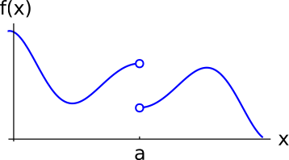
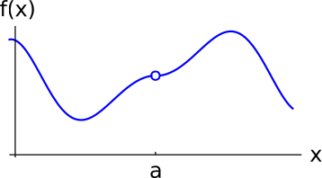
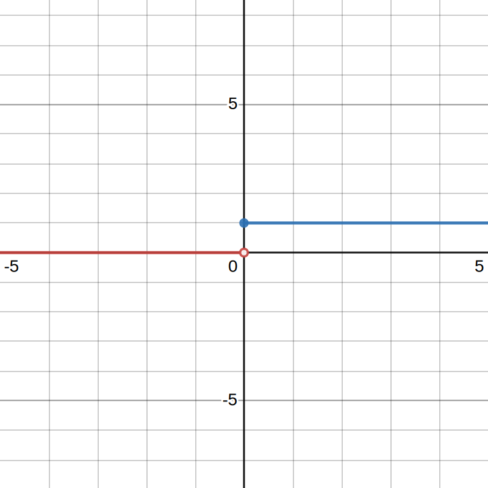
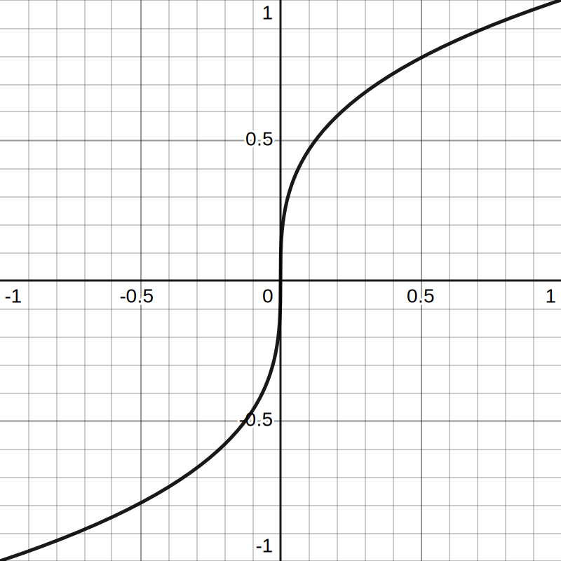

alias:: discontinuous

- # Discontinuity
	- ## 📝Definition
	  A discontinuity is point at which a mathematical object is discontinuous.
	- ## 🧠Intuition
	  A discontinuity is a point at which a function jumps suddenly in value, blows up, or is undefined.
	- ## 🏷(Sub)Categories
	  There are several forms of discontinuity.
		- 📌Jump Discontinuity
			- Definition:
				- If the left-hand limit \lim_{x\to a^-} and the right-hand limit \lim_{x\to a^+} both exist at a point x=a, but they are not equal, then we say that f has a **jump discontinuity** at x=a.
			- Diagram:
				- 
		- 📌Removable Discontinuity
			- Definition:
				- If the overall limit \lim_{x\to a}f(x) exists (i.e., the left- and right-hand limits agree), but the overall limit does not equal f(a), then we say that f has a **removable discontinuity** at x=a.
			- Diagram:
				- 
	- ## 🧮Expression
	  $$
	  \begin{align}
	  f(x)&=
	  \end{align}
	  $$
	- ## 📈Diagram
	  
	- ## ✒Descriptive Explanation
	  A narrative... a descriptive words subject on the concept... 描述性解释…
	- ## 🌓Complement
	  [[Continuity]]
	- ## 🗃Example
	  Example is the most straightforward way to understand a mathematical concept.
	- ## 🤳Applicability
	   What are the situations in which this subject can be applied?
	- ## 🧪Composition
	  What kind of stuffs composite this subject?
	- ## 🎯Intent
	   A short description what does this thing do?
- # 🧬Related Elements
   The closest pattern to current one, what are their differences?
	- 📌Example - Derivative of a Jump Discontinuity Function
		- Take a look at the following function:
			- 
		- The <u>right-sided derivative</u> is easy, which is:
		  $$
		  f'(0^+)=1
		  $$
		- However, we sometime may make mistake on the <u>left-sided derivative</u>:
		  $$
		  f'(0^-)=\infin
		  $$
		- It is infinity rather 0!! Why? Please recall how to calculate the derivative - some value close to $x=0$ and $x=-0.001$, that line is <u>hell vertical line</u>😲😲! The similar function is the following:
		  $$
		  f(x) = \sqrt[3]{x}
		  $$
		- {:height 300, :width 300}
		- Therefore it is not differentiable at $x=0$.