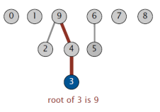
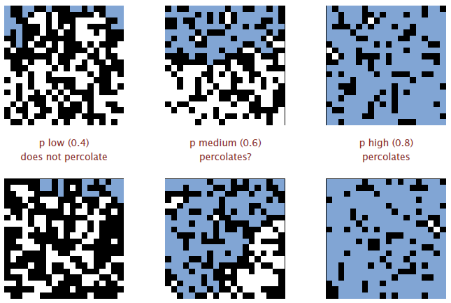

- # 📝Definition
	- The input is a sequence of pairs of integers, where each integer represents an object of some type and we are to interpret the pair $p$ $q$ as meaning $p$ is connected to $q$. We assume that "is connected to" is an [equivalence relation](((6328174b-a107-46d4-9c92-ed9b65e70b0f))).
- # 🎯Intent
	- Our goal is to write a program to filter out extraneous pairs from the sequence: When the program reads a pair $p$ $q$ from the input, it should write the pair to the output only if the pairs it has seen to that point do not imply that $p$ is connected to $q$. If the previous pairs do imply that $p$ is connected to $q$, then the program should ignore the pair $p$ $q$ and proceed to read in the next pair.
- # 📈Diagram
	- 📌diagram of connectivity example
		- 
	- 📌diagram of `union()` operation
		- The following is the connectivity with the procedure of step by step `union()`.
		- {:height 200, :width 200}
- # 🩹Interface
	- The 2 Key interfaces
		- **Find** query.  Check if two objects are in the same component.
		- **Union** command.  Replace components containing two objects with their union.
		- {:height 400, :width 400}
	- To start with, we follow the definition of [data structure and interface](((6329b0b1-4a11-4d08-855f-1b27389fdc4d))) defined in the MIT classes.
		- | `public class UnionFindBase`        |                                                              |
		  | --------------------------------- | ------------------------------------------------------------ |
		  | `UnionFindBase(int N)`            | initialize union-find data structure with $N$ objects ($0$ to $N – 1$) |
		  | `void union(int p, int q)`        | add connection between $p$ and $q$                           |
		  | `boolean connected(int p, int q)` | are $p$ and $q$ in the same component?                       |
		  | `int find(int p)`                 | component identifier for $p$ ($0$ to $N – 1$)                |
		  | `int count()`                     | number of components                                         |
- # 🐍Algorithm and Data Structure
	- ## 📌Performance Comparison
		- Test File Sample
			- The first number stands for the number of components. The rests are the union operands.
			- ``` 
			  % more tinyUF.txt
			  10
			  4 3
			  3 8
			  6 5
			  9 4
			  2 1
			  8 9
			  5 0
			  7 2
			  6 1
			  1 0
			  6 7
			  ```
		- Test Code
			- ``` java
			  import java.io.IOException;
			  import java.nio.file.Path;
			  import java.nio.file.Paths;
			  import java.util.Scanner;
			  
			  public class Main {
			  
			      /*
			       * 3 different files
			       */
			      public static String[] paths = new String[]{"../res/tinyUF.txt", "../res/mediumUF.txt", "../res/largeUF.txt"};
			  
			      /*
			       * Test function. Use QuickFind, QuickUnion, and WeightedUnion to process files and record their time.
			       *
			       * @param uf the base class object for polymorphism
			       * @throws IOException if the files broken
			       */
			      public static void test(UnionFindBase uf) throws IOException {
			          System.out.println("------" + uf.getClass() + " performance report------ ");
			          for (String path : paths) {
			              long startTime = System.nanoTime();
			              Path filePath = Paths.get(path);
			              Scanner scanner = new Scanner(filePath);
			              int n = scanner.nextInt();
			              uf.construct(n);        //👈since the object will be used few times. so use a method to
			              						// construct rather than constructor one time initialization
			              while (scanner.hasNext()) {
			                  int p = scanner.nextInt();
			                  int q = scanner.nextInt();
			                  if (uf.connected(p, q)) continue;  //👈see if connected
			                  uf.union(p, q);                    //👈union
			              }
			  
			              System.out.println("There are " + uf.amount + " components.");
			              double elapsedTime = (System.nanoTime() - startTime) / 1000000.0;
			              System.out.println("Processing \"" + filePath.getFileName() + "\" : " + elapsedTime + "ms");
			          }
			          System.out.println();
			      }
			  
			      /*
			       * The main method.
			       */
			      public static void main(String[] args) throws IOException {
			          test(new QuickFind());
			          test(new QuickUnion());
			          test(new WeightedUnion());
			          test(new WeightedUnionOnePassCompression());
			          test(new WeightedUnionTwoPassCompression());
			      }
			  }
			  
			  ```
		- Result
			- ``` shell
			  ------class QuickFind performance report------ 
			  There are 2 components.
			  Processing "tinyUF.txt" : 51.47ms
			  There are 3 components.
			  Processing "mediumUF.txt" : 22.7214ms
			  There are 6 components.
			  Processing "largeUF.txt" : 810162.8484ms  👈
			  
			  ------class QuickUnion performance report------
			  There are 2 components.
			  Processing "tinyUF.txt" : 2.2864ms
			  There are 3 components.
			  Processing "mediumUF.txt" : 2.1651ms
			  There are 6 components.
			  Processing "largeUF.txt" : 4335791.7685ms  👈
			  
			  ------class WeightedUnion performance report------
			  There are 2 components.
			  Processing "tinyUF.txt" : 3.1877ms
			  There are 3 components.
			  Processing "mediumUF.txt" : 2.0371ms
			  There are 6 components.
			  Processing "largeUF.txt" : 2389.0748ms  👈
			  
			  ------class WeightedUnionOnePassCompression performance report------ 
			  There are 2 components.
			  Processing "tinyUF.txt" : 54.2482ms
			  There are 3 components.
			  Processing "mediumUF.txt" : 19.7781ms
			  There are 6 components.
			  Processing "largeUF.txt" : 2377.3732ms  👈
			  
			  ------class WeightedUnionTwoPassCompression performance report------
			  There are 2 components.
			  Processing "tinyUF.txt" : 2.8052ms
			  There are 3 components.
			  Processing "mediumUF.txt" : 2.7872ms
			  There are 6 components.
			  Processing "largeUF.txt" : 2248.6976ms  👈
			  
			  
			  ```
		- Conclusion
		  collapsed:: true
			- In the end, you will find the very interesting fact that **with same interface, different algorithm and data structure scale the performance**!!
	- ## 📌Base Class
		- Since there are many repeated codes. I made a base class for different algorithms and data structures. I think this is a good example of [[Object-oriented Programming Paradigm]] as well.
		- ``` java
		  public abstract class UnionFindBase {
		      protected int[] id;        // the id has diff meaning in diff contexts
		      protected int amount;      // the amount of components
		      private int length;        // the length of elements
		  
		      protected UnionFindBase() {
		      }
		  
		      public void construct(int n) {
		          if (n < 0) throw new IllegalArgumentException();
		          amount = length = n;
		          id = new int[n];
		          for (int i = 0; i < n; ++i) {
		              id[i] = i;
		          }
		      }
		  
		      public int length() {
		          return length;
		      }
		  
		      public boolean connected(int p, int q) {
		          return find(p) == find(q);
		      }
		  
		      public abstract void union(int p, int q); //👈⭐union function to override
		  
		      public abstract int find(int p); //👈⭐find function to override
		  }
		  
		  ```
	- ## 📌Quick Find
		- Data structure.
			- Integer array `id[]` of length $N$.
			- ⭐Interpretation: `id` stands for the "id of component". a.k.a. $p$ and $q$ are connected if and only if they have the same `id`.
			- 
		- Operation
			- Find.
				- That is very easy to check if $p$ and $q$ have the same `id`.
				- e.g. `id[6] = 0; id[1] = 1;` 6 and 1 are not connected since they have different `id`.
			- Union
				- Union is very heavy which has to find all the related `id` need to change. That is iterating to change all entries whose `id` equals `id[p]` to `id[q]`.
				- e.g. If you want to union 6 and 1
				  
		- Cost model
			- | algorithm  | initialize | union | find |
			  | ---------- | ---------- | ----- | ---- |
			  | quick-find | $N$        | $N$   | 1    |
			- Union is too expensive. It takes $N^2$([quadratic](((6326888e-2beb-4ec0-bca1-0ba863acc203)))) array accesses to process a sequence of $N$ union commands on $N$ objects.
		- Code
			- ``` java
			  
			  public class QuickFind extends UnionFindBase {
			  
			      public QuickFind() {
			          super();
			      }
			  
			      public int find(int p) {
			          return id[p];
			      }
			  
			      public void union(int p, int q) {
			          int pId = find(p);
			          int qId = find(q);
			          if (pId == qId) {
			              return;
			          }
			          for (int i = 0; i < length(); i++) {
			              if (id[i] == pId) {
			                  id[i] = qId;
			              }
			          }
			          amount--;
			      }
			  }
			  
			  ```
	- ## 📌Quick Union
		- Data Structure
			- 
			- Integer array `id[]` of length $N$.
			- ⭐Interpretation: `id[i]` is parent of `i`.
				- e.g. Root of `i` is `id[id[id[...id[i]...]]]`.
			- Explanation
				- If I want to find
					- find `3`->`4`->`9`  (`9` itself is `9`. Stop)
					- find `2`->`9` (`9` itself is `9`. Stop)
				- Then we have the conclusion is that `3` and `2` are connected.
				- A better visualization
				  
		- Operation
			- Find
				- Not so hard, just a loop till the end. Check if $p$ and $q$ have the same root.
			- Union
				- Relative easy. To merge components containing $p$ and $q$, set the id of $p$'s root to the id of $q$'s root.
		- Cost Model
			- | algorithm   | initialize | union | find |
			  | ----------- | ---------- | ----- | ---- |
			  | quick-union | $N$        | 1     | $N$  |
			- The find operation can lead to worst case which is that the branch is too tall...
			- 
		- Code
			- ``` java
			  public class QuickUnion extends UnionFindBase {
			  
			      public QuickUnion() {
			      }
			  
			      public int find(int p) {
			          while (p != id[p]) p = id[p];
			          return p;
			      }
			  
			      public void union(int p, int q) {
			          int pRoot = find(p);
			          int qRoot = find(q);
			          if (pRoot == qRoot) {
			              return;
			          } else {
			              id[pRoot] = qRoot;
			              amount--;
			          }
			      }
			  
			  }
			  
			  ```
	- ## 📌Weighted Union
		- Intro
			- Weighted union is a refined version of quick-union.
		- Characteristics
			- Keep **track of size** of each tree (number of objects).
			- **Balance** by linking root of smaller tree to root of larger tree.
			- {:height 300, :width 300}
		- Data Structure
			- Same as quick-union, but maintain extra array `size[i]` to count number of objects in the tree rooted at `i`.
		- Operation
			- Find
				- Identical to quick union.
			- Union
				- Modify quick-union to:
					- Link root of smaller tree to root of larger tree.
					- Update the `size[]` array.
		- Cost Model
			- Proposition. Depth of any node $x$ is at most $\lg N$. You can prove it if you want.
			- {:height 300, :width 300}
			- | algorithm      | initialize | union | find    |
			  | -------------- | ---------- | ----- | ------- |
			  | weighted-union | $N$        | 1     | $\lg N$ |
		- Code
			- ``` java
			  import java.util.Arrays;
			  
			  public class WeightedUnion extends QuickUnion {
			      protected int[] size;
			  
			      public WeightedUnion() {
			          super();
			      }
			  
			      public void construct(int n) {
			          super.construct(n);
			          size = new int[length()];
			          Arrays.fill(size, 1);
			      }
			  
			      public void union(int p, int q) {
			          int pRoot = find(p);
			          int qRoot = find(q);
			          if (pRoot == qRoot) return;
			          if (size[pRoot] < size[qRoot]) { id[pRoot] = qRoot; size[qRoot] += size[pRoot]; }
			          else                           { id[qRoot] = pRoot; size[pRoot] += size[qRoot]; }
			          amount--;
			      }
			  }
			  ```
	- ## 📌Weighted Union with Compression
		- ``` java
		  public class WeightedUnionOnePassCompression extends WeightedUnion {
		      public int find(int p) {
		          while (p != id[p]) {
		              id[p] = id[id[p]];  //👈Only one extra line of code!!
		              p = id[p];
		          }
		          return p;
		      }
		  }
		  ```
		- ``` java
		  //😲Mind Blowing!!
		  public class WeightedUnionTwoPassCompression extends WeightedUnion {
		      public int find(int p) {
		          int root = p;
		          while (root != id[root])
		              root = id[root];
		          while (p != root) {
		              int newp = id[p];
		              id[p] = root;
		              p = newp;
		          }
		          return root;
		      }
		  }
		  
		  ```
- # 🤳Applicability
	- Pixels in a digital photo.
	- Computers in a network.
	- Friends in a social network.
	- Transistors in a computer chip.
	- Elements in a mathematical set.
	- Variable names in Fortran program.
	- Metallic sites in a composite system.
	- ## Percolation
		- 📝Definition
			- In physics, chemistry and materials science, percolation refers to the movement and filtering of fluids through porous materials.
			- In statistical physics and mathematics, percolation theory describes **the behavior of a network when nodes or links are added**.
		- 📈Diagram
			- {:height 400, :width 400}
		- 📊 Model
			- We use mathematical model to simulate the real world problem.
			- 📌Definition of the model
				- $N\times N$ grid of sites.
				- Each site is open with probability $p$ (or blocked with probability $1 – p$).
				- System percolates **iff** top and bottom are connected by open sites.
			- 📌Interpretation of the model
				- Percolation Theory is widely used and it can be interpreted in various ways.
				- | model              | system     | vacant site | occupied site | percolates   |
				  | ------------------ | ---------- | ----------- | ------------- | ------------ |
				  | electricity        | material   | conductor   | insulated     | conducts     |
				  | fluid flow         | material   | empty       | blocked       | porous       |
				  | social interaction | population | person      | empty         | communicates |
		- 🎯Intent
			- 📌To find the probability that the system percolates
				- In a famous scientific problem, researchers are interested in: if sites are independently set to be open with probability $p$?
				  collapsed:: true
					- When $p=0$, the system does not percolate
					- When $p=1$, the system percolates.
				- The graph below shows the likelihood whether a system is percolated.
				  collapsed:: true
					- {:height 400, :width 400}
				- The task is to write a computer program to estimate $p$. When $N$ is large, theory guarantees a sharp threshold $p^*$.
				  collapsed:: true
					- $p > p^*$: almost certainly percolates.
					- $p < p^*$: almost certainly does not percolate.
					- {:height 300, :width 300}
			- 📌Solution
				-