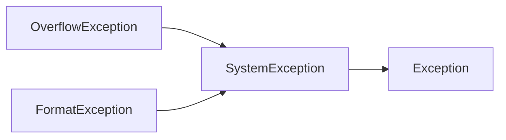

# 🧠Intuition
- The fundamental idea of exception is ^d5e20b858167b2c9
    - 1️⃣
        - to separate detection of an [[Error]] (which should be done in a called function, a.k.a. [[Glossary#Implementer|implementer]] ) from
        - the handling of an error (which should be done in the calling function, a.k.a. [[Glossary#Client|client]])
        
    - 2️⃣
        - while in the meantime ensuring that a detected error cannot be ignored.
        

# 📋Prerequisite
`Exception` can be saw as the "source" or "form" of the concept errors. So there must be a mechanism to handle these kinds of errors. That is [[try-catch]].

# ⛈Characteristics / Properties
## [[inheritance]]
#csharp  provides a robust solution for handling exception which is defined very carefully with an **inheritance hierarchies**(异常用继承层次结构组织). The following is an example:


Therefore, we could use `Exception` to catch any types of exception since it is the *great-granddaddy* of all exceptions.

```c#
try
{
    
}
catch (Exception ex)
{
    //this block will handle all kinds of exception
}
```

# ⌨Sample Code
Since `Exception` and `try-catch` are closely related. The sample codes go to [[try-catch#⌨Sample Code]].

- example of throwing exceptions in C++
    - throwing bad argument
        - ``` c++
          class Bad_area { }; // a type specifically for reporting errors from area()
          
          // calculate area of a rectangle;
          // throw a Bad_area exception in case of a bad argument
          int area(int length, int width)
          {
            if (length<=0 || width<=0) throw Bad_area{};  //👈the 'throw' is to hope that some `catch` will provide an appropriate response
            return length*width;
          }
          
          int main()
          {
            try {
                int x = –1;
                int y = 2;
                int z = 4;
                // . . .
                int area1 = area(x,y);
                int area2 = framed_area(1,z);
                int area3 = framed_area(y,z);
                double ratio = area1/area3;
          }
            
          catch (Bad_area) {
          	cout << "Oops! bad arguments to area()\n";
          }
          }
          
          ```
        - The separation of duty is extremely important of [[#^d5e20b858167b2c9|understanding exception]].
            - `main()` knows nothing about which function did a throw `Bad_area{}`
            - `area()` knows nothing about which function (if any) cares to catch the `Bad_area` exceptions it throws.


# 🏷(Sub)Categories
## unhandled exception
### 📝Definition
The catch mechanism is cascading back(由内向外遍历). If the certain type of exception was still not catch, then it will be **unhandled exception**.
### ⌨Sample Code
```c#
string numStr = "2147483648";
try
{
    int num = int.Parse(numStr);
    Console.WriteLine(num);
}
catch(FormatException fEx)
{
    
}
```
Because the `catch` block only handles `FormatException`, the number exceeds the maximum which will conduct an `OverflowException`.


