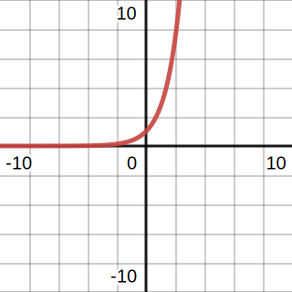
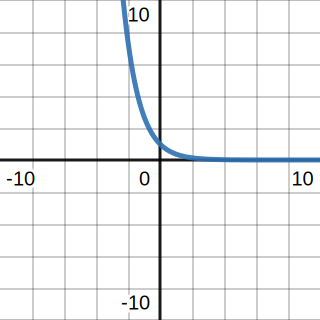

# 🧾 Cheat Sheet
$$
\begin{align}
(1)&x^0 = 1\\
(2)&x^nx^m = x^{n+m}\\
(3)&\frac{x^n}{x^m} = x^{n-m} = \frac{1}{x^{m-n}}\\
(4)&(x^n)^m = x^{nm}\\
(5)&\left(\frac{x}{y}\right)^n = \frac{x^n}{y^n}\\
(6)&x^{-n} = \frac{1}{x^n}\\
(7)&\frac{1}{x^{-n}} = x^n\\
(8)&\left(\frac{x}{y}\right)^{-n} = \left(\frac{y}{x}\right)^n = \frac{y^n}{x^n}\\
(9)&x^{\frac{n}{m}} = \left(x^{\frac{1}{m}}\right)^n = (x^n)^{\frac{1}{m}} = \sqrt[m]{x^n}\\
\end{align}
$$

# 📝Definition
- The most general form of "an" exponential function is a power-law function of the form.
  $$
  f(x)=ab^{cx+d}
  $$
  where $a,c,d$ are real numbers, $b$ is a positive real number, and $x$ is a real variable.

# 🏷(Sub)Categories
- For $f(x)=ab^{cx+d}$,
- when $c$ is positive, $f(x)$ is exponentially increasing function
  {:height 216, :width 212}
- when $c$ is negative, $f(x)$ is exponentially decreasing function
  {:height 216, :width 212}

- 🌓Complement
    - [[Logarithm]]
    