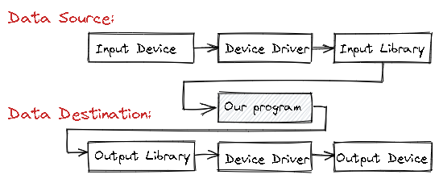
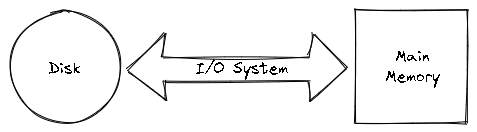

# 📝Definition
File and stream I/O (input/output) refers to the transfer of data either **to** or **from** a storage medium.

# 🎯Intent
The intent of `I/O` model
- To set up I/O streams to the appropriate data sources and destinations.
- To read and write from/to those streams.

# 🧠Intuition
Find an intuitive way of explanation of this concept.
- In terms of hardware
    - {:height 300, :width 300}
    
- In terms of functional abstraction
    - {:height 300, :width 300}
    
# 🥼Expert's Advice
See what experts addressed.
- In C++,
    - The following is a close example on [[RAII]].
      ``` c++
      void fill_from_file(vector<Point>& points, string& name)
      {
          ifstream ist {name}; // open file for reading
          if (!ist) error("can't open input file ",name);
          // . . . use ist . . .
      }👈// the file is implicitly closed when we leave the function
         // this is a good practice ✅ compared to manually open/close a file
      ```
    
# 🍪Common I/O Task
- Links:
    - C#.
        - https://docs.microsoft.com/en-us/dotnet/standard/io/common-i-o-tasks
        - https://docs.microsoft.com/en-us/dotnet/standard/io/handling-io-errors
        
    - C++.
    
## Common File Tasks
- Read from a text file
    - The procedure is like this
        - 1. Know its name
          2. Open it (for reading)
          3. Read in the characters
          4. Close it (though that is typically done implicitly)
        
    - C++
        - ``` c++
          #include "std_lib_facilities.h"
          
          /*
           * The "data.txt" is with following formats.
           * 0 60.7
           * 1 60.6
           * 2 60.3
           * 3 59.22
           */
          
          /* a struct reading per line */
          struct Reading
          {
              int hour;
              double temperature;
          };
          
          int main()
          {
              /* istream,cin getting user input */
              cout << "Please enter input file name: ";
              string iname;
              cin >> iname;
          
              /* ifstream(in file stream) open a file */
              ifstream ist {iname};
              if (!ist) error("can't open input file ",iname);
          
              /* ifstream(in file stream) reading a file */
              vector<Reading> temps;
              int hour;
              double temperature;
              while (ist >> hour >> temperature) {
                  if (hour < 0 || 23 <hour) error("hour out of range");
                  temps.push_back(Reading{hour,temperature});
              }
          
              /* ofstream(output file stream) open-create a file for writing */
              string oname;
              cout << "Please enter name of output file: ";
              cin >> oname;
              ofstream ost {oname}; // ost writes to a file named oname
              if (!ost) error("can't open output file ",oname);
          
              /* ofstream writing to that file */
              for (int i=0; i<temps.size(); ++i)
              {
                  ost << '(' << temps[i].hour << ','
                      << temps[i].temperature << ")\n";
              }
          
              return 0;
          }
          ```
        
    - C#
        - Synchronous version
            - ``` c#
              try
              {
                // Open the text file using a stream reader.
                using (var sr = new StreamReader("TestFile.txt"))
                {
                  // Read the stream as a string, and write the string to the console.
                  Console.WriteLine(sr.ReadToEnd());
                }
              }
              catch (IOException e)
              {
                Console.WriteLine("The file could not be read:");
                Console.WriteLine(e.Message);
              }
              ```
            
        - Asynchronous version
            - ``` c#
              try
              {
                using (var sr = new StreamReader("TestFile.txt"))
                {
                  ResultBlock.Text = await sr.ReadToEndAsync();
                }
              }
              catch (FileNotFoundException ex)
              {
                ResultBlock.Text = ex.Message;
              }
              ```
            
- Write to a text file
    - The process is like this
        - 1. Name it
          2. Open it (for writing) or create a new file of that name
          3. Write out our objects
          4. Close it (though that is typically done implicitly)
        
## Common Directory Tasks
- ...

## I/O Error Handling
- C++
    - ``` c++
      /* read integers from ist into v until we reach eof() or terminator */
      void fill_vector(istream& ist, vector<int>& v, char terminator)
      {
          for (int i; ist >> i; ) v.push_back(i);
          /* Case1️⃣ fine: we found the end of file */
          if (ist.eof()) return;
      
          /* Case2️⃣ stream corrupted; let’s get out of here!*/
          if (ist.bad()) error("ist is bad");
          
          /* Case3️⃣ failed. clean up the mess as best we can and report the problem */
          if (ist.fail())
          {
              ist.clear(); // clear stream state,
              // so that we can look for terminator
              char c;
              ist >> c; // read a character, hopefully terminator
              if (c != terminator)
              { // unexpected character
                  ist.unget(); // put that character back
                  ist.clear(ios_base::failbit); // set the state to fail()
              }
          }
      }
      ```
    