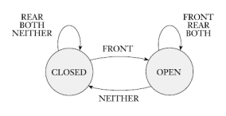

# 📝Definition
A finite automaton is a 5-[[tuple|tuple]] ($Q,\Sigma,\delta,q_0,F$), where
- $Q$ is a finite [[set|set]] called the states
- $\Sigma$ is a finite [[set|set]] called the alphabet
- $\delta:Q\times\Sigma\rightarrow Q$ is the transition function
- $q_0\in Q$ is the starter state
- $F\subseteq Q$ is the [[set|set]] of accept states(or final states)

> [!tip] Tips
> - Notation. For the "$\times$" and "$\rightarrow$" in $\delta:Q\times\Sigma\rightarrow Q$, it means [[domain]] and [[range]].
> - Facts. There is only 1 starter state while there could be multiple accept states.

# 🗃Example
## Door
📈Diagram

# 🧪Composition
## state

## alphabet

## transition function

## starter state

## accept state

# 💫Operation

## Computation
### 🧠Intuition
The computation of a finite automaton is the computation it supports.
### 📝Definition
Suppose the following
- $M = (Q,\Sigma,\delta,q_0,F)$ is a finite automaton
- $\Sigma$ is the alphabet
- $w = w_1w_2\cdots w_n$ is a string where each $w_i$ is a member of the alphabet $\Sigma$.
- $r_0, r_1, . . . , r_n$, a sequence of states(input)
Then $M$ accepts $w$ if a sequence of states $r_0, r_1, . . . , r_n$ in $Q$ exists with three conditions:
- 1️⃣$r_0=q_0$
- 2️⃣$\delta(r_i, w_{i+1})=r_{i+1}$, for $i=0,...,n-1$
- 3️⃣\$r_n\in F$

> [!NOTE] Note
> - Condition 1 says that the machine starts in the start state.
> - Condition 2 says that the machine goes from state to state according to the transition function.
> - Condition 3 says that the machine accepts its input if it ends up in an accept state.
> - We say that $M$ recognizes [[regular language|language]] $A$ if $A = \{w|M\space\text{accepts} \space w\}$.

