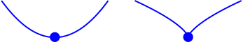
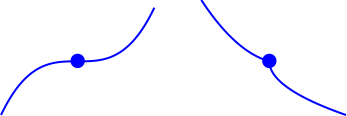

- # First Derivative Test
	- ## 📝Definition
	  The first-derivative test examines a function's monotonic properties (where the function is increasing or decreasing), focusing on a particular point in its domain.
	- ## 🧠Intuition
	  Find the function's [[extremum]] point.
	- ## 🤳Applicability
		- 📌Finding [[Local Minima]] and [[Local Maxima]]
			- Suppose the $f(x)$ is continuous at $x=a$ and has a [[Critical Point]] at $x=a$
				- $f$ has a local minimum at $x=a$ if $f'(x)<0$ just to the left of $a$ and $f'(x)>0$ just to the right of $a$.
				  
				- $f$ has a local maximum at $x=a$ if $f'(x)>0$ just to the left of $a$ and $f'(x)<0$ just to the right of $a$.
				  
				- The point $x=a$ is neither a local minimum nor a local maximum of $f$ if $f'(x)$ has the same sign just to the left of $a$ and just to the right of $a$.
				  
	- ## 🗃Example
		- 📌Example 1 - Use first derivative test to find local extrema
			- Question: List all $x$-values of points at which the function
			  $$
			  g(x)=x^5/5+2x^4+4x^3-17
			  $$
			  has a local extrema.
			- Solution:
				- 1)Find the critical point by $g'(x)$
					- $$
					  g'(x)=x^4+8x^3+12x^2=x^2(x+6)(x+2)=0
					  $$
					- result is  $x=0, -6, -2$
				- 2)Then we can draw the diagram as followed
				  (x+2).svg)
				- 3)Then we need to know the sign except the 3 critical points.
					- $g'(-10)=3200$, so $g'$ is positive on $(-\infin, -6)$
					- $g'(-4)=-64$, so $g'$ is negative on $(-6, -2)$
					- $g'(-1)=5$, so $g'$ is positive on $(-2, 0)$
					- $g'(1)=21$, so $g'$ is positive on $(0, +\infin)$
				- 4)we can draw the diagram as followed
				  (x+2).svg){:height 72, :width 360}
				- 5) Then we knew
					- local minimum: $x=-2$
					- local maximum: $x=-6$
		- 📌Example 2 - Use first derivative test to find local extrema
			- Question: List all $x$ -values of points at which the function  
			  $$
			  h(x)=1.5x^{2/3}+x
			  $$
			  has a local extrema.
			- Solution:
				- 1)Find the critical point by $h'(x)$
					- $$
					  h'(x)=\frac{1}{\sqrt[3]{x}}+1
					  $$
					- result is
						- at $x=0$ is not defined
						- at $x=-1$ is $h'(x)=0$
				- 2)Then we can draw the diagram as followed  
				  =frac{1}{sqrt[3]{x}}+1.svg)
				- 3)Then we need to know the sign except the 2 critical points.
					- $h'(-8)=1/2$ , so $g'$ is positive on $(-\infin, -1)$
					- $h'(-1/8)=-1$ , so $g'$ is negative on $(-1, 0)$
					- $h'(1)=2$ , so $g'$ is positive on $(0, +\infin)$
				- 4)we can draw the diagram as followed  
				  =frac{1}{sqrt[3]{x}}+1.svg)
				- 5) Then we knew
					- local minimum: $x=0$
					- local maximum: $x=-1$
	- ## 🙋‍♂️Related Elements
	  [[Second Derivative Test]]. For the comparison with it, please refer to ((63044ce2-d814-454d-a4c3-f51cc3da638b)).
	- ## 🧮Expression
	  $$
	  \begin{align}
	  f(x)&=
	  \end{align}
	  $$
	- ## 📈Diagram
	  
	- ## ✒Descriptive Explanation
	  A narrative... a descriptive words subject on the concept... 描述性解释…
	- ## 🌓Complement
	  What is the complement of this subject? e.g. vector-covector, constructor-destructor
	- ## 🧪Composition
	  What kind of stuffs composite this subject?
	- ## 🏷(Sub)Categories
	  What are the sub objects of this subject?
	- ## 🎯Intent
	   A short description what does this thing do?