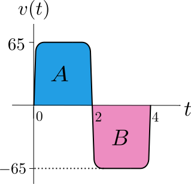

alias:: FTC1

- # 🎯Intent
	- It helps on the integration part of [[Calculus]].
	- The FTC1 connects the [[definite integral]] to the [[Antiderivative]]. With this connection, we can now compute definite integrals using antiderivatives, and dispense with [Riemann sums](((633f8f9f-c0b3-4d71-abf1-bc74283f85c2))).
- # 📝Definition
	- The First Fundamental Theorem of Calculus states that:
		- If $F$ is [[differentiable]] , and $F'=f$ is [[Continuous]] , then
		- $$
		  \displaystyle  \displaystyle \int _a^b f(x) \, dx=F(b)-F(a)
		  $$
	- In other words, the [[definite integral]] of a function is the difference between the values of its [[Antiderivative]] at the [[Limit]]s of the definite integral.
- # 🧠Intuition
	- Geometric Intuition of FTC1
		- $\int_a^b f(x)dx$ is the definite integral of a general function is the signed area bounded by the curve $y=f(x)$.
			- where the areas considered are between the vertical lines $x=a$ and $x=b$.
		- The important point is that
			- the area *above* the $x$-axis is counted with a **positive** sign
			- the area *below* the $x$-axis is counted with a **negative** sign.
		- Graph
			- {:height 200, :width 300}
		- $$
		  \int _{a}^{b} f(x) \, dx\, =\, \text{Area above} \, x\text{-axis and below }\, y=f(x)\, -\,  \text{Area below} \, x\text{-axis and above }\, y=f(x)
		  $$
- # ✒Notation
	- $$
	  \begin{align}
	  \displaystyle  \displaystyle \left.\phantom{\int }F(x)\, \right|_a^b=F(b)-F(a)
	  \end{align}
	  $$
- # 🧬Related Elements
	- ## 📌Comparing FTC1 and [[MVT]]
	  id:: 908c048d-f677-4dcf-aaec-edd14984f977
		- If $F(x)$ is [[differentiable]] and $F'(x)$ is [[Continuous]] on $[a,b]$. And let
			- $$
			  \begin{align}
			  \Delta F&=  F(b)-F(a)\\
			  \Delta x&=b-a
			  \end{align}
			  $$
		- Then, the MVT states that
			- $$
			  \frac{\Delta F}{\Delta x}=F'(c)\quad\quad\text{for some }c, a<c<b
			  $$
		- On the other hand, the FTC1 gives
			- $$
			  \frac{\Delta F}{\Delta x}=  \frac{1}{b-a} \int _a^b F'(x) \, dx.
			  $$
		- We see that the FTC1 gives a specific value for $\frac{\Delta F}{\Delta x}$, the average rate of change of $F$ over $[a,b]$, but the MVT does not, since it does not tell us where $c$ is.
		- Therefore, the First Fundamental Theorem much more useful than the Mean Value Theorem. Once we have FTC1 at our disposal, we do not need to use MVT anymore. Nonetheless, the Mean Value Theorem is important as the basis of calculus. We needed it to establish the fact that two antiderivatives of the same function can only differ by a constant. We will need this fact again in order to prove FTC1 in the next section.
- # 🗃Example
	- 📌travelling in <u>one direction</u>
		- Scenario
			- Suppose you are traveling always in one direction between time $a$ and $b$, and the velocity of your car at time $t$ is $v(t)\geq$, and the position of your car at time $t$ is $x(t)$.
		- Two Big Picture
			- From [Riemann sums](((633f8f9f-c0b3-4d71-abf1-bc74283f85c2))) perspective
				- Measure the speed
					- If you record your velocity every second.  let $t_i$ be the moment within the $i^{th}$ second when you read the speedometer, and $v(t_i)$ be the velocity of your car at $t_i$. And let $\Delta t$ be one second.
				- Measure the distance
					- Then $v(t_i)\cdot\Delta t$ is an approximation of the distance travelled within the $i^{th}$ second, and when we add up all these small distances, we get an approximation of the total distance travelled in the entire journey.
				- Summary
					- the Riemann sum **==approximates==** the total distance travelled by your car in the journey.
					- $$
					  \sum _{i=1}^{n} v(t_i) \cdot \Delta t\approx x(b)-x(a)\quad\quad\text{Riemann sum approximation}
					  $$
			- From FTC1 perspective
				- Summary
					- The definite integral is **==equal==** to the total distance travelled in the whole journey.
					- $$
					  \displaystyle  \displaystyle \int _a^b v(t)\, dt=x(b)-x(a)\quad\quad\text{FTC1}
					  $$
	- 📌travelling <u>round trip</u>
		- Scenario
			- Suppose you drove along a straight road from home to the border, which is 125 km away. You took 2 hours to drive there but just as you arrived you realized that you had forgotten to bring your passport, and so you immediately turned back to drive home again. The round trip took 4 hours in total.
		- Distinction between "speed" and "velocity"
			- Velocity is signed.  The velocity function is $v(t)$.
			- Speed is unsigned. The speed function is $\lvert v(t)\rvert$. In other words, speed is the absolute value of velocity.
		- Graph
			- velocity graph
				- {:height 200, :width 200}
				- since it went back and therefore the integration is $A+B=0$.  (A is positive, B is negative)
			- position graph
				- {:height 200, :width 200}
			- speed graph
				- Speed graph is always above the $t$-axis. Therefore it is $A-B$.
	- 📌example of FTC1
		- Question
			- Calculate
				- $$
				  \displaystyle \int _{-\pi /2}^{\pi /2} \cos (\theta ) \, d\theta =?
				  $$
			- Is it true that
				- $$
				  \displaystyle \int _{-\pi /2}^{\pi /2} \cos (\theta )\,  d\theta = \int _{0}^{\pi } \sin (\theta ) \, d\theta ?
				  $$
		- Solution
			- By FTC1
				- $$
				  \displaystyle \left.\int _{-\pi /2}^{\pi /2} \cos (\theta )\,  d\theta \, = \, \sin (\theta )\right|_{-\pi /2}^{\pi /2} \, = \,  1- (-1) \, =\, 2.
				  $$
			- On the other hand
				- $$
				  \displaystyle \left.\int _{0}^{\pi } \sin (\theta ) \, d\theta \, = \left[-\cos (\theta )\right]\right|_{0}^{\pi } \, = \,  [-(-1)]- [-1] \, =\, 2.
				  $$
			- So
				- $$
				  \displaystyle \int _{-\pi /2}^{\pi /2} \cos (\theta ) \, d\theta = \int _{0}^{\pi } \sin (\theta )\,  d\theta .
				  $$
		- Notice that this equality is consistent with the interpretation of definite integrals as the area under curves. Both of these integral equal the area under one hump of the sine or cosine curve, shaded in the figure below.
			- {:height 200, :width 400}