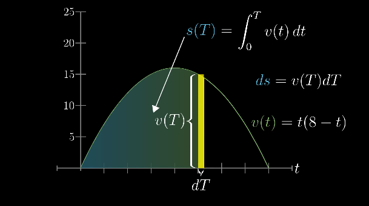
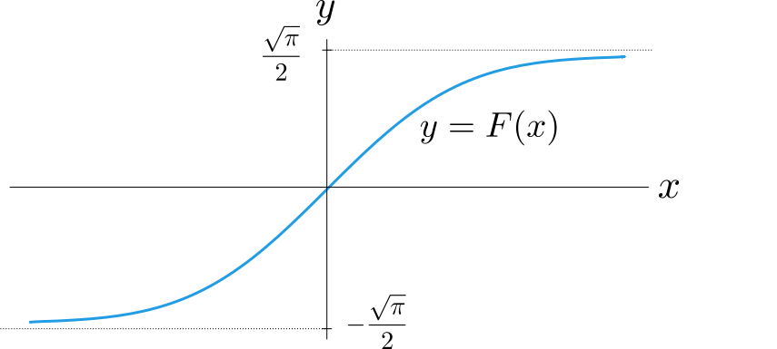

# 🎯Intent
- It helps on the integration part of [[Calculus]].
- The FTC1 connects the [[definite integral]] to the [[Antiderivative]]. With this connection, we can now compute definite integrals using antiderivatives, and dispense with [[Riemann sums]].

# 📝Definition
- The First Fundamental Theorem of Calculus states that:
    - If $F$ is [[differentiable]] , and $F'=f$ is [[Continuous]] , then
    - $$
      \displaystyle  \displaystyle \int _a^b f(x) \, dx=F(b)-F(a)
      $$
    
- In other words, the [[definite integral]] of a function is the difference between the values of its [[Antiderivative]] at the [[limit]]s of the definite integral.

# 🧠Intuition
- Geometric Intuition of FTC1
    - $\int_a^b f(x)dx$ is the definite integral of a general function is the signed area bounded by the curve $y=f(x)$.
        - where the areas considered are between the vertical lines $x=a$ and $x=b$.
        
    - The important point is that
        - the area *above* the $x$-axis is counted with a **positive** sign
        - the area *below* the $x$-axis is counted with a **negative** sign.
        
    - Graph
        - {:height 200, :width 300}
        
    - $$
      \int _{a}^{b} f(x) \, dx\, =\, \text{Area above} \, x\text{-axis and below }\, y=f(x)\, -\,  \text{Area below} \, x\text{-axis and above }\, y=f(x)
      $$
    
- 📌FTC1 and our real life
    - 
    - The integral that $s(T)=\int _{0}^{T} v(t)\, dt$ is how much we travel either by (1) measuring distance using distance function $s(T)$ or (2) measuring distance by sum each smart distance $ds=v(T)dT$ we travel using velocity function $v(t)$.
    
# ✒Notation
$$
\begin{align}
\displaystyle  \displaystyle \left.\phantom{\int }F(x)\, \right|_a^b=F(b)-F(a)
\end{align}
$$

# 🌓Complement
- [[FTC2]]

# 🌱Related Elements
![[average#MVT, FTC1, and average value]]
## 📌Comparing FTC1 and [[MVT]]
- If $F(x)$ is [[differentiable]] and $F'(x)$ is [[Continuous]] on $[a,b]$. And let
    - $$
      \begin{align}
      \Delta F&=  F(b)-F(a)\\
      \Delta x&=b-a
      \end{align}
      $$
    
- Then, the MVT states that
    - $$
      \frac{\Delta F}{\Delta x}=F'(c)\quad\quad\text{for some }c, a<c<b
      $$
    
- On the other hand, the FTC1 gives
    - $$
      \frac{\Delta F}{\Delta x}=  \frac{1}{b-a} \int _a^b F'(x) \, dx.
      $$
    
- We see that the FTC1 gives a specific value for $\frac{\Delta F}{\Delta x}$, the average rate of change of $F$ over $[a,b]$, but the MVT does not, since it does not tell us where $c$ is.
- Therefore, the First Fundamental Theorem much more useful than the Mean Value Theorem. Once we have FTC1 at our disposal, we do not need to use MVT anymore. Nonetheless, the Mean Value Theorem is important as the basis of calculus. We needed it to establish the fact that two antiderivatives of the same function can only differ by a constant. We will need this fact again in order to prove FTC1 in the next section.

- 📏Proof
    - Proof of FTC1
        - 📋Prerequisite
            - Recall the statement of FTC1: Given a differentiable function $F$ with continuous derivative $F'=f$,
                - $$
                  \int _{a}^{b} f(x) \,  dx \, =\, F(b)- F(a).
                  $$
                
        - ✏Steps
            - First, define
                - $$
                  G(x)=\int _{a}^{x} f(t)\, dt.
                  $$
                
            - Note that $G(x)$ makes sense as the limit of Riemann sums.
            - Second, since $f$ is continuous, the FTC2 says that
                - $$
                  G'=f
                  $$
                
            - Now, since $F'=f$, and $G'=f$, both $F$ and $G$ are antiderivatives of $f$. Therefore, as a consequence of the [[Mean Value Theorem]],
                - $$
                  F'(x)\, =\, G'(x)\Rightarrow F(x)\, =\, G(x)+C
                  $$
                - where $C$ is a constant.
                
            - Finally, we compute $F(b)-F(a)$ in terms of $G$:
                - $$
                  \begin{align}
                  F(b)-F(a)&=(G(b)+C)\, -\, (G(a)+C)\\&=G(b)-G(a)\\&=\int _{a}^{b} f(t)\, dt- \int _{a}^{a} f(t)\, dt\qquad (\text{Definition of}\, \, G)\\
                  &=\int _{a}^{b} f(t)\, dt - 0\\&=\int _{a}^{b} f(t)\, dt.
                  \end{align}
                  $$
                
            - Therefore,
                - $$
                  \int _{a}^{b} f(t)\, dt=F(b)-F(a)
                  $$
                - This is the statement of FTC1, even though the integration variable is renamed $t$.
            

# 🗃Example
- 📌travelling in <u>one direction</u>
    - Scenario
        - Suppose you are traveling always in one direction between time $a$ and $b$, and the velocity of your car at time $t$ is $v(t)\geq$, and the position of your car at time $t$ is $x(t)$.
        
    - Two Big Picture
        - From [[Riemann sums]] perspective
            - Measure the speed
                - If you record your velocity every second.  let $t_i$ be the moment within the $i^{th}$ second when you read the speedometer, and $v(t_i)$ be the velocity of your car at $t_i$. And let $\Delta t$ be one second.
                
            - Measure the distance
                - Then $v(t_i)\cdot\Delta t$ is an approximation of the distance travelled within the $i^{th}$ second, and when we add up all these small distances, we get an approximation of the total distance travelled in the entire journey.
                
            - Summary
                - the Riemann sum **==approximates==** the total distance travelled by your car in the journey.
                - $$
                  \sum _{i=1}^{n} v(t_i) \cdot \Delta t\approx x(b)-x(a)\quad\quad\text{Riemann sum approximation}
                  $$
                
        - From FTC1 perspective
            - Summary
                - The definite integral is **==equal==** to the total distance travelled in the whole journey.
                - $$
                  \displaystyle  \displaystyle \int _a^b v(t)\, dt=x(b)-x(a)\quad\quad\text{FTC1}
                  $$
                
- 📌travelling <u>round trip</u>
    - Scenario
        - Suppose you drove along a straight road from home to the border, which is 125 km away. You took 2 hours to drive there but just as you arrived you realized that you had forgotten to bring your passport, and so you immediately turned back to drive home again. The round trip took 4 hours in total.
        
    - Distinction between "speed" and "velocity"
        - Velocity is signed.  The velocity function is $v(t)$.
        - Speed is unsigned. The speed function is $\lvert v(t)\rvert$. In other words, speed is the absolute value of velocity.
        
    - Graph
        - velocity graph
            - {:height 200, :width 200}
            - since it went back and therefore the integration is $A+B=0$.  (A is positive, B is negative)
            
        - position graph
            - {:height 200, :width 200}
            
        - speed graph
            - Speed graph is always above the $t$-axis. Therefore it is $A-B$.
            
- 🕹Quiz
    - 📌Quiz related to FTC1
        - Question
            - Calculate
                - $$
                  \displaystyle \int _{-\pi /2}^{\pi /2} \cos (\theta ) \, d\theta =?
                  $$
                
            - Is it true that
                - $$
                  \displaystyle \int _{-\pi /2}^{\pi /2} \cos (\theta )\,  d\theta = \int _{0}^{\pi } \sin (\theta ) \, d\theta ?
                  $$
                
        - Solution
            - By FTC1
                - $$
                  \displaystyle \left.\int _{-\pi /2}^{\pi /2} \cos (\theta )\,  d\theta \, = \, \sin (\theta )\right|_{-\pi /2}^{\pi /2} \, = \,  1- (-1) \, =\, 2.
                  $$
                
            - On the other hand
                - $$
                  \displaystyle \left.\int _{0}^{\pi } \sin (\theta ) \, d\theta \, = \left[-\cos (\theta )\right]\right|_{0}^{\pi } \, = \,  [-(-1)]- [-1] \, =\, 2.
                  $$
                
            - So
                - $$
                  \displaystyle \int _{-\pi /2}^{\pi /2} \cos (\theta ) \, d\theta = \int _{0}^{\pi } \sin (\theta )\,  d\theta .
                  $$
                
        - Notice that this equality is consistent with the interpretation of definite integrals as the area under curves. Both of these integral equal the area under one hump of the sine or cosine curve, shaded in the figure below.
            - {:height 200, :width 400}
            
    - 📌Quiz on using FTC1 to estimate ^bbe3db2a104d29a3
        - 💬Question: Find a function $f$ that we can compare with the integrand to establish the estimate.
            - $$
              \int _{0}^{1} \frac{dx}{1+x^3}\, >\, \ln 2.
              $$
            
        - 🏹Strategy: Try to find the closest form of FTC1.
        - ✏Solution:
            - Since
                - $x^3<x$ on $(0,1)\implies \   \displaystyle \frac1{1+x^3}>\frac1{1+x}\, \,$ on $(0,1)$.
                
            - Therefore,
                - $$
                  \int_{0}^{1} \frac{dx}{1+x^3}>  \int_{0}^{1} \frac{dx}{1+x} \  =\  \ln(1+x)\,  \bigg|_{0}^{1} \  =\  \ln 2\  \approx \  .69.
                  $$
                
            - Notice that
                - $$
                  \frac1{1+x^3}>\frac1{1+x^2}\, \, \text{on $(0,1)$ as well}
                  $$
                
            - This gives a stronger estimate since
                - $$
                  \left. \int _{0}^{1} \frac{dx}{1+x^2}\  =\  \tan ^{-1}(x) \, \right|_0^1\  =\  \frac{\pi }{4}\  \approx 0.79.
                  $$
                
    - 📌Quiz on using FTC1 to estimate ^bbe3db2a104d29a3
        - 💬Question: Find a function $f$ that we can compare with the integrand to establish the estimate.
            - $$
              \int _{10}^{20} \sqrt{x^2+1}\, dx \, >\, 150.
              $$
            
        - ✏Solution:
            - $$
              \int _{10}^{20} \sqrt{x^2+1}\, dx \  > \left. \int _{10}^{20} \sqrt{x^2}\, dx \  =\  \int _{10}^{20} x\, dx\  = \frac{x^2}{2}\right|_{10}^{20} \  =\  \frac1{2}(400-100)=150.
              $$
            
    - 📌Quiz of smart trick on solving FTC1
        - 💬Question: For what $C$ is $\int _{c}^{x} \frac{dt}{\sqrt{t^2+a^2}}\, =\,  \ln \left(x+\sqrt{x^2+a^2}\right)\,$?
        - 🏹Strategy: The strategy is taking advantage that the integral is $0$!
        - ✏Solution:
            - Let $x=c$, then the equation becomes
                - $$
                  0=\ln \left(c+\sqrt{c^2+a^2}\right).
                  $$
                
            - Solve this equation for $c$ by exponentiating both sides:
                - $$
                  1=c+\sqrt{c^2+a^2};
                  $$
                
            - Then subtract $c$ and square both sides, and after some algebra, one gets
                - $$
                  c=\frac{1}{2}(1-a^2).
                  $$
                
- 🧀Applicability
    - 📌Constructing functions([[Transcendental Function]]) using integrals ^c5b79b5a6111e23d
        - 🧠Intuition
            - Using definite integral to create some function you can express in other tools.
            
        - Process
            - Recall the FTC2 gives the integral formula
                - $$
                  G(x) = \int _{a}^{x} f(t) \,  dt,
                  $$
                
            - as the solution to the following differential equation and initial condition:
                - $$
                  \begin{align}
                  y'&=f &(\text{differential equation})\\
                  y(a)&=0&(\text{initial condition})
                  \end{align}
                  $$
                
            - Depending on what the [[Differential Equation]] is, $G(x)$ can be a function we already know. An example is that.
                - $$
                  L(x)=\int _{1}^{x} \frac{dt}{t}=\ln(x)\quad(x>0)
                  $$
                - > ==**Note⚠**==: e.g. we know rational function but we don't know logarithm function since logarithm is something out of our common sense. That's how our ancestors found them!
                
            - Notice that while the integrand $\frac{1}{t}$ is a ratio of two polynomials,  cannot be written in terms of polynomials using algebraic operations $+,-,\cdot ,\div,\sqrt[n]{}$. It is an example of a “transcendental" function, a function that “transcends" algebra.
            - On the other hand, the solution that FTC2 gives for another differential equation may be a function that cannot be expressed (without an integral) in terms of any function we already know. For example,
                - $$
                  F(x)=\int _{0}^{x} e^{-t^2} \,  dt
                  $$
                
            - is the solution to
                - $$
                  \begin{align}
                  y'&=e^{-x^2} &(\text{differential equation})\\
                  y(0)&=0&(\text{initial condition})
                  \end{align}
                  $$
                - {:height 200, :width 300}
                  Geometrically, $F(x) = \int _{0}^{x} e^{-t^2} \,  dt = \text{Area of shaded region}.$
                
            - Using the first and second derivatives of , we sketched the graph of $F$ as shown below.
                - {:height 200, :width 250}
                
            - Properties of $F$
                - $F$ is odd: $F(-x)=-F(x)$
                - $\lim _{x\rightarrow \infty } F(x)= \frac{\sqrt{\pi }}{2};\lim _{x\rightarrow -\infty } F(x)= \frac{-\sqrt{\pi }}{2}$
                
            - Graph of $F$
                - {:height 200, :width 200}
                - The graph of $F$ has two horizontal asymptotes at $y=\frac{\sqrt{\pi }}{2}$ and $y=-\frac{\sqrt{\pi }}{2}$.
                - {:height 200, :width 200}
                
            - This function is known as [[Error Function]] and it is used extensively in [[probability]].
            
        - Summary
            - Even though we may not have explicit formulas for these functions defined by integral formulas, we can apply FTC2 to find their derivatives. Therefore, we have all of our usual tools at our disposal. For example, we can graph them, or approximate them by linear and quadratic approximations.
            
      -
      
