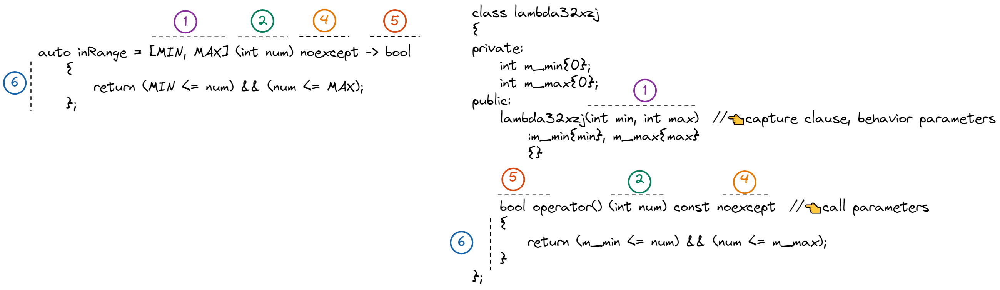

> [!Warning] Terminology
> Please beware of the following:
> - ***function object data type***
>	- [[class]] or structure with a [[function call operator]] method
>- ***function object***
>	 - an ==instance== of a function object data type
>	 - a callable object


# 📝Definition
A _function object_, or _functor_, is any type that implements the [[function call operator]] `operator()`. 

> [!warning] Don't use the name "functor"
> The standard of #cpp refers to "Function Object" not ~~"Functor"~~.

# 🎯Intent
The [[STL]] uses function objects primarily as sorting criteria for [[STL#🧪Composition#containers|containers]] and in [[STL#🧪Composition#algorithms|algorithms]].

**📌Work with Containers**
One use of function objects is as a *sorting criterion* for containers. For example, the `set` container is declared as follows:
```cpp
template <class Key,
    class Traits=less<Key>,
    class Allocator=allocator<Key>>
class set
```
The 2nd template argument is the function object `less`. This function object returns **`true`** if the first parameter is less than the 2nd parameter. 

> [!question] Why should I offer a function object?
> Because it provides a way you can **define your own sorting criteria** for containers by creating a function object and specifying it in the template list for the container.

**📌Work with Algorithms**
The following is an example
```cpp
template <class ForwardIterator, class Predicate>
ForwardIterator remove_if(
    ForwardIterator first,
    ForwardIterator last,
    Predicate pred);
```
The last argument of `remove_if` is a function object to act as [[function#^11fe4b|predicate function]].

# 🚀Benefit / Pros
Function objects provide **==2==** main advantages over a straight function call. 
- a function object can contain [[Finite Automaton#🧪Composition#state|state]].
- a function object is a type and therefore can be used as a [[Templates|template]] parameter.

```cpp
class AbsoluteValue
{
public:
    double operator()(double input) const
    {
        return input < 0 ? -input : input;
    }
};
```


# 🌱Related Elements
**📌[[functional header file]]**
[[functional header file|<functional>]] is a collection of function objects.

## Terminology across similar disciplines
- functor
	- Don't use it. Refer to function object if what you mean.
- [[function pointer]]
	- pointer which refers to a function rather than pointing to data
- function object data type
	- class which declares [[function call operator]]
- function object
	- instance of a function object data type
- `std::function`
	- container, holds a single function pointer or a function object
- [[functional header file|<functional>]]
	- STL which holds a lot function object

## function object & lambda expression
Function object is the "behind-scene" of lambda expression. We can see them in analogy.


