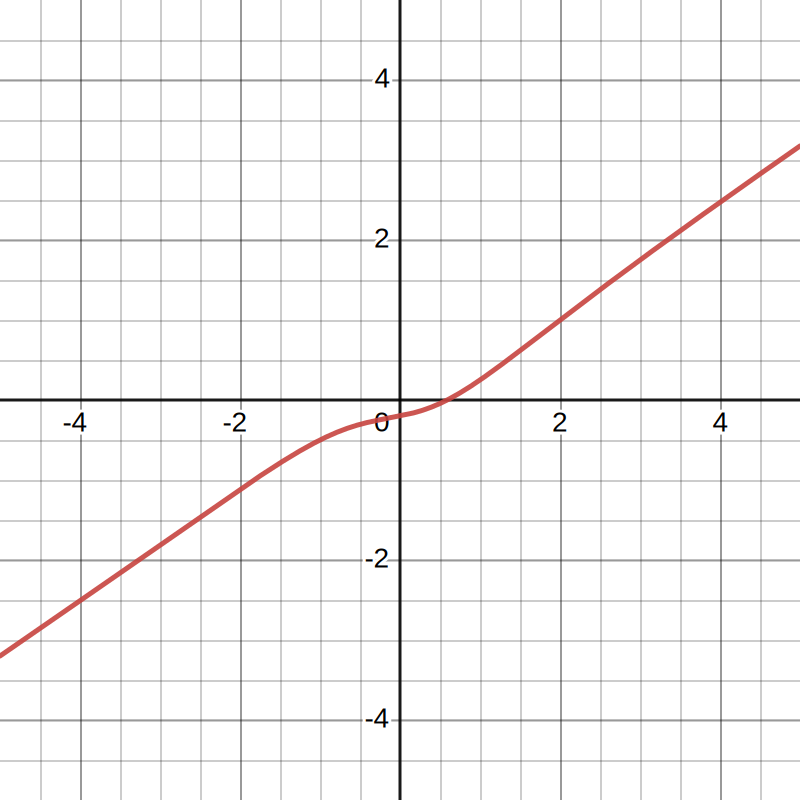

alias:: mapping

- # 📝Definition
	- In Programming,
		- A function is a named sequence of statements.
	- In Mathematics,
		- $f$ is a function that **maps** real $n$-vectors to **real** numbers.
		- Therefore, $f(x)$ is a scalar which is the **value** of such function at $x$(param).  Hence, function sometimes is called real-valued function or scalar-valued function.
		- A function is a rule for transforming an object into another object.
		- A map is often used as a synonym for a function. For **2** non-empty sets $A, B$, the mapping denotes as $f:A\rarr B$. Such that, for every $a_i$ of $A$, there is one **unique** element $b_i$ in $B$ corresponding to $a_i$.
			- $f(a)=b$
		- A function is **a binary relation between two sets** that associates each element of the first set(nonempty real number$\mathbb{R}$ set) to exactly one element of the second set.
			- $$
			  y = f(x)
			  $$
			- a.k.a. $x$ is in the set $A$ of left side, $y$ is in the set $B$ of the right side.
- # 📈Diagram
	- Diagram of "This is a function" which passed the [vertical line test](((633250a6-c025-4d26-95ae-277e4b9c7080))).
		- {:height 300, :width 300}
	- Diagram of "This is not a function" which failed the [vertical line test](((633250a6-c025-4d26-95ae-277e4b9c7080))).
		- {:height 300, :width 300}
- # 🧠Intuition
	- A function is an object that sets up an **input–output relationship**. Therefore, function is also called **mapping**. If $f(a)=b$, we say that $f$ maps $a$ to $b$.
- # 🧪Composition
	- In mathematics
	- In programming, a function can be composed by:
		- the return type
		- the name
		- the parameter list
		- the body
		- C++ function example
		  
		  ``` c++
		  // a function calculate a fibonacci number
		  int fibon_elem(int pos)
		  {
		      int elem = 1;
		      int n_2 = 1, n_1 = 1;
		      for(int ix = 3; ix <= pos; ++ix)
		      {
		          elem = n_2 + n_1;
		          n_2 = n_1; n_1 = elem;
		      }
		      return elem;
		  }
		  ```
- # 🏷(Sub)Categories
  What are the sub objects of this subject?
	- Categories of Function Call
		- Member Function Call
			- `object_name.member-function-name ( argument-list )`
	- 📌Unary Function
		- If the [arity](((6325c53d-86d0-4267-b340-c65975b272d0))) $k$ is 1, $f$ has a single argument and $f$ is called a unary function.
	- 📌Binary Function
		- If the [arity](((6325c53d-86d0-4267-b340-c65975b272d0))) $k$ is 2, $f$ has 2 arguments and $f$ is called a binary function.
	- 📌Predicate Function / Property Function
		- A predicate or property is a function whose range is $\{TRUE, FALSE\}$. a.k.a the output must be one of another.
		- In programming, we often name them by convention, like `isVowel()` or `isAlphabet()`.
	- 📌Relation (Function)
		- A predicate function whose domain(input) is a set of $k$-tuples $A \times\cdots\times A$ is called a "relation" or "relation function". More precisely, a $k$-ary relation function, or a $k$-ary relation on $A$.
		- Binary Relation (Function)
		  id:: 6325c8c4-6d8b-4315-a3bf-fe66872181a5
			- A common case is $2$-ary relation. For example, "less than" is a binary relation usually written with the infix operation symbol, $a<b$.
			- If $R$ is a binary relation, the statement $aRb$ means that $aRb = TRUE$.
			- Similarly, if $R$ is a $k$-ary relation, the statement $R(a_1, . . . , a_k)$ means that $R(a_1, . . . , a_k) = TRUE$.
		- Equivalence Relation (Function)
		  id:: 6328174b-a107-46d4-9c92-ed9b65e70b0f
			- A special type of binary relation, called an equivalence relation, captures the notion of two objects being equal in some feature. A binary relation $R$ is an equivalence relation if $R$ satisfies three conditions:
				- $R$ is **reflexive** if for every $x$, $xRx$;
				- $R$ is **symmetric** if for every $x$ and $y$, $xRy$ implies $yRx$; and
				- $R$ is **transitive** if for every $x, y$, and $z, xRy$ and $yRz$ implies $xRz$.
	- 📌Inverse Function
	  id:: 6337202d-82b6-4aaf-afac-c05f25c83e91
		- 📝Definition
			- Given a function $f(x)$, its inverse $f^(-1)(x)$ is defined by
				- $$
				  f(f^{-1}(x))=f^{-1}(f(x))\equiv x
				  $$
		- 🧠Intuition
			- The inverse function is like an **undo** button.
		- 📈Diagram
			- If you know what the graph of your function looks like, the graph of the inverse function is easy to find.
			- {:height 300, :width 300}
		- ⛈Characteristics / Properties
			- Domain
				- The domain of $f^{-1}$ is the same as the range of $f$.
			- Range
				- The range of $f^{-1}$ is the same as the domain of $f$.
			- Value
				- The value of $f^{-1}(y)$ is the number $x$ such that $f(x)=y$. So
					- $$
					  \text{if $f(x)=y,\quad$then $f^{-1}(y)=x$}
					  $$
	- Odd and Even Functions
	  id:: 63435778-63e3-4af1-83b9-a61582b3d33b
		- 📌Even Function
		  id:: 63435778-152f-42e0-9823-1ab681fbc686
			- 📝Definition
				- We say that a function $f$ is *even* if
					- $$
					  f(-x)=f(x)
					  $$
				- for all $x$ in the domain of $f$.
			- 📈Diagram
				- We conclude that the graph of an even function has mirror symmetry about the $y$-axis.
				- {:height 300, :width 300}
		- 📌Odd Function
			- 📝Definition
				- We say that a function $f$ is *odd* if
					- $$
					  f(-x)=-f(x)
					  $$
				- for all $x$ in the domain of $f$.
			- 📈Diagram
				- The graph of an odd function has $180\degree$ point symmetry about the origin.
				- {:height 300, :width 300}
		- 📌Zero Function (both odd and even function)
			- $$
			  f(x)=0
			  $$
		- 📌Neither odd or even
			- 📈Diagram
				- {:height 300, :width 300}
	- surjection and bijection function
		- Category
			- 📌non-injective surjective function(surjection) 满射
			- 📌injective surjective function(bijection) 双射
			- 📌injective non-surjective function(injection, not a bijection) 单射
			- 📌non-injective non surjective function 非映射
		- Diagram
			- {:height 300, :width 500}
	- 📌 [[Linear Function]]
	- 📌
	- 📌 [[polynomial]]
- # ⛈Characteristics / Properties
	- 📌 [[Upper and Lower Bound]]
	- 📌Codomain
	  id:: 63371466-8171-46ad-b423-9bbc596ed5ab
		- The subset of codomain is [range](((632a66cd-b4ee-4660-bed0-df0b9f8a89af))).
		- The codomain is a set of **possible** outputs.
	- 📌Domain
	  id:: 6329b0b1-f0b0-4926-9412-8c2523b33683
		- The set of possible inputs to the function is called its domain.
	- 📌Range
	  id:: 632a66cd-b4ee-4660-bed0-df0b9f8a89af
		- The outputs of a function come from a set called its range.
		- A function that does use all the elements of the range is said to be **onto** the range.
		  id:: 63435778-af86-4bc6-be68-e9a5243639a1
		- The range is the set of **actual** outputs.
		- 🧠Intuition
			- The range is the union of both shadows from left and right.
			- {:height 500, :width 500}
	- 📌Argument
		- When the domain of a function $f$ is $A_1\times\cdots\times A_k$ for some sets $A_1, . . . ,A_k$, the input to $f$ is a $k$- [[Tuple]] $(a_1, a_2, . . . , a_k)$ and we call the $a_i$ the arguments to $f$.
	- 📌Arity
	  id:: 6325c53d-86d0-4267-b340-c65975b272d0
		- A function with $k$ arguments is called a $k$-ary function, and $k$ is called the arity of the function.
	- 📌Graph
		- The graph of a function is really important: it really shows what the function "looks like".
	-
- # ✒Notation
	- The notation for saying that $f$ is a function with domain $D$ and range $R$ is
		- $$
		  \begin{align}
		  f: D\rightarrow R
		  \end{align}
		  $$
	- Using table to describe a function
		- Consider the function $f : \{0, 1, 2, 3, 4\}\rightarrow\{0, 1, 2, 3, 4\}$.
		- | $n$  | $f(n)$ |
		  | ---- | ------ |
		  | $0$  | $1$    |
		  | $1$  | $2$    |
		  | $2$  | $3$    |
		  | $3$  | $4$    |
		  | $4$  | $0$    |
		- This function adds 1 to its input and then outputs the result modulo 5.
		  
		  ``` c++
		  int func(int input)
		  {
		      return (input + 1) % 5;
		  }
		  ```
	-
- # 💫Support Operation
	- 📌Composition of function
	  id:: 63435778-fead-4b6c-b68f-c35030d9c68d
		- 📝Definition
			- The nesting of two or more functions to form a single new function is known as composition.
		- ✒Notation
			- The composition of two functions $f$ and $g$ is denoted $f \circ g$, where $f$ is a function whose **domain** includes the **range** of $g$.
			- $$
			  (f\circ g)(x)=f(g(x))
			  $$
			- Here is the $\circ$ means "composed with".
		- 🗃Example
			- If
				- $$
				  \begin{align}
				  g(x)&=2^x\\
				  h(x)&=5x^4\\
				  j(x)&=2x-1\\
				  \end{align}
				  $$
			- The function $f$
				- $$
				  \begin{align}
				  f(x)&=g\circ h\circ j\\
				  &=g(h(j(x)))\\
				  &=g(h(2x-1))\\
				  &=g(5(2x-1))\\
				  &=2^{5(2x-1)}
				  \end{align}
				  $$
		- 🕳Pitfalls
			- Products and compositions are not the same thing!
- # 🔎Implementation / Mechanism
	- 📌Things behind invoking a function
		- When we invoke a function, a special area of memory is set up on [[Stack]]. Within this special area of memory there is a space to hold the value of each function parameter and variables inside the scope(local variables).
		- ```c++
		  void SomeFunction(int param)
		  {
		    ======================
		    ||                  ||
		    ||                  ||
		    ||      STACK       ||
		    ||                  ||
		    ||                  ||
		    ======================
		  }
		  ```
		- When the function completes, this area of memory is discarded.(***popped*** from the program stack)
		- By default, an object is passed to a function, its value is copied to the local definition. That is called [[pass-by-value]] .
		  ```c++
		  // pass by value
		  void SomeFunction(int num);
		  ```
		- If we want to modify the original value, it is called [[pass-by-reference]] .
		  ```c++
		  // pass by reference
		  void SomeFunction(int &num);
		  ```
- # 🥼Expert's Advice
	- By Lippman
		- > "It is better to communicate between functions using parameters rather than use objects defined at file scope. Since function dependent on file scope is harder to reuse in a different context."
		- ``` c++
		  void SomeFunction()
		  {
		      // here use some value in file scope ❌
		      // therefore it is hard to check     ❌
		  }
		  ```
- **📌Invoke Function using  `->()`  and  `.()` **
	- In C#, a function can be called like this:
	- ```
	  number.ToString();
	  ```
	- But in C++, you may see 2 ways of invoking a function:
	- ```
	  xxx.DoSomething();
	  xxx->DoSomething();
	  ```
	- The difference is that:
	- When  `xxx`  is an **object** of a class, it uses  `xxx.Function();`
	- When  `xxx`  is a **pointer** to an object, it uses  `xxx->Function();`