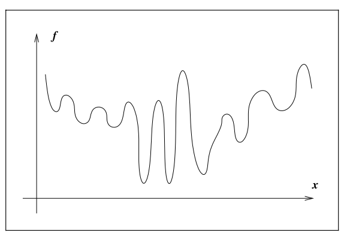

alias:: global minimizer, absolute minimum

- #minimum
- {{embed ((6343704b-3817-4ae2-84c9-5093e818fc10))}}
- 📝Definition
	- A point $x^*$ is a global minimum if $f(x^*)\leq f(x)$ for all $x\in\mathbb{R}^n$​.
	- A global minimum, also known as an absolute minimum, is the smallest overall value of a set, function, etc., over its entire range.
- 📈Diagram
	- A difficult case for global minimization
		- {:height 300, :width 300}
		- So in future practice, we should pay attention to those crazy function may be "trapped".
- 🕳Pitfalls
	- It is impossible to construct an algorithm that will find a global minimum for an arbitrary function.