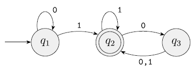

### High-level programming language
- 📝**Definition**: The first high-level programming language is called FORTRAN(formula translation) which resembles the mathematical formulas into machine language.

### Parameterized classes
- 📝**Definition**: Classes that include a base-type specification are called ***parameterized classes*** in the object-oriented community.

### `size_type`
- 📝**Definition**: `container::size_type` is the type that is used for the number of elements in the container and is **container-dependent**.

### Simulations and models
- 📝**Definition**: Most problems are far too complex to allow for a complete understanding. There are just too many details. The reason to build a model is that, <u>despite the complexity of a particular problem</u>. If you can come up with a reasonable model for a process, you can often translate the dynamics of the model into a program that captures the behavior of that model. Such a program is called a <u>simulation</u>.
    

### State
- 📝**Definition**: The value of an object is often called its state, so the idea of a valid value is often referred to as a **valid state** of an object.

### State Diagram
- 📝**Definition**: State diagram is a diagram which is always used in [[Finite Automaton]].
- 📈**Diagram**:
	- 

### Storage Duration
- 📝**Definition**: It refers to the period of time for which memory is allocated for an object is called its *storage duration* or *extent*.
    
### Text Editor
- 📝**Definition**: This is where you write the source codes.

### Undefined order evaluation
- 📝**Definition**: See [[Expression#^676303de228f35c6|here]]

### Z(Not organized)

- *ABI*: Application Binary Interface, a specification for a specific hardware platform combined with the operating system. Contrast with API.

- *address*: a value that allows us to find an object in a computer’s memory.

- *alias*: an alternative way of referring to an object; often a name, pointer, or reference.

- *API*: Application Programming Interface, a set of functions that form the communication between various software components. Contrast with ABI.

- *application*: a program or a collection of programs that is considered an entity by its users.

- *assertion*: a statement inserted into a program to state (assert) that something must always be true at this point in the program.

- *bug*: an error in a program.

- *code*: a program or a part of a program; ambiguously used for both source code and object code.

- *concept*: (1) a notion, and idea; (2) a set of requirements, usually for a template argument.

- *concrete type*: a type that is not a base class, and objects of the type are intended to be used directly (not only by pointer/indirection), its size is known, it can typically be allocated anywhere the programmer wants (e.g., stack or statically).

- *constructor*: an operation that initializes (“constructs”) an object. Typically a constructor establishes an invariant and often acquires resources needed for an object to be used (which are then typically released by a destructor).

- *copy*: an operation that makes two object have values that compare equal. See also move.

- *correctness*: a program or a piece of a program is correct if it meets its specification. Unfortunately, a specification can be incomplete or inconsistent, or can fail to meet users’ reasonable expectations. Thus, to produce acceptable code, we sometimes have to do more than just follow the formal specification.

- *cost*: the expense (e.g., in programmer time, run time, or space) of producing a program or of executing it. Ideally, cost should be a function of complexity.

- *customization point*: ???

- *data*: values used in a computation.

- *design*: an overall description of how a piece of software should operate to meet its specification.

- *destructor*: an operation that is implicitly invoked (called) when an object is destroyed (e.g., at the end of a scope). Often, it releases resources.

- *executable*: a program ready to be run (executed) on a computer.

- *file*: a container of permanent information in a computer.

- *handle*: a class that allows access to another through a member pointer or reference. See also resource, copy, move.

- *hiding*: the act of preventing a piece of information from being directly seen or accessed. For example, a name from a nested (inner) scope can prevent that same name from an outer (enclosing) scope from being directly used.

- *infinite recursion*: a recursion that doesn’t end until the machine runs out of memory to hold the calls. In reality, such recursion is never infinite but is terminated by some hardware error.

- *information hiding*: the act of separating interface and implementation, thus hiding implementation details not meant for the user’s attention and providing an abstraction.

- *initialize*: giving an object its first (initial) value.

- *input*: values used by a computation (e.g., function arguments and characters typed on a keyboard).

- *integer*: a whole number, such as 42 and -99.

- *ISO*: International Organization for Standardization. The C++ language is an ISO standard, ISO/IEC 14882. More information at [iso.org](http://iso.org/).

- *lifetime*: the time from the initialization of an object until it becomes unusable (goes out of scope, is deleted, or the program terminates).

- *loop*: a piece of code executed repeatedly; in C++, typically a for-statement or a  `while` -statement.

- *move*: an operation that transfers a value from one object to another leaving behind a value representing “empty.” See also copy.

- *move-only type*: a concrete type that is movable but not copyable.m

- *overflow*: producing a value that cannot be stored in its intended target.

- *overload*: defining two functions or operators with the same name but different argument (operand) types.

- *override*: defining a function in a derived class with the same name and argument types as a virtual function in the base class, thus making the function callable through the interface defined by the base class.

- *paradigm*: a somewhat pretentious term for design or programming style; often used with the (erroneous) implication that there exists a paradigm that is superior to all others.

- *pointer*: (1) a value used to identify a typed object in memory; (2) a variable holding such a value.

- *post-condition*: a condition that must hold upon exit from a piece of code, such as a function or a loop.

- *pre-condition*: a condition that must hold upon entry into a piece of code, such as a function or a loop.

- *pseudo code*: a description of a computation written in an informal notation rather than a programming language.

- *range*: a sequence of values that can be described by a start point and an end point. For example,  `[0:5)`  means the values 0, 1, 2, 3, and 4.

- *regular*: a semiregular type that is equality-comparable (see  `std::regular`  concept). After a copy, the copied object compares equal to the original object. A regular type behaves similarly to built-in types like  `int`  and can be compared with  `==` . In particular, an object of a regular type can be copied and the result of a copy is a separate object that compares equal to the original. See also *semiregular type*.

- *requirement*: (1) a description of the desired behavior of a program or part of a program; (2) a description of the assumptions a function or template makes of its arguments.

- *rounding*: conversion of a value to the mathematically nearest value of a less precise type.

- *RTTI*: Run-Time Type Information. ???

- *scope*: the region of program text (source code) in which a name can be referred to.

- *semiregular*: a concrete type that is copyable (including movable) and default-constructible (see  `std::semiregular`  concept). The result of a copy is an independent object with the same value as the original. A semiregular type behaves roughly like an built-in type like  `int` , but possibly without a  `==`  operator. See also *regular type*.

- *software*: a collection of pieces of code and associated data; often used interchangeably with program.

- *source code*: code as produced by a programmer and (in principle) readable by other programmers.

- *specification*: a description of what a piece of code should do.

- *standard*: an officially agreed upon definition of something, such as a programming language.

- *state*: a set of values.

- *STL*: the containers, iterators, and algorithms part of the standard library.

- *style*: a set of techniques for programming leading to a consistent use of language features; sometimes used in a very restricted sense to refer just to low-level rules for naming and appearance of code.

- *subtype*: derived type; a type that has all the properties of a type and possibly more.

- *system*: (1) a program or a set of programs for performing a task on a computer; (2) a shorthand for “operating system”, that is, the fundamental execution environment and tools for a computer.

- *TS*: [Technical Specification](https://www.iso.org/deliverables-all.html?type=ts), A Technical Specification addresses work still under technical development, or where it is believed that there will be a future, but not immediate, possibility of agreement on an International Standard. A Technical Specification is published for immediate use, but it also provides a means to obtain feedback. The aim is that it will eventually be transformed and republished as an International Standard.

- *template*: a class or a function parameterized by one or more types or (compile-time) values; the basic C++ language construct supporting generic programming.

- *truncation*: loss of information in a conversion from a type into another that cannot exactly represent the value to be converted.

- *uninitialized*: the (undefined) state of an object before it is initialized.

- *unit*: (1) a standard measure that gives meaning to a value (e.g., km for a distance); (2) a distinguished (e.g., named) part of a larger whole.

- *use case*: a specific (typically simple) use of a program meant to test its functionality and demonstrate its purpose.

- *value type*: a term some people use to mean a regular or semiregular type.

