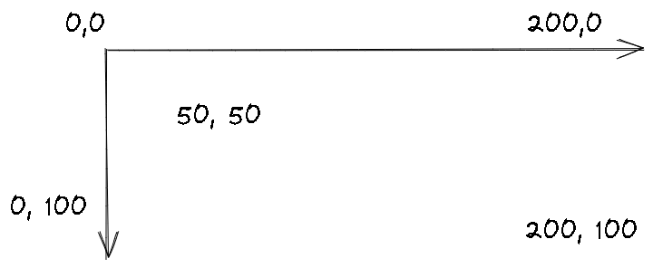

### Associative arrays
- 📝**Definition**: Arrays implemented using maps as their underlying representation are called **associative arrays**.

### Base Type /Super Type
- 📝**Definition**:
    - In the context of inheritance,
        - Base type means a type that has a subset of the properties of a type.
        
    - In the context of template/generic, base type is type of the generic.
        - ``` c++
          //in this case, `string` is base type
          vector<string> vec;
          ```
        
### Bounds-checking
- 📝**Definition**: The operation of testing whether an index is valid is called ***bounds-checking***.

### Client
- 📝**Definition**: Clients are who calls functions provided by a library

### Coordinates
- 📝**Definition**:
    - In computer science, The most common way of modeling a screen in a program is as a rectangle of pixels. Each pixel is identified by an x (horizontal) coordinate and a y (vertical) coordinate. The x coordinates start with 0, indicating the leftmost pixel, and increase (toward the right) to the rightmost pixel.
    - In mathematician's view, the preceding view is odd...
    
- 📈**Diagram**:
    - {:height 250, :width 250}
    
### definite assignment rule
- 📝**Definition**:
    - It is a **MUST** to assign a value to a variable before to use it. The following is wrong:
    
- ⌨ **Code**:
    - ```c#
      int age;
      Console.WriteLine(age);  //Error!!
      ```
    
### edit-compile-debug
- 📝**Definition**: Often a single error can have a cascading effect and cause a compiler to report more errors than actually are present. It is also a good idea to <u>recompile the code after each fix</u>—or after making at most a small number of obvious fixes. This cycle is known as <u>edit-compile-debug</u>.

### extrinsic
- 📝**Definition**: By extrinsic, we mean that the first item is ‘first’, not because of what the item is, but **because some external party put it there**. In short, the first is because it is THE first.

    
### fully qualified name
- 📝**Definition**: A name composed of a [[namespace]] name (or a class name) and a member name combined by `::` is called a fully qualified name.
- ⌨**Code**:
    - In C++
        - ``` c++
          namespace TextLib {
          class Text { /* . . . */ };
          class Glyph { /* . . . */ };
          class Line { /* . . . */ };
          // . . .
          }
          ```
        - Such `TextLib::Text` is a fully qualified name.
    - In C#,
        - `Rhino.Geometry.Point3d` is a fully qualified name.


### High-level programming language
- 📝**Definition**: The first high-level programming language is called FORTRAN(formula translation) which resembles the mathematical formulas into machine language.


### Implementer
- 📝**Definition**: Implementer is who implements a library

### Keyword
- 📝**Definition**: Keywords are predefined reserved identifiers that have special meanings to the compiler.
- 🧠**Intuition**: Words that can't be used as identifiers in your program.
- 🔗**Link**:
    - C++ keyword: https://docs.microsoft.com/en-us/cpp/cpp/keywords-cpp?view=msvc-170
    - C# keyword: https://docs.microsoft.com/en-us/dotnet/csharp/language-reference/keywords/
    
### Lexicon
- 📝**Definition**: A set of words with no associated definitions is called a ***lexicon***.
- 🀄**CHN**: lexicon被翻译成辞典是不正确的，因为lexicon强调是一串不带释义的英文单词。讲白了就是一个set of English words

### Lexicographic order
- 📝**Definition**: The order defined by the underlying ASCII codes.


### Method
- 📝**Definition**: functions defined in the class called "method". functions defined outside of class is called free function.

### Most vexing parse
- 📝**Definition**: The most vexing parse is a counterintuitive form of syntactic ambiguity resolution in the C++ programming language. In certain situations, the C++ grammar cannot distinguish the following 2.
    - the creation of an object parameter
    - specification of a function's type.
    
- ⌨**Code**
    - example on most vexing parse(1)
        - for the following code
        - ``` c
          void f(double my_dbl) {
            int i(int(my_dbl));
          }
          ```
        - Line 2 above is **ambiguous**😲. However, due to C allows superfluous parentheses around function parameter declarations. There are 2 interpretation.
            - One is to interpret to **declare a variable** `i` with initial value produced by converting `my_dbl` to an `int`.
                - ``` c++
                  //an int object with initial value of `my_db1`
                  int i = my_db1;
                  ```
                
            - Other is to interpret to **declare a function** `i`.
                - ``` c++
                  // A function named i takes an integer and returns an integer.
                  int i(int my_dbl);
                  ```
                
        - example on most vexing parse(2)
            - ``` c++
              Widget w1(10); // ✅🆗call Widget ctor with argument 10
              
              Widget w2(); // ❌most vexing parse! declares a function
              			 // named w2 that returns a Widget!
              
              Widget w3{}; // ✅calls Widget ctor with no args bu using {} init
              ```
            
### ODR
- 📝**Definition**: The "One Definition Rule" states that no translation unit may define certain entities more than once.

### Off-by-one error
- 📝**Definition**: The index is not in range...
- ⌨**Code**:
    - example of "off-by-one error"
      
      ``` c++
      vector<int> v; // a vector of ints
      for (int i; cin>>i; )
      {
        v.push_back(i); // get values
      }
      
      for (int i = 0; i<=v.size(); ++i) // 👈here is the off-by-one error
      {
        cout << "v[" << i <<"] == " << v[i] << '\n';
      }
      
      ```
    

### Parameterized classes
- 📝**Definition**: Classes that include a base-type specification are called ***parameterized classes*** in the object-oriented community.

### Poisson Distribution
- 📝**Definition**: **Poisson distribution** is a [discrete probability distribution](https://en.wikipedia.org/wiki/Discrete_probability_distribution) that expresses the probability of a given number of events occurring in a fixed interval of time or space if these events occur with a known constant mean rate and [independently](https://en.wikipedia.org/wiki/Statistical_independence) of the time since the last event.

### Procedure
- 📝**Definition**: A function that does not return a value and is instead executed for its effect.


### receiver
- 📝**Definition**: the object that is the target of that transmission
- ⌨**Code**: `receiver.name(arguments);`

### sender
- 📝**Definition**: the object that initiates the method is called the sender


### `size_type`
- 📝**Definition**: `container::size_type` is the type that is used for the number of elements in the container and is **container-dependent**.

### Simulations and models
- 📝**Definition**: Most problems are far too complex to allow for a complete understanding. There are just too many details. The reason to build a model is that, <u>despite the complexity of a particular problem</u>. If you can come up with a reasonable model for a process, you can often translate the dynamics of the model into a program that captures the behavior of that model. Such a program is called a <u>simulation</u>.

### Stack Frame
- 📝**Definition**: A new space created by system for all the local variables required when calling a function. In Visual Studio debug mode, there is a tab called `Call Stack`.
- 🀄**CHN**:
- 🔗**Link**:
- 💡**Intuitive**:
- 🖼**Image**:
    - Stack Frame Diagram
      {:height 229, :width 434}
    

### State
- 📝**Definition**: The value of an object is often called its state, so the idea of a valid value is often referred to as a **valid state** of an object.

### State Diagram
- 📝**Definition**: State diagram is a diagram which is always used in [[Finite Automaton]].
- 📈**Diagram**:
	- 


### sentinel variable
- 📝**Definition**: 哨兵变量。Often used in flow control.


### Storage Duration
- 📝**Definition**: It refers to the period of time for which memory is allocated for an object is called its *storage duration* or *extent*.
    
### Text Editor
- 📝**Definition**: This is where you write the source codes.

### Undefined order evaluation
- 📝**Definition**: See [[Expression#^676303de228f35c6|here]]


### variate
- 📝**Definition**: A variate is a generalization of the concept of a random variable that is defined without reference to a particular type of probabilistic experiment. It is defined as the set of all random variables that obey a given probabilistic law.


### Z(Not organized)

- *ABI*: Application Binary Interface, a specification for a specific hardware platform combined with the operating system. Contrast with API.

- *abstract class*: a class that cannot be directly used to create objects; often used to define an interface to derived classes. A class is made abstract by having a pure virtual function or only protected constructors.

- *abstraction*: a description of something that selectively and deliberately ignores (hides) details (e.g., implementation details); selective ignorance.

- *address*: a value that allows us to find an object in a computer’s memory.

- *algorithm*: a procedure or formula for solving a problem; a finite series of computational steps to produce a result.

- *alias*: an alternative way of referring to an object; often a name, pointer, or reference.

- *API*: Application Programming Interface, a set of functions that form the communication between various software components. Contrast with ABI.

- *application*: a program or a collection of programs that is considered an entity by its users.

- *approximation*: something (e.g., a value or a design) that is close to the perfect or ideal (value or design). Often an approximation is a result of trade-offs among ideals.

- *array*: a homogeneous sequence of elements, usually numbered, e.g.,  `[0:max)` .

- *assertion*: a statement inserted into a program to state (assert) that something must always be true at this point in the program.

- *base class*: a type that is intended to be derived from (e.g., has a non- `final`  virtual function), and objects of the type are intended to be used only indirectly (e.g., by pointer). [In strict terms, “base class” could be defined as “something we derived from” but we are specifying in terms of the class designer’s intent.] Typically a base class has one or more virtual functions.

- *bug*: an error in a program.

- *code*: a program or a part of a program; ambiguously used for both source code and object code.

- *complexity*: a hard-to-precisely-define notion or measure of the difficulty of constructing a solution to a problem or of the solution itself. Sometimes complexity is used to (simply) mean an estimate of the number of operations needed to execute an algorithm.

- *computation*: the execution of some code, usually taking some input and producing some output.

- *concept*: (1) a notion, and idea; (2) a set of requirements, usually for a template argument.

- *concrete type*: a type that is not a base class, and objects of the type are intended to be used directly (not only by pointer/indirection), its size is known, it can typically be allocated anywhere the programmer wants (e.g., stack or statically).

- *constant*: a value that cannot be changed (in a given scope); not mutable.

- *constructor*: an operation that initializes (“constructs”) an object. Typically a constructor establishes an invariant and often acquires resources needed for an object to be used (which are then typically released by a destructor).

- *copy*: an operation that makes two object have values that compare equal. See also move.

- *correctness*: a program or a piece of a program is correct if it meets its specification. Unfortunately, a specification can be incomplete or inconsistent, or can fail to meet users’ reasonable expectations. Thus, to produce acceptable code, we sometimes have to do more than just follow the formal specification.

- *cost*: the expense (e.g., in programmer time, run time, or space) of producing a program or of executing it. Ideally, cost should be a function of complexity.

- *customization point*: ???

- *data*: values used in a computation.

- *debugging*: the act of searching for and removing errors from a program; usually far less systematic than testing.

- *declaration*: the specification of a name with its type in a program.

- *definition*: a declaration of an entity that supplies all information necessary to complete a program using the entity. Simplified definition: a declaration that allocates memory.

- *derived class*: a class derived from one or more base classes.

- *design*: an overall description of how a piece of software should operate to meet its specification.

- *destructor*: an operation that is implicitly invoked (called) when an object is destroyed (e.g., at the end of a scope). Often, it releases resources.

- *encapsulation*: protecting something meant to be private (e.g., implementation details) from unauthorized access.

- *error*: a mismatch between reasonable expectations of program behavior (often expressed as a requirement or a users’ guide) and what a program actually does.

- *executable*: a program ready to be run (executed) on a computer.

- *feature creep*: a tendency to add excess functionality to a program “just in case.”

- *file*: a container of permanent information in a computer.

- *floating-point number*: a computer’s approximation of a real number, such as 7.93 and 10.78e-3.

- *function*: a named unit of code that can be invoked (called) from different parts of a program; a logical unit of computation.

- *global variable*: technically, a named object in namespace scope.

- *handle*: a class that allows access to another through a member pointer or reference. See also resource, copy, move.

- *header*: a file containing declarations used to share interfaces between parts of a program.

- *hiding*: the act of preventing a piece of information from being directly seen or accessed. For example, a name from a nested (inner) scope can prevent that same name from an outer (enclosing) scope from being directly used.

- *ideal*: the perfect version of something we are striving for. Usually we have to make trade-offs and settle for an approximation.

- *implementation*: (1) the act of writing and testing code; (2) the code that implements a program.

- *infinite loop*: a loop where the termination condition never becomes true. See iteration.

- *infinite recursion*: a recursion that doesn’t end until the machine runs out of memory to hold the calls. In reality, such recursion is never infinite but is terminated by some hardware error.

- *information hiding*: the act of separating interface and implementation, thus hiding implementation details not meant for the user’s attention and providing an abstraction.

- *initialize*: giving an object its first (initial) value.

- *input*: values used by a computation (e.g., function arguments and characters typed on a keyboard).

- *integer*: a whole number, such as 42 and -99.

- *iteration*: the act of repeatedly executing a piece of code; see recursion.

- *ISO*: International Organization for Standardization. The C++ language is an ISO standard, ISO/IEC 14882. More information at [iso.org](http://iso.org/).

- *library*: a collection of types, functions, classes, etc. implementing a set of facilities (abstractions) meant to be potentially used as part of more that one program.

- *lifetime*: the time from the initialization of an object until it becomes unusable (goes out of scope, is deleted, or the program terminates).

- *loop*: a piece of code executed repeatedly; in C++, typically a for-statement or a  `while` -statement.

- *move*: an operation that transfers a value from one object to another leaving behind a value representing “empty.” See also copy.

- *move-only type*: a concrete type that is movable but not copyable.m

- *object*: (1) an initialized region of memory of a known type which holds a value of that type; (2) a region of memory.

- *operation*: something that can perform some action, such as a function and an operator.

- *overflow*: producing a value that cannot be stored in its intended target.

- *overload*: defining two functions or operators with the same name but different argument (operand) types.

- *override*: defining a function in a derived class with the same name and argument types as a virtual function in the base class, thus making the function callable through the interface defined by the base class.

- *owner*: an object responsible for releasing a resource.

- *paradigm*: a somewhat pretentious term for design or programming style; often used with the (erroneous) implication that there exists a paradigm that is superior to all others.

- *pointer*: (1) a value used to identify a typed object in memory; (2) a variable holding such a value.

- *post-condition*: a condition that must hold upon exit from a piece of code, such as a function or a loop.

- *pre-condition*: a condition that must hold upon entry into a piece of code, such as a function or a loop.

- *program*: code (possibly with associated data) that is sufficiently complete to be executed by a computer.

- *programming*: the art of expressing solutions to problems as code.

- *programming language*: a language for expressing programs.

- *pseudo code*: a description of a computation written in an informal notation rather than a programming language.

- *pure virtual function*: a virtual function that must be overridden in a derived class.

- *RAII*: (“Resource Acquisition Is Initialization”) a basic technique for resource management based on scopes.

- *range*: a sequence of values that can be described by a start point and an end point. For example,  `[0:5)`  means the values 0, 1, 2, 3, and 4.

- *recursion*: the act of a function calling itself; see also iteration.

- *reference*: (1) a value describing the location of a typed value in memory; (2) a variable holding such a value.

- *regular expression*: a notation for patterns in character strings.

- *regular*: a semiregular type that is equality-comparable (see  `std::regular`  concept). After a copy, the copied object compares equal to the original object. A regular type behaves similarly to built-in types like  `int`  and can be compared with  `==` . In particular, an object of a regular type can be copied and the result of a copy is a separate object that compares equal to the original. See also *semiregular type*.

- *requirement*: (1) a description of the desired behavior of a program or part of a program; (2) a description of the assumptions a function or template makes of its arguments.

- *resource*: something that is acquired and must later be released, such as a file handle, a lock, or memory. See also handle, owner.

- *rounding*: conversion of a value to the mathematically nearest value of a less precise type.

- *RTTI*: Run-Time Type Information. ???

- *scope*: the region of program text (source code) in which a name can be referred to.

- *semiregular*: a concrete type that is copyable (including movable) and default-constructible (see  `std::semiregular`  concept). The result of a copy is an independent object with the same value as the original. A semiregular type behaves roughly like an built-in type like  `int` , but possibly without a  `==`  operator. See also *regular type*.

- *software*: a collection of pieces of code and associated data; often used interchangeably with program.

- *source code*: code as produced by a programmer and (in principle) readable by other programmers.

- *specification*: a description of what a piece of code should do.

- *standard*: an officially agreed upon definition of something, such as a programming language.

- *state*: a set of values.

- *STL*: the containers, iterators, and algorithms part of the standard library.

- *style*: a set of techniques for programming leading to a consistent use of language features; sometimes used in a very restricted sense to refer just to low-level rules for naming and appearance of code.

- *subtype*: derived type; a type that has all the properties of a type and possibly more.

- *system*: (1) a program or a set of programs for performing a task on a computer; (2) a shorthand for “operating system”, that is, the fundamental execution environment and tools for a computer.

- *TS*: [Technical Specification](https://www.iso.org/deliverables-all.html?type=ts), A Technical Specification addresses work still under technical development, or where it is believed that there will be a future, but not immediate, possibility of agreement on an International Standard. A Technical Specification is published for immediate use, but it also provides a means to obtain feedback. The aim is that it will eventually be transformed and republished as an International Standard.

- *template*: a class or a function parameterized by one or more types or (compile-time) values; the basic C++ language construct supporting generic programming.

- *testing*: a systematic search for errors in a program.

- *trade-off*: the result of balancing several design and implementation criteria.

- *truncation*: loss of information in a conversion from a type into another that cannot exactly represent the value to be converted.

- *uninitialized*: the (undefined) state of an object before it is initialized.

- *unit*: (1) a standard measure that gives meaning to a value (e.g., km for a distance); (2) a distinguished (e.g., named) part of a larger whole.

- *use case*: a specific (typically simple) use of a program meant to test its functionality and demonstrate its purpose.

- *value type*: a term some people use to mean a regular or semiregular type.

- *virtual function*: a member function that can be overridden in a derived class.
