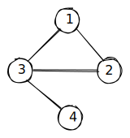
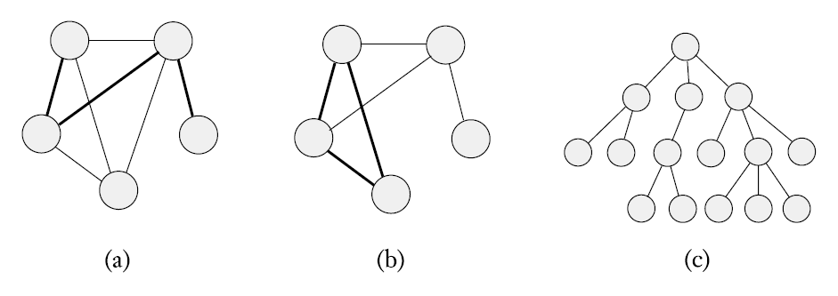
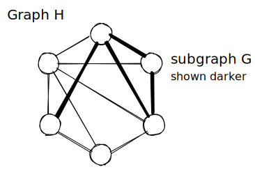
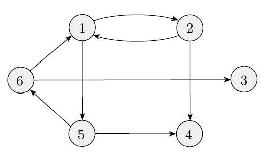
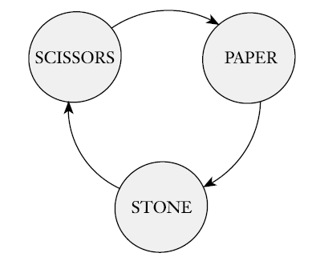

# 📝Definition
- An undirected graph, or simply a graph, is a set of points with **lines** **connecting** some of the **points**.

# 📈Diagram
- {:height 200, :width 200}
- {:height 500, :width 500}
  path, cycle, tree

# 🧪Composition
- 📌node / vertex
- 📌line / edge
- 📌path
    - A path in a graph is a [[Tuple|sequence]] of nodes connected by edges.
    
- 📌simple path
    - A simple path is a path that doesn’t repeat any nodes.
    
- 📌cycle
    - A path is a cycle if it starts and ends in the same node.
    
- 📌simple cycle ^31c62213ac8acf6b
    - A simple cycle is one that contains at least three nodes and repeats only the first and last nodes.
    
- 📌directed path
    - A path in which all the arrows point in the same direction as its steps is called a directed path.
    
# ✒Notation
- If $V$ is the [[set]] of nodes of a graph $G$ and $E$ is the set of edges of that graph, we say
    - $$
      G = (V,E).
      $$
    
- The notation to the preceding diagram can be
    - $$
      G=(V,E)=(  \underbrace{\{1,2,3,4\}}_G,  \underbrace{ \{(1,2),(1,3),(2,3),(3,4)\} } _E)
      $$
    
# ⛈Characteristics / Properties
- 📌Degree ^bbcb5829b989f491
    - The number of edges at a particular node is the degree of that node.
    - In the diagram, node-2 is a degree of $2$ while node-4 is a degree of $1$.
    
- 📌Self-loop
    - An edge from a node to itself is called a self-loop.
    
- 📌Connected ^aa7ddb0bfb41c91f
    - A graph is connected if every two nodes have a path between them.
    
- 🌱Related Elements
    - The nature of graph has some similarity with 3-[[simplex]].
    
# 🏷(Sub)Categories
## 📌Subgraph
- Graph $G$ is a subgraph of graph $H$ if the nodes of $G$ are a subset of the nodes of $H$, and the edges of $G$ are the edges of $H$ on the corresponding nodes.
- {:height 200, :width 200}

## 📌 [[Tree]]
## 📌directed graph
- A directed graph has arrows instead of lines.
    - {:height 200, :width 200} ^fab4c9b58e3e75b1
    
### Notation
- We represent an edge **from** $i$ **to** $j$ as a pair $(i, j)$. The formal description of a directed graph $G$ is $(V,E)$
$$
G=(V,E)=(  \underbrace{\{1,2,3,4,5,6\}}_G,  \underbrace{ \{(1,2),(2,1),(2,4),(5,4),(5,6),(6,1),(6,3)\} } _E)
$$

### Matrix Representation
![[matrix#^471fd6ee9a6d8360]]
### Properties
- 📌outdegree
    - The number of arrows pointing from a particular node is the outdegree of that node.
    - e.g. The outdegree of node-3 is 0.
    
- 📌indegree
    - The number of arrows pointing to a particular node is the indegree.
    - e.g. The indegree of node-4 is 2.
    
- 📌strongly connected
    - A directed graph is strongly connected if a directed path connects every two nodes.
    
### Applicability
- 📌Binary Relation
    - Directed graphs are a handy way of depicting binary relations.
    - If $R$ is a [[function#^b5e21d73e61288f3|binary relation]] whose domain is $D\times D$, a labeled graph $G = (D,E)$ represents $R$, where $E = \{(x, y)| xRy\}$.
    - A typical example is the children game Scissors-Paper-Stone
      {:height 200, :width 200}
    
