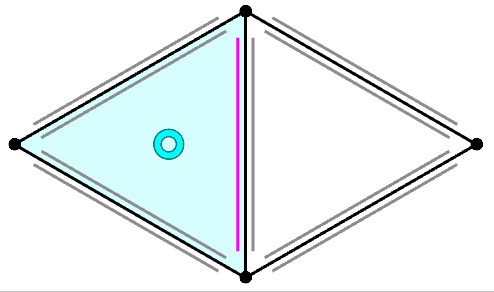

alias:: doubly connected edge list, DCEL

- #[[data structure]]
- 📝Definition
	- Let $H$ be any set with an even number of elements, let $\rho:H\rightarrow H$ be any permutation of $H$, and let $\eta:H\rightarrow H$ be an involution without any fixed points, i.e., $\eta\circ\eta=$identity and $\eta(h)\neq h$ for any $h\in H$. Then $(H,\rho,\eta)$ is a ***half edge mesh***, the elements of $H$ are called ***half edges***, the orbits of $\eta$ are ***edges***, the orbits of $\rho$ are ***faces***, and the orbits of $\eta\circ\rho$ are ***vertices***.
- 🧠Intuition
	- (infml.) Each edge gets split into two *oppositely-oriented* **half edges**.
- 📈Diagram
	- {:height 300, :width 600}
	- {:height 300, :width 400} Each oriented triangle also defines three _directed edges_ between its three vertices. Other triangles in the mesh may contain edges with the same incident vertices, possibly in the opposite direction. A [[manifold]] mesh will have at most two triangles incident on the same (undirected) _edge_, therefor we'll refer to each triangle's directed edge as a _half-edge_.
- 💫Support Operation
	- There are 2 most important operations of Half Edge Mesh: "Next" and "Twin".
	- Twin
		- 📝Definition
			- $\eta$ = "twin" , the "twin halfedge" sticking in the same edge with opposite orientation.
	- Next
		- 📝Definition
			- $\rho$ = "next" , along the orientation, next operation is the "next halfedge" of current halfedge.
- 🗃Example
	- 📌Simple Example of Half Edge Mesh
		- 📈Diagram
			- {:height 200, :width 450}
		- ✒Notation
			- $$
			  (h_0,...,h_9)\xmapsto[\bold{"twin"}]{\eta}(h_3,h_6,h_7,h_0,h_8,h_9,h_1,h_2,h_4,h_5)\\\\
			  (h_0,...,h_9)\xmapsto[\bold{"next"}]{\rho}(h_1,h_2,h_0,h_4,h_5,h_3,h_9,h_6,h_7,h_8)
			  $$
		-
	- 📌Example
		- the orbits of $\eta$ are ***edges***:
			- {:height 200, :width 200}
		- the orbits of $\rho$ are ***faces***:
			- {:height 200, :width 200}
		- the orbits of $\eta\circ\rho$ are ***vertices***:
			- {:height 200, :width 200}