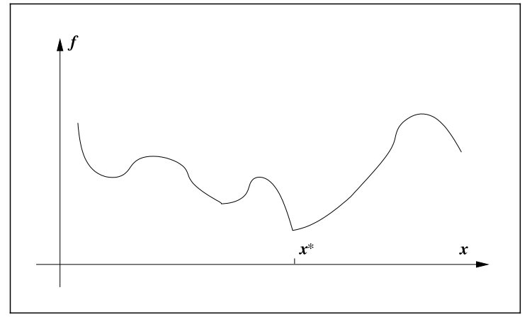

-
- Welcome.
- # MIT
	- ## 📚Theory of Computation
		- ### ℹSyllabus
			- Course Goal
			- Course Textbook
			- Lecturer
			- Link: [course](https://ocw.mit.edu/courses/18-404j-theory-of-computation-fall-2020/)
			- Video:[xxx](https://)
		- ### 📺Lectures
			- Lecture 1. Video 25:35
		- ### 💻Assignment
			- Assignment
		- ### 📖Reading
			- 0 Introduction
				- 0.1. [[Theory of Computation]], [[Complexity]], [[Computability]], [[Automata]]
				- 0.2. [[Set]], [[Tuple]], [[Function]], [[Graph]], [[Tree]], [[Boolean Logic]]
			- 1 Regular Expression
			- 2 Context-Free Languages
			- Things I don't know
				- p8(bottom)-p10(top)
	- Introduction to Algorithm
		- Course Information
			- Topics:
				- algorithm - to know what it is first
				- correctness - then to define what is correct
				- efficiency - evaluate the efficiency
				- model of computation - how to compute and integrate algorithm in computation
				- data structure - how data structure can help
				- runtime analysis - having all set up, it's time to analyze
			- 🎯Goal
				- The goal is to **solve** computation problems, and to **communicate** that your solutions are **correct** and **efficient**.
		- Content
			- Lecture 1. Algorithms and Computation✅
				- [[Algorithm]], [[interface]], [[data structure]], [[Asymptotic Notation]]
			- Lecture 2. Data Structures and Dynamic Arrays✅
				- [[sequence]]
	- ## 📚Single Variable Calculus
		- ### ℹSyllabus
			- Course Goal
			- Course Textbook
			- Lecturer
			- Link: [xxx](https://)
			- Video:[xxx](https://)
		- ### 📺Lectures
			- Lecture...
			- Integration
				- The Integral
					- [[Mean Value Theorem]], [[Upper and Lower Bound]], [[Antiderivative]], [[Differential]], [[Differential Equation]]
					- [[Euler]], [[Slope Field]]
					- Homework B the Parachute ride is really good. need to document. Only the last question I don't understand.
				- Integration Theory
					- [[Summation Notation]], [[definite integral]], [Riemann Sums](((633f8f9f-c0b3-4d71-abf1-bc74283f85c2))), [[First Fundamental Theorem of Calculus]], [[Second Fundamental Theorem of Calculus]]
		- ### 💻Assignment
			- Assignment
		- ### 📖Reading
- # Stanford
	- CS103
		- 2022 Fall
			- Lecture0 pdf✅
	- CS107
		- ## 📚CS107 Programming Paradigms 2008
			- ### ℹSyllabus
				- Course Goal
				- Course Textbook
				- Lecturer
				- Link: [xxx](https://)
				- Video:[link](https://www.bilibili.com/video/BV1Cx411S7HJ?share_source=copy_web&vd_source=218d39032e526d50fa83fd2c8d8aab99)
			- ### 📺Lectures
				- Lecture 1 video✅ notes not❌
				- Lecture 2
					- c/c++
						-
			- ### 💻Assignment
				- Assignment
			- ### 📖Reading
		- ## 📚CS107 2022 Summer
			- ### ℹSyllabus
				- Course Goal
				- Course Textbook
				- Lecturer
				- Link: [link](https://web.stanford.edu/class/archive/cs/cs107/cs107.1226/)
				- Video:[xxx](https://)
			- ### 📺Lectures
				- Lecture 1 pdf✅
				- Lecture 2 pdf
			- ### 💻Assignment
				- Assignment
			- ### 📖Reading
	- CS110
	- CS106B
	- CS143
		- lecture0 pdf - p22/p35 documentation
	- ## 📚ENGR108
		- ### ℹSyllabus
			- Course Goal
			- Course Textbook
			- Lecturer
			- Link:
				- https://web.stanford.edu/~boyd/vmls/
			- Video
				- [bilibili](https://www.bilibili.com/video/BV17h411W7bk?p=8&share_source=copy_web&vd_source=218d39032e526d50fa83fd2c8d8aab99)
				- [Youtube](https://www.youtube.com/playlist?list=PLoROMvodv4rMz-WbFQtNUsUElIh2cPmN9)
			- Slides: https://stanford.edu/class/engr108/lectures.html
		- ### 📺Lectures
			- Lecture 1
				- [[vector]]
			- Lecture 7✅
				- [[Linear Function]]
				- [[Affine Function]]
			- Lecture 8✅
				- [[Taylor Approximation]]
				- [[Regression Model]]
			- Lecture 9
				- [[Norm]]
				- [[L2-norm]]. In this course, they refer "norm" as L-2 norm.
			- Lecture 10✅
				- Euclidean distance, triangle inequality, feature distance, document dissimilarity. Written in the operation section in vector.
			- Lecture 15✅
				- ⭐⭐[[Linear Dependence]], [[Linear Independence]]
				- Boyd said these are super important concept across his book.
				- [[Basis]], [[Orthonormality]]
			- Lecture 17✅
				- [[matrix]]
				- TODO currently, the norm is kind of messy in [[matrix]], [[vector]], [[Norm]], and [[L2-norm]]. Try to organize them in light of more general and bigger picture. e.g. L-$p$ norm (see wolfram mathworld)
			- Lecture 18✅
				- Matrix-Vector Multiplication
			- Lecture 19✅
				- Matrix-vector operation applicability
		- ### 💻Assignment
			- Assignment
		- ### 📖Reading
	-
- # Princeton
	- ## 📚Algorithms Part I
		- ### ℹSyllabus
			- Course Goal
			- Course Textbook
			- Lecturer
			- Link: [xxx](https://)
			- Video:[xxx](https://)
		- ### 📺Lectures
			- Week 1
				- Course Introduction
					- Assignment✅
					- Lecture Note Documentation✅
				- Union-Find
					- [[Dynamic connectivity]]
				- Analysis of Algorithms
					-
		- ### 💻Assignment
			- Assignment
		- ### 📖Reading
	- ## 📚Algorithms Part II
		- ### ℹSyllabus
			- Course Goal
			- Course Textbook
			- Lecturer
			- Link: [xxx](https://)
			- Video:[xxx](https://)
		- ### 📺Lectures
			- Lecture...
		- ### 💻Assignment
			- Assignment
		- ### 📖Reading
- # C++
	- Books
		- Programming Principle and Practice using C++
		  collapsed:: true
			- 346 / 1313
			- TODO 9.7 & 9.8 I have read front and back. Require documentation. This is a good reference of designing interface. Possible to integrate to future chapter 14(design class)?
			-
			- Things I don't know
				- p456, "use Shape's constructors(A.16)"
		- Effective Modern C++
		  collapsed:: true
			- Progress
				- Item 1
				  Item 2
				  Item 3
				  Item 4
				  Item 5
				  Item 6
				  Item 7✅
				  Item 8✅
				  Item 9✅
				  Item 10
				  Item 11
				  Item 12
				  Item 13
				  Item 14
				  Item 15
				  Item 16
				  Item 17
				  Item 18
				  Item 19
				  Item 20
				  Item 21
				  Item 22
				  Item 23
				  Item 24
				  Item 25
				  Item 26
				  Item 27
				  Item 28
				  Item 29
				  Item 30
				  Item 31
				  Item 32
				  Item 33
				  Item 34
				  Item 35
				  Item 36
				  Item 37
				  Item 38
				  Item 39
				  Item 40
				  Item 41
				  Item 42
			- Things I don't know
				- Item8 p60-p62
				- Item9 p64-p67
		- Book
			- Table of Content
				- Chapter 01 Overview of C++
				- Chapter 02 Functions and Libraries
				- Chapter 03 Strings
				- Chapter 11 Pointers and Arrays
					- [[Bit]], [[Byte]], [[Word]]
			- Things I don't know
				- ...
			- Info
				- link
- # C#
	- ## Step by Step
		- Chapter 07 Class and objects
			- [[class]], [[Encapsulation]], [[Constructor]]
		- Chapter 20 Delegate and Event
			- [[Delegate]]
		- Chapter 26 MVVM
			- [[MVVM]]
	- ## WPF Tutorial
		- Link: https://wpf-tutorial.com/
		- About WPF
			- [[WPF]]
			- WPF vs. WinForm
		- XAML
			- [[XAML]]
		- WPF Application
		- Basic Control
		- Control Concepts
		- Panels
- # Math
	- ## Algebraic Topology
		- Link:
			- https://pi.math.cornell.edu/~hatcher/AT/ATpage.html
			- https://pi.math.cornell.edu/~hatcher/AT/AT.pdf
			- https://www.youtube.com/playlist?list=PL8yHsr3EFj52yxQGxQoxwOtjIEtxE2BWx
	- ## Algebraic Geometry
		- Link:
			- https://www.youtube.com/playlist?list=PL8yHsr3EFj53j51FG6wCbQKjBgpjKa5PX
			- https://www.youtube.com/playlist?list=PL8yHsr3EFj50Un2NpfPySgXctRQK7CLG-
			- https://www.youtube.com/playlist?list=PL8yHsr3EFj53Rwr6ly1oUasJXR2Qerwgj
			-
	- ## Group Theory
		- Link:
			- https://www.youtube.com/playlist?list=PL8yHsr3EFj51pjBvvCPipgAT3SYpIiIsJ
	- ## Number Theory
		- Link:
			- https://www.youtube.com/playlist?list=PL8yHsr3EFj53L8sMbzIhhXSAOpuZ1Fov8
			- https://www.youtube.com/playlist?list=PL8yHsr3EFj52Qf7lc3HHvHRdIysxEcj1H
	- ## Numeric Optimization
		- Book - Numerical Optimization by J. Nocedal, S.J. Wright
			- Chapter 01 Introduction
				- [[Numerical Optimization]], [[Convex]], [[Convex Optimization]], [[Convex Function]]
			- Chapter 02 Fundamentals of Unconstrained Optimization
				- [[Unconstrained Optimization]], [[extremum]]
			- Unorganized
				- If the **objective function** in the optimization problem and the **feasible region** are **both convex**, then **any local solution** of the problem **is** in fact a **global solution**.
				- ### Non-smooth Problem
					- {:height 200, :width 200}
					- 📝Definition
						- Geometrically, the nonsmooth function consists of a few smooth pieces, with **discontinuities between the pieces**.
					- 🎯Intent
						- It may be possible to find the minimizer by **minimizing each smooth piece individually**, a.k.a. examing the **subgradient** and **generalized gradient**.
						- (a side note, this book will not cover non-smooth problem.)
	- ## Calculus
		- ### The Calculus Lifesaver
			- Table of Content
				- Chapter 1 Functions, Graphs, and Lines
					- [[Function]], [codomain](((63371466-8171-46ad-b423-9bbc596ed5ab))), [domain](((6329b0b1-f0b0-4926-9412-8c2523b33683))), [range](((63435778-af86-4bc6-be68-e9a5243639a1))), [interval notation](((63435779-808f-4753-869a-768bdf607fb6))), [vertical line test](((633250a6-c025-4d26-95ae-277e4b9c7080))), [horizontal line test](((63435779-1c08-499a-beb1-43d307665875))), [inverse function](((6337202d-82b6-4aaf-afac-c05f25c83e91))), [composition of function](((63435778-fead-4b6c-b68f-c35030d9c68d))), [odd function and even function](((63435778-63e3-4af1-83b9-a61582b3d33b))), [[Linear Function]], [[polynomial]], [[quadratic function]], [[rational function]], [[exponential]], [[Logarithm]], [[Trigonometric Function]]
			- Things I don't know
				- ...
			- Info
				- link
	- ## Differential Geometry of Curves and Surfaces
		- Table of Content
			- Chapter 1...
		- Author
			- Manfredo Perdigao do Carmo
		- Things I don't know
			- ...
		- Info
			- link
	- ## Linear Algebra
		- ### Linear Algebra for Everyone
			- Table of Content
				- Chapter 1 Vectors and Matrices
					- 1.1 Linear Combinations of Vectors
						- key takeaway: the column and row picture of vector and matrix, how linear combination spans the space
						- [[linear combination]], [[vector]], [[matrix]]
					- 1.2 Lengths and Angles from Dot Product
						- key takeaway: understand the dot product and how it measure the angles
						- [[dot product]], [Angle](((63452c51-4559-46a1-86ca-ab2a3b8952a0))), [[Triangle Inequality]], [[Schwarz Inequality]]
			- Author
				- ...
			- Things I don't know
				- ...
			- Info
				- link
	- ## Lectures on Differential Geometry
		- Table of Content
			- Chapter 1...
		- Author
			- Richard Schoen
			- Shing-Tung Yau
		- Things I don't know
			- ...
		- Info
			- link
	- ## A Course in Minimal Surfaces
		- Table of Content
			- Chapter 1...
		- Author
			- Tobias Holck Colding
			- II Minicozzi, William P.
		- Things I don't know
			- ...
		- Info
			- link
	- ## Riemannian Geometry
		- Table of Content
			- Chapter 1...
		- Author
			- Manfredo Perdigao do Carmo
		- Things I don't know
			- ...
		- Info
			- link
	- ## Mathematics for 3D Game Programming and Computer Graphics
		- Table of Content
			- Chapter 2 Vector
				- [[dot product]]
			- Chapter 3 Matrices
				- 3.4. [[Determinant]]
		- Things I don't know
			- ...
		- Info
			- link
	-
- # Computer Graphics and Computational Geometry
	- Computer Graphics (00106501) USTC
		- Course Info
			- Link: [刘利刚《计算机图形学》2020 (ustc.edu.cn)](http://staff.ustc.edu.cn/~lgliu/Courses/ComputerGraphics_2020_spring-summer/default.htm)
		- Lecture
			-
		- Assignment
			- Assignment 0
			- Assignment 1 - MiniDraw
	- ## 📚GAMES101
		- ### ℹSyllabus
			- Course Goal
			- Course Textbook
			- Lecturer
			- Link: [xxx](https://)
			- Video: [here](https://www.bilibili.com/video/BV1X7411F744?share_source=copy_web&vd_source=218d39032e526d50fa83fd2c8d8aab99)
		- ### 📺Lectures
			- Lecture...
		- ### 💻Assignment
			- Assignment
		- ### 📖Reading
	- ## 📚Discrete Differential Geometry
		- ### ℹSyllabus
			- Course Goal
			- Course Textbook
			- Lecturer
			- Link: [xxx](https://)
			- Video:[xxx](https://)
		- ### 📺Lectures
			-
		- ### 💻Assignment
			- Assignment
		- ### 📖Reading
			- Chapter 02 Combinatorial Surfaces
				- [[Convex Set]], [[Convex Hull]], [[Simplex]]