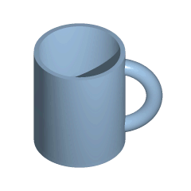

alias:: 同胚

- 📈Diagram
	- {:height 200, :width 200}
	  In the perspective of #topology , a coffee mug and donut are the same. Because a continuous deformation between a coffee mug and a donut (torus) illustrating that they are homeomorphic.