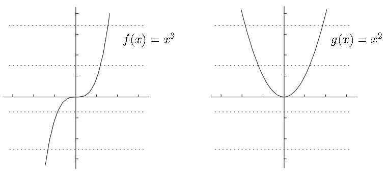
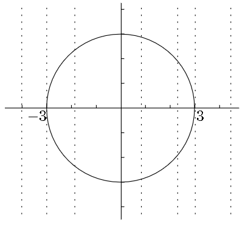
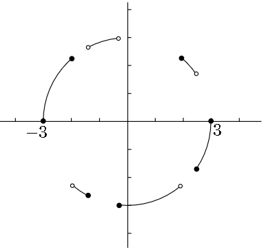

# Horizontal Line Test
- 📝**Definition**
    - If every horizontal line intersects the graph of a [[Function]] at most once, the function has an [[Function#^a7ed31bf0b55411a|inverse]].
    
- 🀄**CHN**:
- 🔗**Link**:
- 💡**Intuitive**:
- 🖼**Image**:
    - Left pass, right fail.
    - {:height 300, :width 300}

# Vertical Line Test
- 📝**Definition**
    - The vertical line test: if you have some graph and you want to know whether it’s the graph of a function, see whether any vertical line intersects the graph more than once. If so, it’s not the graph of a function.
    
- 🀄**CHN**:
- 🔗**Link**:
- 💡**Intuitive**:
- 🖼**Image**:
    - Fail at vertical line test
        - {:height 300, :width 300}
        
    - Pass at vertical line test
        - {:height 300, :width 300}
        
