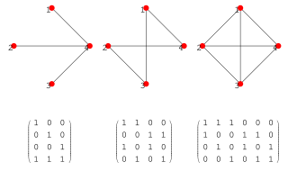
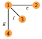
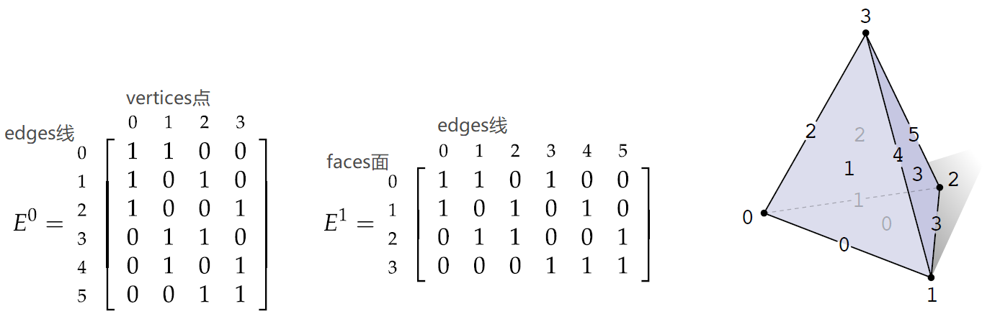
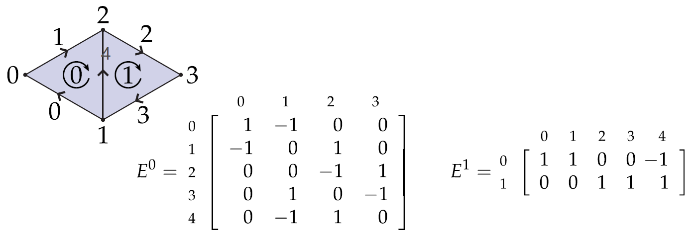

- 📝Definition
	- The incidence matrix of a [[Graph]] gives the (0,1)-matrix which has a row for each vertex and column for each edge, and $(v,e)=1$ if and only if vertex $v$ is incident upon edge $e$. However, some authors define the incidence matrix to be the transpose of this, with a column for each vertex and a row for each edge.
	- Let $G = (V, E)$ be a graph where $V = \{1, 2, . . . , n\}$ and $E = \{e_1, e_2, . . . , e_m\}$. The incidence matrix of $G$ is an $n\times m$ matrix $B = (b_{ik} )$, where each row corresponds to a vertex and each column corresponds to an edge such that if $ek$ is an edge between $i$ and $j$, then all elements of column $k$ are $0$ except $b_{ik} = b_{jk} = 1$.
- 📈Diagram
	- {:height 300, :width 500}
- 🗃Example
	- The Incidence Matrix of a Graph
		- {:height 100, :width 100}
		- $$
		  B=
		  \begin{bmatrix}
		  1&1&1\\1&0&0\\0&1&0\\0&0&1
		  \end{bmatrix}
		  $$
	-
- 🤳Applicability
	- Incidence Matrix as Topological Data Structure
		- 📝Definition
			- Let $K$ be a [[Simplicial Complex]] , let $n_k$ denote the number of $k$-simplices in $K$, and suppose that for each $k$ we give the $k$-simplices a canonical ordering so that they can be specified via indices $1,...,n_k$. The $k$-th *incidence matrix* is then a $n_{k+1}\times n_k$ matrix $E^k$ with entries $E^{k}_{ij}=1$ if the $j$th $k$-simplex is contained in the $i$-th $(k+1)$-simplex, and $E^k_{ij}=0$ otherwise.
		- 📈Diagram
			- {:height 300, :width 500}
		- 🧠Intuition
			- the matrix from *left to right* is getting **higher dimension**, e.g. vertices->edges->faces.
			- the column of each matrix is the ingredient to construct row which is the upper dimension, e.g. columns of $E^0$ is vertices, row is edges
			- seeing from the column picture, if the ingredient is used, then it is positive(**1**), otherwise negative(**0**)
		- 🕳Cons
			- Incidence Matrix is not appropriate for a very large complex with a relatively small number of connections—**most** of the entries are going to be **zero**.
		- 🏷(Sub)Categories
			- Signed Incidence Matrix
				- 📝Definition
					- A *signed incidence matrix* is an incidence matrix where the sign of each nonzero entry is determined by the relative orientation of the two simplices corresponding to that row/column.
				- 📈Diagram
					- {:height 300, :width 500}
					- in the dimension of vertices-edges, `-1 = start point` 	`1 = end point`
					- in the dimension of edges-faces, `-1 = reverse orientation`   `1 = the orientation`